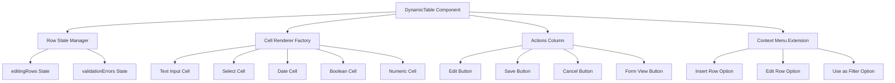

# Design Document

## Overview

This design document outlines the implementation of inline editing functionality for the Material React Table grid component in the Etendo ERP system. The feature will allow users to edit and create records directly within the grid interface, providing a spreadsheet-like experience without leaving the grid context.

The implementation will extend the existing `DynamicTable` component (`packages/MainUI/components/Table/index.tsx`) and leverage the current Material React Table infrastructure while adding new state management, cell rendering logic, and user interaction patterns.

## Architecture

### High-Level Architecture



### State Management Architecture

The inline editing functionality will introduce new state management layers:

1. **Row Editing State**: Tracks which rows are currently being edited
2. **Cell Value State**: Stores modified values for cells in edit mode
3. **Validation State**: Manages validation errors for edited rows
4. **UI State**: Controls visual feedback and loading states

## Components and Interfaces

### 1. Enhanced DynamicTable Component

The main `DynamicTable` component will be extended with new state and functionality:

```typescript
interface EditingRowsState {
  [rowId: string]: {
    originalData: EntityData;
    modifiedData: Partial<EntityData>;
    isNew: boolean;
    validationErrors: Record<string, string>;
    isSaving: boolean;
  };
}

interface InlineEditingState {
  editingRows: EditingRowsState;
  contextMenu: {
    anchorEl: HTMLElement | null;
    cell: MRT_Cell<EntityData> | null;
    row: MRT_Row<EntityData> | null;
    showInlineOptions: boolean;
  };
}
```

### 2. Cell Editor Factory

A new factory component will determine which input component to render based on field type:

```typescript
interface CellEditorProps {
  value: unknown;
  onChange: (value: unknown) => void;
  onBlur: () => void;
  field: Field;
  hasError: boolean;
  disabled: boolean;
}

interface CellEditorFactoryProps extends CellEditorProps {
  fieldType: FieldType;
}

const CellEditorFactory: React.FC<CellEditorFactoryProps> = ({ fieldType, ...props }) => {
  switch (fieldType) {
    case FieldType.TEXT:
      return <TextCellEditor {...props} />;
    case FieldType.NUMBER:
    case FieldType.QUANTITY:
      return <NumericCellEditor {...props} />;
    case FieldType.DATE:
    case FieldType.DATETIME:
      return <DateCellEditor {...props} />;
    case FieldType.BOOLEAN:
      return <BooleanCellEditor {...props} />;
    case FieldType.LIST:
      return <SelectCellEditor {...props} />;
    case FieldType.TABLEDIR:
    case FieldType.SEARCH:
      return <SearchCellEditor {...props} />;
    default:
      return <TextCellEditor {...props} />;
  }
};
```

### 3. Individual Cell Editors

Each cell editor will be a specialized component for different data types:

#### TextCellEditor
```typescript
const TextCellEditor: React.FC<CellEditorProps> = ({ value, onChange, onBlur, hasError, disabled }) => {
  return (
    <input
      type="text"
      value={String(value || '')}
      onChange={(e) => onChange(e.target.value)}
      onBlur={onBlur}
      disabled={disabled}
      className={`inline-edit-input ${hasError ? 'error' : ''}`}
      autoFocus
    />
  );
};
```

#### SelectCellEditor
```typescript
const SelectCellEditor: React.FC<CellEditorProps> = ({ value, onChange, onBlur, field, hasError, disabled }) => {
  const options = field.refList || [];
  
  return (
    <select
      value={String(value || '')}
      onChange={(e) => onChange(e.target.value)}
      onBlur={onBlur}
      disabled={disabled}
      className={`inline-edit-select ${hasError ? 'error' : ''}`}
      autoFocus
    >
      <option value="">Select...</option>
      {options.map(option => (
        <option key={option.id} value={option.value}>
          {option.label}
        </option>
      ))}
    </select>
  );
};
```

#### DateCellEditor
```typescript
const DateCellEditor: React.FC<CellEditorProps> = ({ value, onChange, onBlur, hasError, disabled }) => {
  const formatDateForInput = (date: unknown) => {
    if (!date) return '';
    const d = new Date(date as string);
    return d.toISOString().split('T')[0];
  };

  return (
    <input
      type="date"
      value={formatDateForInput(value)}
      onChange={(e) => onChange(e.target.value)}
      onBlur={onBlur}
      disabled={disabled}
      className={`inline-edit-date ${hasError ? 'error' : ''}`}
      autoFocus
    />
  );
};
```

#### BooleanCellEditor
```typescript
const BooleanCellEditor: React.FC<CellEditorProps> = ({ value, onChange, onBlur, hasError, disabled }) => {
  return (
    <input
      type="checkbox"
      checked={Boolean(value)}
      onChange={(e) => onChange(e.target.checked)}
      onBlur={onBlur}
      disabled={disabled}
      className={`inline-edit-checkbox ${hasError ? 'error' : ''}`}
      autoFocus
    />
  );
};
```

#### NumericCellEditor
```typescript
const NumericCellEditor: React.FC<CellEditorProps> = ({ value, onChange, onBlur, hasError, disabled }) => {
  return (
    <input
      type="number"
      value={String(value || '')}
      onChange={(e) => onChange(Number(e.target.value))}
      onBlur={onBlur}
      disabled={disabled}
      className={`inline-edit-number ${hasError ? 'error' : ''}`}
      autoFocus
    />
  );
};
```

### 4. Actions Column Component

A new actions column will be added to handle row-level operations:

```typescript
interface ActionsColumnProps {
  row: MRT_Row<EntityData>;
  isEditing: boolean;
  isSaving: boolean;
  hasErrors: boolean;
  onEdit: () => void;
  onSave: () => void;
  onCancel: () => void;
  onOpenForm: () => void;
}

const ActionsColumn: React.FC<ActionsColumnProps> = ({
  row,
  isEditing,
  isSaving,
  hasErrors,
  onEdit,
  onSave,
  onCancel,
  onOpenForm
}) => {
  if (isEditing) {
    return (
      <div className="flex gap-1">
        <IconButton
          onClick={onSave}
          disabled={isSaving || hasErrors}
          title="Save"
          className="text-green-600 hover:text-green-800"
        >
          <CheckIcon />
        </IconButton>
        <IconButton
          onClick={onCancel}
          disabled={isSaving}
          title="Cancel"
          className="text-red-600 hover:text-red-800"
        >
          <XIcon />
        </IconButton>
        {hasErrors && (
          <div className="text-red-500" title="Validation errors">
            <ErrorIcon />
          </div>
        )}
      </div>
    );
  }

  return (
    <div className="flex gap-1">
      <IconButton
        onClick={onEdit}
        title="Edit in grid"
        className="text-blue-600 hover:text-blue-800"
      >
        <PencilIcon />
      </IconButton>
      <IconButton
        onClick={onOpenForm}
        title="Open form view"
        className="text-gray-600 hover:text-gray-800"
      >
        <FormIcon />
      </IconButton>
    </div>
  );
};
```

### 5. Enhanced Context Menu

The existing `CellContextMenu` component (`packages/MainUI/components/Table/CellContextMenu.tsx`) will be extended to include inline editing options. This leverages the current right-click functionality that already exists for "Use as Filter".

**Current CellContextMenu Features:**
- Right-click context menu on any cell
- "Use as Filter" functionality with intelligent value extraction
- Support for different field types (boolean, list, reference, primitive)
- Integration with the existing Menu component from ComponentLibrary

**Enhancement Strategy:**
Instead of replacing the existing component, we'll extend it to include the new inline editing options:

```typescript
interface EnhancedCellContextMenuProps extends CellContextMenuProps {
  onEditRow: () => void;
  onInsertRow: () => void;
  canEdit: boolean;
  isRowEditing: boolean;
}

const EnhancedCellContextMenu: React.FC<EnhancedCellContextMenuProps> = ({
  anchorEl,
  onClose,
  cell,
  row,
  onFilterByValue,
  onEditRow,
  onInsertRow,
  canEdit,
  isRowEditing,
  columns
}) => {
  const { t } = useTranslation();

  const handleUseAsFilter = () => {
    // Existing logic from current CellContextMenu
    // ... (same implementation as current component)
    onFilterByValue(columnId, filterValues.filterId, filterValues.filterValue, filterValues.filterLabel);
    onClose();
  };

  return (
    <Menu anchorEl={anchorEl} onClose={onClose} className="rounded-xl">
      <div className="rounded-2xl px-2 py-4">
        {canEdit && !isRowEditing && (
          <>
            <div
              onClick={() => { onEditRow(); onClose(); }}
              className="cursor-pointer rounded-lg p-2 transition hover:bg-(--color-baseline-20)"
              onKeyDown={(e) => {
                if (e.key === "Enter" || e.key === " ") {
                  e.preventDefault();
                  onEditRow();
                  onClose();
                }
              }}
            >
              {t("table.editRow")}
            </div>
            <div
              onClick={() => { onInsertRow(); onClose(); }}
              className="cursor-pointer rounded-lg p-2 transition hover:bg-(--color-baseline-20)"
              onKeyDown={(e) => {
                if (e.key === "Enter" || e.key === " ") {
                  e.preventDefault();
                  onInsertRow();
                  onClose();
                }
              }}
            >
              {t("table.insertRow")}
            </div>
            <div className="border-t border-(--color-transparent-neutral-30) my-2" />
          </>
        )}
        <div
          onClick={handleUseAsFilter}
          className="cursor-pointer rounded-lg p-2 transition hover:bg-(--color-baseline-20)"
          onKeyDown={(e) => {
            if (e.key === "Enter" || e.key === " ") {
              e.preventDefault();
              handleUseAsFilter();
            }
          }}
        >
          {t("table.useAsFilter")}
        </div>
      </div>
    </Menu>
  );
};
```

**Integration Benefits:**
1. **Reuses existing infrastructure**: The right-click detection, menu positioning, and styling are already implemented
2. **Maintains consistency**: Users already know how to access the context menu
3. **Preserves existing functionality**: The "Use as Filter" feature continues to work
4. **Minimal code changes**: We extend rather than replace the existing component

## Data Models

### Editing State Model

```typescript
interface EditingRowData {
  originalData: EntityData;
  modifiedData: Partial<EntityData>;
  isNew: boolean;
  validationErrors: Record<string, string>;
  isSaving: boolean;
  hasUnsavedChanges: boolean;
}

interface EditingRowsState {
  [rowId: string]: EditingRowData;
}
```

### Validation Error Model

```typescript
interface ValidationError {
  field: string;
  message: string;
  type: 'required' | 'format' | 'server';
}

interface RowValidationResult {
  isValid: boolean;
  errors: ValidationError[];
}
```

### Save Operation Model

```typescript
interface SaveOperation {
  rowId: string;
  isNew: boolean;
  data: Partial<EntityData>;
  originalData?: EntityData;
}

interface SaveResult {
  success: boolean;
  data?: EntityData;
  errors?: ValidationError[];
}
```

## Error Handling

### Client-Side Validation

1. **Required Field Validation**: Check mandatory fields before save
2. **Format Validation**: Validate data types and formats
3. **Business Rule Validation**: Apply any client-side business rules

### Server-Side Error Handling

1. **Network Errors**: Handle connection issues gracefully
2. **Validation Errors**: Display server validation messages
3. **Conflict Resolution**: Handle concurrent modification scenarios

### Error Display Strategy

- **Field-Level Errors**: Red border and tooltip on invalid cells
- **Row-Level Errors**: Error icon in actions column with tooltip
- **Global Errors**: Toast notifications for system-level issues

## Testing Strategy

### Unit Tests

1. **Cell Editor Components**: Test each editor type individually
2. **Validation Logic**: Test client-side validation rules
3. **State Management**: Test editing state transitions
4. **Utility Functions**: Test data transformation and formatting

### Integration Tests

1. **Edit Flow**: Test complete edit-save-cancel workflows
2. **New Record Flow**: Test new record creation process
3. **Context Menu**: Test right-click menu functionality
4. **Error Scenarios**: Test various error conditions

### End-to-End Tests

1. **User Workflows**: Test complete user scenarios
2. **Multi-Row Editing**: Test simultaneous editing of multiple rows
3. **Form Integration**: Test navigation between grid and form views
4. **Data Persistence**: Test data saving and retrieval

## Performance Considerations

### Optimization Strategies

1. **Lazy Loading**: Only render editors for visible cells
2. **Debounced Validation**: Delay validation to reduce API calls
3. **Memoization**: Cache expensive computations and renders
4. **Virtual Scrolling**: Maintain existing virtualization benefits

### Memory Management

1. **State Cleanup**: Clear editing state when rows are removed
2. **Event Listener Cleanup**: Properly remove event listeners
3. **Component Unmounting**: Clean up resources on component unmount

## Security Considerations

### Data Validation

1. **Input Sanitization**: Sanitize all user inputs
2. **Type Checking**: Validate data types before processing
3. **Permission Checks**: Verify user permissions for edit operations

### API Security

1. **Authentication**: Ensure all API calls are authenticated
2. **Authorization**: Check user permissions for each operation
3. **Data Integrity**: Validate data consistency on server side

## Migration Strategy

### Backward Compatibility

1. **Feature Flag**: Implement behind a feature flag for gradual rollout
2. **Existing Functionality**: Ensure all current features remain functional
3. **Configuration Options**: Allow disabling inline editing if needed

### Rollout Plan

1. **Phase 1**: Basic inline editing for text fields
2. **Phase 2**: Support for all field types
3. **Phase 3**: Advanced features (validation, error handling)
4. **Phase 4**: Performance optimizations and polish

## Accessibility

### Keyboard Navigation

1. **Tab Order**: Proper tab order through editable cells
2. **Enter/Escape**: Standard keyboard shortcuts for save/cancel
3. **Arrow Keys**: Navigate between cells in edit mode

### Screen Reader Support

1. **ARIA Labels**: Proper labeling for all interactive elements
2. **Status Announcements**: Announce state changes to screen readers
3. **Error Messages**: Accessible error message presentation

### Visual Accessibility

1. **High Contrast**: Ensure sufficient color contrast for all states
2. **Focus Indicators**: Clear visual focus indicators
3. **Error States**: Multiple ways to indicate errors (color, icons, text)