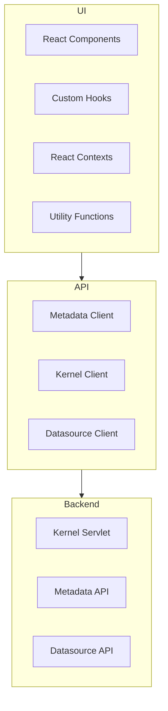

# WorkspaceUI Architecture Overview

## System Architecture

WorkspaceUI es una aplicación React/Next.js que sirve como interfaz principal para Etendo ERP.

### High-Level Architecture

## Key Components

### Frontend Layer
- **Next.js App Router**: Routing y SSR
- **React Components**: UI components reutilizables
- **Material-UI**: Design system base
- **React Hook Form**: Form management
- **TypeScript**: Type safety
- **Custom JavaScript Evaluation**: Secure dynamic code execution in table cells

### Integration Layer  
- **API Client**: Backend communication abstraction
- **Metadata Client**: Window/tab metadata retrieval
- **Kernel Client**: Process and action execution
- **Datasource Client**: Entity data retrieval
- **Custom JS Engine**: Sandboxed JavaScript evaluation for column customization

### Backend Integration
- **Etendo Classic**: ERP backend with Java servlets
- **Metadata API**: UI and process definitions
- **Kernel Servlet**: Process and action execution
- **Datasource Servlet**: Data queries

## Data Flow Patterns

See [data-flow.md](./data-flow.md) for complete details.

## Integration Patterns

See [integration-patterns.md](./integration-patterns.md) for integration patterns.