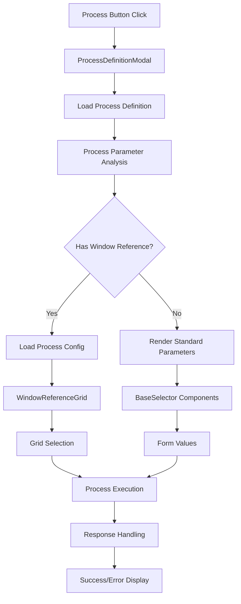

# Process Execution Architecture

This document provides a comprehensive overview of the process execution architecture in Etendo WorkspaceUI, including the technical solution for enhanced process parameter handling, type safety, and execution patterns.

## Overview

The process execution system is designed to handle complex business processes with various parameter types, validation requirements, and execution patterns. The architecture provides a type-safe, extensible, and maintainable solution for process definition, parameter handling, and execution workflows.

## Core Architecture Components

### 1. Type System Architecture

The system uses a comprehensive type system that ensures type safety across all process execution components:

```typescript
// Core Process Types
interface ProcessDefinition {
  id: string;
  name: string;
  javaClassName: string;
  parameters: ProcessParameters;
  onLoad: string;
  onProcess: string;
}

interface ProcessParameter {
  id: string;
  name: string;
  reference: string;
  refList?: RefListOption[];
  defaultValue?: EntityValue;
  mandatory?: boolean;
  tab?: string;
  window?: ProcessWindow;
}

type ProcessParameters = Record<string, ProcessParameter>;
```

### 2. Component Architecture

The system follows a layered component architecture:

```
ProcessDefinitionModal
├── ProcessParameterRenderer
│   ├── WindowReferenceGrid (for window references)
│   ├── BaseSelector (for standard parameters)
│   └── GenericSelector (fallback)
├── ProcessExecutor
│   ├── WindowReferenceExecutor
│   └── StandardProcessExecutor
└── ProcessResponseHandler
```

### 3. Data Flow Architecture



### 4. Configuration System

The system uses a configuration-driven approach for process-specific behavior:

```typescript
interface ProcessDefinitionData {
  inpColumnId: string;
  inpPrimaryKeyColumnId: string;
  defaultKeys: Record<string, string>;
  dynamicKeys: Record<string, string>;
  staticOptions: Record<string, EntityValue>;
}

type ProcessDefinitionRegistry = Record<string, ProcessDefinitionData>;
```

## Key Features

### 1. Type-Safe Parameter Handling

- **Generic Type Parameters**: Support for various parameter types with compile-time type checking
- **Reference Type Mapping**: Automatic mapping between backend reference IDs and frontend component types
- **Value Validation**: Built-in validation based on parameter configuration
- **Default Value Management**: Automatic application of default values from process configuration

### 2. Dynamic UI Generation

- **Component Selection**: Automatic component selection based on parameter reference type
- **Grid Configuration**: Dynamic grid configuration for window reference parameters
- **Form Generation**: Automatic form generation for standard parameters
- **Responsive Layout**: Adaptive layout based on parameter count and types

### 3. Process-Specific Customization

- **Configuration Registry**: Centralized configuration for process-specific behavior
- **Dynamic Options**: Runtime configuration of datasource options
- **Filter Expressions**: Process-specific filter expressions for data retrieval
- **Execution Patterns**: Different execution patterns for different process types

### 4. Error Handling and User Feedback

- **Comprehensive Error States**: Handling of various error conditions
- **User-Friendly Messages**: Localized error and success messages
- **Loading States**: Visual feedback during async operations
- **Validation Feedback**: Real-time validation feedback

## Implementation Patterns

### 1. Component Composition Pattern

The system uses composition over inheritance for component architecture:

```typescript
// Parameter renderer composition
const renderParameter = (parameter: ProcessParameter) => {
  if (parameter.reference === WINDOW_REFERENCE_ID) {
    return <WindowReferenceGrid parameter={parameter} {...gridProps} />;
  }
  return <BaseSelector parameter={parameter} {...selectorProps} />;
};
```

### 2. Configuration-Driven Pattern

Process-specific behavior is driven by configuration rather than hardcoded logic:

```typescript
// Configuration-driven options building
const buildDatasourceOptions = (processId: string, baseOptions: DatasourceOptions) => {
  const config = PROCESS_DEFINITION_DATA[processId];
  if (!config) return baseOptions;
  
  return {
    ...baseOptions,
    ...config.staticOptions,
    ...applyDynamicKeys(config.dynamicKeys, recordValues),
    ...applyDefaultKeys(config.defaultKeys, session)
  };
};
```

### 3. Hook-Based State Management

State management is centralized using custom hooks:

```typescript
// Process configuration hook
const useProcessConfig = (processId: string, windowId: string, tabId: string) => {
  // Configuration loading logic
  // Error handling
  // Caching
};

// Process execution hook
const useProcessExecution = (processDefinition: ProcessDefinition) => {
  // Execution logic
  // Response handling
  // State management
};
```

### 4. Adapter Pattern for Data Transformation

Data transformation between different layers uses adapter patterns:

```typescript
// Parameter to component props adapter
const adaptParameterToProps = (parameter: ProcessParameter): ComponentProps => {
  return {
    id: parameter.id,
    name: parameter.name,
    required: parameter.mandatory || false,
    options: parameter.refList || [],
    defaultValue: parameter.defaultValue
  };
};

// Record values adapter
const adaptRecordValues = (record: EntityData, fields: Field[]): RecordValues => {
  return buildPayloadByInputName(record, fields);
};
```

## Performance Optimizations

### 1. Memoization Strategy

- **Component Memoization**: Heavy components are memoized to prevent unnecessary re-renders
- **Calculation Memoization**: Expensive calculations are memoized with proper dependencies
- **Reference Equality**: Proper use of useCallback and useMemo for reference stability

### 2. Lazy Loading

- **Dynamic Imports**: Components are dynamically imported when needed
- **Data Fetching**: Process configuration and options are loaded on demand
- **Grid Pagination**: Large datasets are loaded incrementally

### 3. Caching Strategy

- **Process Definition Caching**: Process definitions are cached to avoid repeated API calls
- **Configuration Caching**: Process configurations are cached with proper invalidation
- **Component State Caching**: Component states are preserved during navigation

## Security Considerations

### 1. Parameter Validation

- **Input Sanitization**: All user inputs are sanitized before processing
- **Type Validation**: Parameters are validated against their expected types
- **Permission Checking**: Process execution permissions are validated

### 2. Data Access Control

- **Entity-Level Security**: Data access is controlled at the entity level
- **Field-Level Security**: Individual field access is controlled
- **Process-Level Security**: Process execution permissions are enforced

### 3. Error Information Disclosure

- **Error Sanitization**: Error messages are sanitized to prevent information disclosure
- **Logging Strategy**: Detailed errors are logged server-side, user-friendly messages client-side
- **Debug Information**: Debug information is only available in development mode

## Testing Strategy

### 1. Unit Testing

- **Component Testing**: Individual components are unit tested with React Testing Library
- **Hook Testing**: Custom hooks are tested in isolation
- **Utility Testing**: Utility functions are comprehensively unit tested

### 2. Integration Testing

- **Process Flow Testing**: Complete process execution flows are integration tested
- **API Integration Testing**: Backend integration points are tested
- **State Management Testing**: Complex state interactions are integration tested

### 3. End-to-End Testing

- **User Journey Testing**: Complete user workflows are e2e tested
- **Cross-Browser Testing**: Testing across different browsers and devices
- **Performance Testing**: Load and performance testing for complex processes

## Extension Points

### 1. Custom Parameter Types

The system can be extended with new parameter types:

```typescript
// Register new parameter type
REGISTER_PARAMETER_TYPE({
  referenceId: 'CUSTOM_REFERENCE_ID',
  component: CustomParameterComponent,
  validator: customValidator,
  transformer: customTransformer
});
```

### 2. Custom Execution Patterns

New execution patterns can be added:

```typescript
// Register new execution pattern
REGISTER_EXECUTION_PATTERN({
  pattern: 'CUSTOM_PATTERN',
  executor: customExecutor,
  responseHandler: customResponseHandler
});
```

### 3. Custom Process Configurations

Process-specific configurations can be extended:

```typescript
// Add new process configuration
PROCESS_DEFINITION_DATA['NEW_PROCESS_ID'] = {
  inpColumnId: 'Custom_Column_ID',
  inpPrimaryKeyColumnId: 'customPrimaryKey',
  customBehavior: {
    // Custom configuration
  }
};
```

## Migration Guide

### From Legacy Process System

1. **Type Migration**: Update process definitions to use new type system
2. **Component Migration**: Migrate custom components to new architecture
3. **Configuration Migration**: Move hardcoded logic to configuration files
4. **Testing Migration**: Update tests to use new testing patterns

### Breaking Changes

- **ProcessParameter Interface**: Updated interface with new required fields
- **Component Props**: Updated component props for better type safety
- **Hook Signatures**: Updated hook signatures for improved consistency

## Future Enhancements

### 1. Advanced Features

- **Process Workflow Engine**: Support for multi-step process workflows
- **Real-time Collaboration**: Multi-user process execution support
- **Advanced Validation**: Complex validation rules with dependency checking

### 2. Performance Improvements

- **Virtual Scrolling**: For large parameter lists and grids
- **Background Processing**: For long-running processes
- **Caching Improvements**: More sophisticated caching strategies

### 3. Developer Experience

- **Process Designer**: Visual process definition designer
- **Testing Tools**: Enhanced testing utilities for process development
- **Documentation Generation**: Automatic documentation generation from process definitions

## Troubleshooting Guide

### Common Issues

1. **Process Not Loading**: Check process definition configuration
2. **Parameters Not Rendering**: Verify parameter reference types
3. **Execution Failures**: Check parameter validation and permissions
4. **Performance Issues**: Review memoization and caching strategies

### Debug Tools

- **Process Debug Panel**: Shows process execution state and configuration
- **Parameter Inspector**: Displays parameter types and values
- **Performance Profiler**: Identifies performance bottlenecks

## Related Documentation

- [Process Execution Feature Documentation](../features/process-execution/)
- [Component Library Documentation](../components/)
- [API Client Documentation](../api/)
- [Testing Documentation](../testing/)
