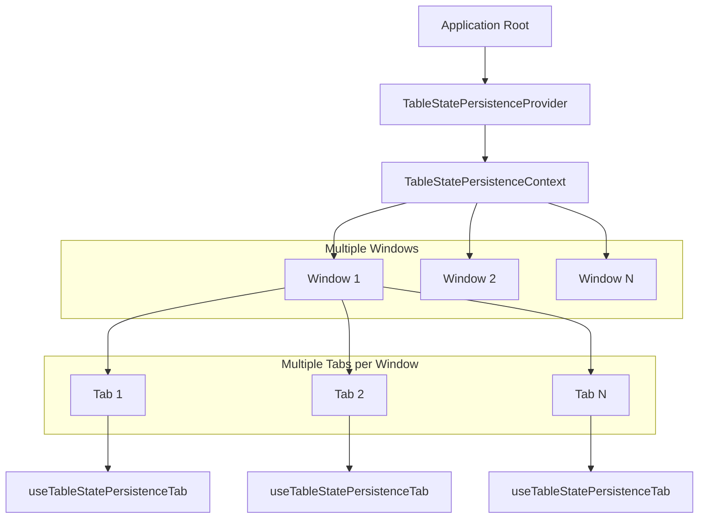

# TableStatePersistenceContext Documentation

## Overview

The `TableStatePersistenceContext` is a React context that provides global state management for table configurations across multiple windows in the Etendo WorkspaceUI. It enables table state persistence when users switch between windows, ensuring that filters, column visibility, sorting, and column order are maintained throughout the user session.

## Location

- **Context Definition**: `packages/MainUI/contexts/tableStatePersistence.tsx`
- **Tab Hook**: `packages/MainUI/hooks/useTableStatePersistenceTab.tsx`
- **Integration**: Wrapped in `packages/MainUI/app/(main)/window/page.tsx`

## Architecture

### State Structure

The context manages a nested state structure that organizes table configurations by window and tab:

```typescript
interface TableStatePersistenceState {
  [windowId: string]: {
    [tabId: string]: {
      table: {
        filters: MRT_ColumnFiltersState;
        visibility: MRT_VisibilityState;
        sorting: MRT_SortingState;
        order: string[];
      }
    }
  }
}
```

### Component Hierarchy



## Core Interface

### TableStatePersistenceContextI

```typescript
interface TableStatePersistenceContextI {
  // State access
  getTableState: (windowId: string, tabId: string) => TableState;
  
  // State setters
  setTableFilters: (windowId: string, tabId: string, filters: MRT_ColumnFiltersState) => void;
  setTableVisibility: (windowId: string, tabId: string, visibility: MRT_VisibilityState) => void;
  setTableSorting: (windowId: string, tabId: string, sorting: MRT_SortingState) => void;
  setTableOrder: (windowId: string, tabId: string, order: string[]) => void;
  
  // Window management
  cleanupWindow: (windowId: string) => void;
  
  // Utility
  getAllState: () => TableStatePersistenceState;
}
```

### TableState

```typescript
interface TableState {
  filters: MRT_ColumnFiltersState;
  visibility: MRT_VisibilityState;
  sorting: MRT_SortingState;
  order: string[];
}
```

## Implementation Details

### Provider Component

```typescript
export default function TableStatePersistenceProvider({ children }: React.PropsWithChildren) {
  const [state, setState] = useState<TableStatePersistenceState>({});

  // Implementation with optimized state management
  // Uses useCallback for all functions to prevent unnecessary re-renders
  // Uses useMemo for context value to optimize provider performance
  
  return (
    <TableStatePersistenceContext.Provider value={value}>
      {children}
    </TableStatePersistenceContext.Provider>
  );
}
```

### Key Features

#### 1. Automatic State Initialization
- Creates nested structure automatically when accessing non-existent window/tab combinations
- Returns safe default values (empty arrays/objects) for new states
- No manual initialization required

#### 2. Immutable State Updates
- All state updates maintain immutability using spread operators
- React state management best practices
- Proper change detection for React re-renders

#### 3. Memory Management
- `cleanupWindow` removes all tab data for a window
- Prevents memory leaks from closed windows
- Efficient garbage collection patterns

#### 4. Performance Optimization
- Uses `useCallback` for all function references
- Uses `useMemo` for context value
- Minimizes unnecessary re-renders

## Usage Patterns

### Direct Context Usage

```typescript
import { useTableStatePersistence } from '@/contexts/tableStatePersistence';

function WindowManager() {
  const {
    getTableState,
    setTableFilters,
    setTableVisibility,
    cleanupWindow,
    getAllState
  } = useTableStatePersistence();

  const handleWindowClose = (windowId: string) => {
    // Clean up all table state for the window
    cleanupWindow(windowId);
  };

  const applyGlobalFilter = (windowId: string, tabId: string) => {
    const currentState = getTableState(windowId, tabId);
    setTableFilters(windowId, tabId, [
      ...currentState.filters,
      { id: 'status', value: 'active' }
    ]);
  };

  return (
    <div>
      <button onClick={() => handleWindowClose('window123')}>
        Close Window
      </button>
      <button onClick={() => applyGlobalFilter('window123', 'tab456')}>
        Apply Filter
      </button>
    </div>
  );
}
```

### Tab-Specific Hook Usage (Recommended)

```typescript
import { useTableStatePersistenceTab } from '@/hooks/useTableStatePersistenceTab';

function TableComponent({ windowId, tabId }) {
  const {
    tableColumnFilters,
    setTableColumnFilters,
    tableColumnVisibility,
    setTableColumnVisibility,
    tableColumnSorting,
    setTableColumnSorting,
    tableColumnOrder,
    setTableColumnOrder,
  } = useTableStatePersistenceTab(windowId, tabId);

  // Use exactly like useState - supports both direct values and updater functions
  const handleFilterChange = (newFilters) => {
    setTableColumnFilters(newFilters);
  };

  const handleVisibilityChange = (updater) => {
    setTableColumnVisibility(prev => ({
      ...prev,
      newColumn: !prev.newColumn
    }));
  };

  return (
    <MaterialReactTable
      state={{
        columnFilters: tableColumnFilters,
        columnVisibility: tableColumnVisibility,
        // ... other state
      }}
      onColumnFiltersChange={setTableColumnFilters}
      onColumnVisibilityChange={setTableColumnVisibility}
      // ... other handlers
    />
  );
}
```

### Integration with Existing Hooks

```typescript
// In useTableData.tsx
export const useTableData = (tab: Tab) => {
  // Replace TabContext table state with persistence hook
  const {
    tableColumnFilters,
    setTableColumnFilters,
    tableColumnVisibility,
    setTableColumnVisibility,
    tableColumnSorting,
    setTableColumnSorting,
    tableColumnOrder,
    setTableColumnOrder,
  } = useTableStatePersistenceTab(tab.window, tab.id);

  // All existing handlers work without modification
  const handleMRTColumnVisibilityChange = useCallback(
    (updater: MRT_VisibilityUpdater<EntityData>) => {
      setTableColumnVisibility(updater);
    },
    [setTableColumnVisibility]
  );

  return {
    // ... other returns
    tableColumnFilters,
    setTableColumnFilters,
    tableColumnVisibility,
    setTableColumnVisibility,
    // ... other table state
  };
};
```

## Error Handling

### Context Validation

```typescript
export const useTableStatePersistence = () => {
  const context = useContext(TableStatePersistenceContext);

  if (!context) {
    throw new Error("useTableStatePersistence must be used within a TableStatePersistenceProvider");
  }

  return context;
};
```

### Safe State Access

```typescript
const getTableState = useCallback(
  (windowId: string, tabId: string): TableState => {
    const defaultState: TableState = {
      filters: [],
      visibility: {},
      sorting: [],
      order: [],
    };

    if (!state[windowId] || !state[windowId][tabId]) {
      return defaultState;
    }

    return state[windowId][tabId].table || defaultState;
  },
  [state]
);
```

## Testing Patterns

### Mock Setup

```typescript
import { useTableStatePersistence } from '@/contexts/tableStatePersistence';

// Mock the hook
jest.mock('@/contexts/tableStatePersistence');
const mockUseTableStatePersistence = jest.mocked(useTableStatePersistence);

// Setup mock return value
const mockContextValue = {
  getTableState: jest.fn().mockReturnValue({
    filters: [],
    visibility: {},
    sorting: [],
    order: []
  }),
  setTableFilters: jest.fn(),
  setTableVisibility: jest.fn(),
  setTableSorting: jest.fn(),
  setTableOrder: jest.fn(),
  cleanupWindow: jest.fn(),
  getAllState: jest.fn().mockReturnValue({})
};

beforeEach(() => {
  mockUseTableStatePersistence.mockReturnValue(mockContextValue);
});
```

### Provider Testing

```typescript
import { renderHook } from '@testing-library/react';
import TableStatePersistenceProvider from '@/contexts/tableStatePersistence';
import { useTableStatePersistenceTab } from '@/hooks/useTableStatePersistenceTab';

const wrapper = ({ children }) => (
  <TableStatePersistenceProvider>{children}</TableStatePersistenceProvider>
);

test('should provide table state persistence', () => {
  const { result } = renderHook(
    () => useTableStatePersistenceTab('window1', 'tab1'),
    { wrapper }
  );

  expect(result.current.tableColumnFilters).toEqual([]);
  expect(result.current.setTableColumnFilters).toBeInstanceOf(Function);
});
```

### State Isolation Testing

```typescript
test('should isolate state between different windows and tabs', () => {
  const { result: tab1 } = renderHook(
    () => useTableStatePersistenceTab('window1', 'tab1'),
    { wrapper }
  );
  
  const { result: tab2 } = renderHook(
    () => useTableStatePersistenceTab('window1', 'tab2'),
    { wrapper }
  );

  const { result: tab3 } = renderHook(
    () => useTableStatePersistenceTab('window2', 'tab1'),
    { wrapper }
  );

  act(() => {
    tab1.current.setTableColumnFilters([{ id: 'name', value: 'test1' }]);
    tab2.current.setTableColumnFilters([{ id: 'status', value: 'test2' }]);
    tab3.current.setTableColumnFilters([{ id: 'date', value: 'test3' }]);
  });

  expect(tab1.current.tableColumnFilters).toEqual([{ id: 'name', value: 'test1' }]);
  expect(tab2.current.tableColumnFilters).toEqual([{ id: 'status', value: 'test2' }]);
  expect(tab3.current.tableColumnFilters).toEqual([{ id: 'date', value: 'test3' }]);
});
```

### Cleanup Testing

```typescript
test('should cleanup window state properly', () => {
  const { result: contextHook } = renderHook(
    () => useTableStatePersistence(),
    { wrapper }
  );

  // Set some state
  act(() => {
    contextHook.current.setTableFilters('window1', 'tab1', [{ id: 'test', value: 'value' }]);
    contextHook.current.setTableFilters('window2', 'tab1', [{ id: 'test', value: 'value' }]);
  });

  // Verify state exists
  expect(Object.keys(contextHook.current.getAllState())).toHaveLength(2);

  // Cleanup one window
  act(() => {
    contextHook.current.cleanupWindow('window1');
  });

  // Verify cleanup
  const state = contextHook.current.getAllState();
  expect(state.window1).toBeUndefined();
  expect(state.window2).toBeDefined();
});
```

## Performance Characteristics

### Memory Usage
- **Efficient Storage**: Only stores actual configurations, not component instances
- **Automatic Cleanup**: Memory freed when windows are closed
- **Nested Structure**: Minimizes object creation and memory overhead

### State Access Performance
- **Direct Object Access**: O(1) access time for state retrieval
- **Memoized Functions**: Prevents unnecessary function re-creation
- **Optimized Updates**: Minimal re-renders through proper React patterns

### React Optimization
- **useCallback**: All functions are memoized to prevent unnecessary re-renders
- **useMemo**: Context value is memoized for provider optimization
- **Stable References**: Function references remain stable across re-renders

## Best Practices

### 1. Provider Placement
```typescript
// ✅ Correct: Place at application root
function App() {
  return (
    <TableStatePersistenceProvider>
      <MainApplication />
    </TableStatePersistenceProvider>
  );
}

// ❌ Incorrect: Multiple providers
function Component() {
  return (
    <TableStatePersistenceProvider> {/* Nested provider - avoid */}
      <SubComponent />
    </TableStatePersistenceProvider>
  );
}
```

### 2. Hook Usage
```typescript
// ✅ Preferred: Use tab-specific hook
const {
  tableColumnFilters,
  setTableColumnFilters
} = useTableStatePersistenceTab(windowId, tabId);

// ⚠️ Advanced: Use direct context for special cases
const { getTableState, setTableFilters } = useTableStatePersistence();
```

### 3. State Updates
```typescript
// ✅ Both patterns supported
setTableColumnFilters([{ id: 'name', value: 'test' }]); // Direct value
setTableColumnFilters(prev => [...prev, newFilter]);    // Updater function

// ✅ Batch related updates
act(() => {
  setTableColumnFilters(newFilters);
  setTableColumnVisibility(newVisibility);
  setTableColumnSorting(newSorting);
});
```

### 4. Memory Management
```typescript
// ✅ Always cleanup when closing windows
const handleWindowClose = (windowId: string) => {
  cleanupWindow(windowId); // Clean persistence state first
  closeWindow(windowId);   // Then close window
};

// ✅ Monitor state in development
const debugState = () => {
  console.log('Current state size:', Object.keys(getAllState()).length);
};
```

## Troubleshooting

### Common Issues

#### Context Not Available
**Error**: "useTableStatePersistence must be used within a TableStatePersistenceProvider"

**Solution**: Ensure `TableStatePersistenceProvider` wraps your component tree:
```typescript
// Add provider at app root
<TableStatePersistenceProvider>
  <YourApp />
</TableStatePersistenceProvider>
```

#### State Not Persisting
**Problem**: Table configurations are lost between window switches.

**Debugging**:
```typescript
const { getAllState } = useTableStatePersistence();

useEffect(() => {
  console.log('Current state:', getAllState());
}, []);
```

**Common Causes**:
- Incorrect `windowId` or `tabId` parameters
- Multiple provider instances
- State updates not using proper setter functions

#### Memory Leaks
**Problem**: Memory usage grows with window/tab usage.

**Detection**:
```typescript
// Monitor state growth
const stateSize = Object.keys(getAllState()).reduce((acc, windowId) => {
  return acc + Object.keys(getAllState()[windowId]).length;
}, 0);
console.log('Total tabs in state:', stateSize);
```

**Solutions**:
- Ensure `cleanupWindow` is called when closing windows
- Check for retained references to old state objects
- Monitor component unmounting in React DevTools

### Debugging Tools

#### State Inspector
```typescript
function StateInspector() {
  const { getAllState } = useTableStatePersistence();
  
  return (
    <details>
      <summary>Table State Inspector</summary>
      <pre>{JSON.stringify(getAllState(), null, 2)}</pre>
    </details>
  );
}
```

#### Performance Monitor
```typescript
function usePerformanceMonitor(windowId: string, tabId: string) {
  const { getTableState } = useTableStatePersistence();
  
  useEffect(() => {
    const start = performance.now();
    const state = getTableState(windowId, tabId);
    const duration = performance.now() - start;
    
    if (duration > 1) {
      console.warn(`Slow state access: ${duration}ms for ${windowId}/${tabId}`);
    }
  });
}
```

## Migration from TabContext

### Before (TabContext)
```typescript
// Old pattern in TabContext
const {
  tableColumnFilters,
  setTableColumnFilters,
  tableColumnVisibility,
  setTableColumnVisibility
} = useTabContext();
```

### After (TableStatePersistenceContext)
```typescript
// New pattern with persistence
const {
  tableColumnFilters,
  setTableColumnFilters,
  tableColumnVisibility,
  setTableColumnVisibility
} = useTableStatePersistenceTab(tab.window, tab.id);
```

### Migration Checklist
- [ ] Replace `useTabContext` table state with `useTableStatePersistenceTab`
- [ ] Add `TableStatePersistenceProvider` to app root
- [ ] Remove table state from `TabContext` interface
- [ ] Add window cleanup to window close handlers
- [ ] Update tests to use new provider
- [ ] Verify state persistence works across window switches

## Related Documentation

- [Table State Persistence Feature](../features/table-state-persistence/README.md)
- [React Patterns](../patterns/react-patterns.md)
- [Architecture Overview](../architecture/overview.md)
- [UserContext Documentation](./user-context.md)

---

**Last Updated**: October 8, 2025  
**Version**: 1.0  
**Context Location**: `packages/MainUI/contexts/tableStatePersistence.tsx`