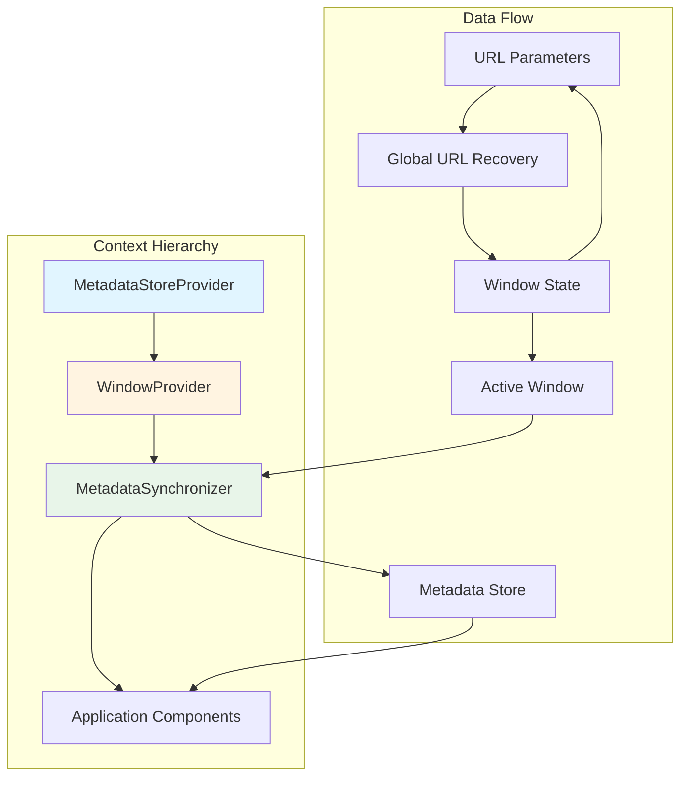

# Window Context Architecture Documentation

## Overview

The Window Context Architecture is a three-tier system that manages window state, metadata, and synchronization in the Etendo WorkspaceUI application. This architecture separates concerns between:

1. **MetadataStoreProvider**: Centralized storage for window metadata
2. **WindowProvider**: Window state management, navigation, and URL synchronization
3. **MetadataSynchronizer**: Automatic metadata loading based on active window

This separation enables efficient state management, automatic metadata loading, and seamless window navigation while maintaining a clean separation of concerns.

## Location

- **WindowProvider**: `packages/MainUI/contexts/window.tsx`
- **MetadataStoreProvider**: `packages/MainUI/contexts/metadataStore.tsx`
- **MetadataSynchronizer & useMetadataContext**: `packages/MainUI/contexts/metadata.tsx`
- **Type Definitions**: `packages/MainUI/utils/window/constants.ts`
- **Integration**: `packages/MainUI/app/layout.tsx`

## Architecture

### Context Hierarchy

The contexts are nested in a specific order in `layout.tsx` to ensure proper data flow:

```tsx
<MetadataStoreProvider>
  <WindowProvider>
    <MetadataSynchronizer />
    <LoadingProvider>
      <Layout>{children}</Layout>
    </LoadingProvider>
  </WindowProvider>
</MetadataStoreProvider>
```

### Architecture Diagram



### Data Flow

1. **URL → WindowProvider**: URL parameters are parsed and recovered into window state
2. **WindowProvider → MetadataSynchronizer**: Active window changes trigger synchronization
3. **MetadataSynchronizer → MetadataStoreProvider**: Metadata is loaded for the active window
4. **MetadataStoreProvider → Application**: Components access metadata via `useMetadataContext`
5. **WindowProvider → URL**: Window state changes are synchronized back to URL

## WindowProvider

### Purpose

The `WindowProvider` is the core state management system for windows in the application. It manages:

- Multiple window instances with unique identifiers
- Window activation and navigation state
- Tab-level state (table filters, sorting, visibility, form state)
- Selected record tracking per tab
- URL synchronization for browser navigation and page refresh recovery
- Integration with the global URL state recovery system

### State Structure

```typescript
interface WindowContextState {
  [windowIdentifier: string]: WindowState;
}

interface WindowState {
  windowId: string;              // Base window ID (e.g., "800001")
  windowIdentifier: string;      // Unique instance ID (e.g., "800001_1")
  title: string;                 // Window title
  isActive: boolean;             // Whether this window is currently active
  initialized: boolean;          // Whether window has been fully initialized
  navigation: NavigationState;   // Tab navigation state
  tabs: {
    [tabId: string]: TabState;   // Tab-specific state
  };
}

interface NavigationState {
  activeLevels: number[];                    // Active tab levels (e.g., [0, 1])
  activeTabsByLevel: Map<number, string>;    // Active tab ID per level
  initialized: boolean;                      // Whether navigation is initialized
}

interface TabState {
  table: TableState;           // Table configuration
  form: TabFormState;          // Form state (mode, recordId)
  level: number;               // Tab level in hierarchy
  selectedRecord?: string;     // Currently selected record ID
}

interface TableState {
  filters: MRT_ColumnFiltersState;      // Column filters
  visibility: MRT_VisibilityState;      // Column visibility
  sorting: MRT_SortingState;            // Column sorting
  order: string[];                      // Column order
  isImplicitFilterApplied?: boolean;    // Implicit filter state
}
```

### Core API

#### State Getters

```typescript
interface WindowContextI {
  // Window access
  getActiveWindowIdentifier: () => string | null;
  getActiveWindow: () => WindowState | null;
  getAllWindows: () => WindowState[];
  getAllWindowsIdentifiers: () => string[];
  getActiveWindowProperty: (propertyName: string) => string | boolean | object | null;
  getAllState: () => WindowContextState;
  
  // Computed values
  windows: WindowState[];
  activeWindow: WindowState | null;
  isHomeRoute: boolean;
  
  // Tab state access
  getTableState: (windowIdentifier: string, tabId: string) => TableState;
  getNavigationState: (windowIdentifier: string) => NavigationState;
  getTabFormState: (windowIdentifier: string, tabId: string) => TabFormState | undefined;
  getSelectedRecord: (windowIdentifier: string, tabId: string) => string | undefined;
  getNavigationInitialized: (windowIdentifier: string) => boolean;
}
```

#### State Setters

```typescript
interface WindowContextI {
  // Window management
  setWindowActive: (params: {
    windowIdentifier: string;
    windowData?: Partial<WindowState>;
  }) => void;
  setWindowInactive: (windowIdentifier: string) => void;
  setAllWindowsInactive: () => void;
  cleanupWindow: (windowIdentifier: string) => void;
  cleanState: () => void;
  
  // Table state setters
  setTableFilters: (
    windowIdentifier: string,
    tabId: string,
    filters: MRT_ColumnFiltersState,
    tabLevel?: number
  ) => void;
  setTableVisibility: (
    windowIdentifier: string,
    tabId: string,
    visibility: MRT_VisibilityState,
    tabLevel?: number
  ) => void;
  setTableSorting: (
    windowIdentifier: string,
    tabId: string,
    sorting: MRT_SortingState,
    tabLevel?: number
  ) => void;
  setTableOrder: (
    windowIdentifier: string,
    tabId: string,
    order: string[],
    tabLevel?: number
  ) => void;
  setTableImplicitFilterApplied: (
    windowIdentifier: string,
    tabId: string,
    isApplied: boolean,
    tabLevel?: number
  ) => void;
  
  // Navigation setters
  setNavigationActiveLevels: (windowIdentifier: string, activeLevels: number[]) => void;
  setNavigationActiveTabsByLevel: (
    windowIdentifier: string,
    activeTabsByLevel: Map<number, string>
  ) => void;
  setNavigationInitialized: (windowIdentifier: string, initialized: boolean) => void;
  
  // Form state management
  setTabFormState: (
    windowIdentifier: string,
    tabId: string,
    formState: TabFormState,
    tabLevel?: number
  ) => void;
  clearTabFormState: (windowIdentifier: string, tabId: string) => void;
  
  // Selected record management
  setSelectedRecord: (
    windowIdentifier: string,
    tabId: string,
    recordId: string,
    tabLevel?: number
  ) => void;
  clearSelectedRecord: (windowIdentifier: string, tabId: string) => void;
  clearChildrenSelections: (
    windowIdentifier: string,
    childTabIds: string[],
    isParentSelectionChanging?: boolean
  ) => void;
  setSelectedRecordAndClearChildren: (
    windowIdentifier: string,
    tabId: string,
    recordId: string,
    childTabIds: string[]
  ) => void;
}
```

#### Recovery State

```typescript
interface WindowContextI {
  // Recovery state (from useGlobalUrlStateRecovery hook)
  isRecoveryLoading: boolean;
  recoveryError: string | null;
}
```

### Key Features

#### 1. URL Synchronization

The `WindowProvider` maintains bidirectional synchronization between window state and the browser URL:

```typescript
/**
 * Synchronize window state to URL
 * 
 * Purpose: Maintains bidirectional synchronization between the window context state 
 * and the browser URL. This enables:
 * - Browser back/forward navigation
 * - Page refresh recovery
 * - Shareable URLs with specific window states
 */
useEffect(() => {
  // Only update URL if not recovering and all windows are initialized
  if (isRecoveryLoading) {
    return;
  }

  if (windows.length === 0) {
    return;
  }

  const newParams = buildWindowsUrlParams(windows);
  const currentParams = searchParams?.toString() || "";

  // Only update if params have changed to avoid unnecessary navigation
  if (newParams !== currentParams) {
    const newUrl = newParams ? `window?${newParams}` : "window";
    router.replace(newUrl);
  }
}, [windows, router, searchParams, isRecoveryLoading]);
```

**Critical Guards**:
- `!isRecoveryLoading`: Prevents URL updates during recovery (URL is source of truth)
- `windows.length === 0`: Prevents unnecessary updates when no windows exist
- `newParams !== currentParams`: Avoids redundant navigation calls

#### 2. State Recovery from URL

The provider integrates with the global URL state recovery system:

```typescript
/**
 * Initialize state from recovered windows
 * 
 * Purpose: Populates the WindowContext state with fully recovered window objects
 * once the global recovery process is complete.
 * 
 * Flow:
 * 1. Waits for global recovery to finish (!isRecoveryLoading)
 * 2. Checks if any windows were recovered
 * 3. Transforms the array of recovered windows into WindowContextState map format
 * 4. Updates the provider state, effectively "mounting" all windows at once
 */
useEffect(() => {
  if (!isRecoveryLoading && recoveredWindows.length > 0) {
    const windowsMap = recoveredWindows.reduce((acc, win) => {
      acc[win.windowIdentifier] = win;
      return acc;
    }, {} as WindowContextState);

    setState(windowsMap);
  }
}, [isRecoveryLoading, recoveredWindows]);
```

#### 3. Automatic Tab Structure Creation

When setting tab state, the provider automatically creates the necessary nested structure:

```typescript
const setTableFilters = useCallback(
  (windowIdentifier: string, tabId: string, filters: MRT_ColumnFiltersState, tabLevel = 0) => {
    setState((prevState: WindowContextState) =>
      updateTableProperty(prevState, windowIdentifier, tabId, "filters", filters, tabLevel)
    );
  },
  []
);

// Helper function ensures tab exists before updating
function ensureTabExists(
  state: WindowContextState,
  windowIdentifier: string,
  tabId: string,
  tabLevel: number
): WindowContextState {
  // Creates window and tab structure if it doesn't exist
  // Returns state with guaranteed tab structure
}
```

#### 4. Selected Record Management with Child Cleanup

The provider includes sophisticated logic for managing selected records and their child tabs:

```typescript
const setSelectedRecordAndClearChildren = useCallback(
  (windowIdentifier: string, tabId: string, recordId: string, childTabIds: string[]) => {
    const previousRecordId = getSelectedRecord(windowIdentifier, tabId);
    const isParentSelectionChanging = previousRecordId !== recordId;

    // Set the selected record
    setSelectedRecord(windowIdentifier, tabId, recordId);
    
    // Clear children selections (preserves FormView children unless parent changes)
    clearChildrenSelections(windowIdentifier, childTabIds, isParentSelectionChanging);
  },
  [state, getSelectedRecord, setSelectedRecord, clearChildrenSelections]
);

const clearChildrenSelections = useCallback(
  (windowIdentifier: string, childTabIds: string[], isParentSelectionChanging = false) => {
    for (const tabId of childTabIds) {
      const childState = getTabFormState(windowIdentifier, tabId);
      const isInFormView = childState?.mode === TAB_MODES.FORM;

      // Only clean if not in FormView OR if parent selection is changing (forced clean)
      const shouldClean = !isInFormView || isParentSelectionChanging;

      if (shouldClean) {
        const selectedRecord = getSelectedRecord(windowIdentifier, tabId);
        if (selectedRecord) {
          clearSelectedRecord(windowIdentifier, tabId);
        }
        clearTabFormState(windowIdentifier, tabId);
      }
    }
  },
  [state, getTabFormState, getSelectedRecord, clearSelectedRecord, clearTabFormState]
);
```

#### 5. Window Cleanup with Smart Activation

When a window is closed, the provider automatically activates another window:

```typescript
const cleanupWindow = useCallback((windowIdentifier: string) => {
  setState((prevState: WindowContextState) => {
    const newState = { ...prevState };
    const windowToDelete = newState[windowIdentifier];
    const wasActive = windowToDelete.isActive;
    const allWindowIdentifiers = Object.keys(newState);

    // Delete the window
    delete newState[windowIdentifier];

    // If the deleted window was active and there are remaining windows
    if (wasActive && allWindowIdentifiers.length > 1) {
      const deletedWindowIndex = allWindowIdentifiers.indexOf(windowIdentifier);
      let windowToActivate: string | null = null;

      // Try to activate the previous window first
      if (deletedWindowIndex > 0) {
        windowToActivate = allWindowIdentifiers[deletedWindowIndex - 1];
      }
      // If no previous window, activate the next one
      else if (deletedWindowIndex < allWindowIdentifiers.length - 1) {
        windowToActivate = allWindowIdentifiers[deletedWindowIndex + 1];
      }

      // Activate the selected window
      if (windowToActivate && newState[windowToActivate]) {
        newState[windowToActivate] = {
          ...newState[windowToActivate],
          isActive: true,
        };
      }
    }

    return newState;
  });
}, []);
```

## MetadataStoreProvider

### Purpose

The `MetadataStoreProvider` is a centralized store for window metadata. It:

- Stores window metadata fetched from the API
- Manages loading states per window
- Handles errors per window
- Provides caching to avoid redundant API calls
- Decouples metadata management from window state management

### State Structure

```typescript
interface IMetadataStoreContext {
  windowsData: Record<string, Etendo.WindowMetadata>;
  loadingWindows: Record<string, boolean>;
  errors: Record<string, Error | undefined>;
  
  loadWindowData: (windowId: string) => Promise<Etendo.WindowMetadata>;
  getWindowMetadata: (windowId: string) => Etendo.WindowMetadata | undefined;
  isWindowLoading: (windowId: string) => boolean;
  getWindowError: (windowId: string) => Error | undefined;
}
```

### Implementation Details

```typescript
export function MetadataStoreProvider({ children }: React.PropsWithChildren) {
  const [windowsData, setWindowsData] = useState<Record<string, Etendo.WindowMetadata>>({});
  const [loadingWindows, setLoadingWindows] = useState<Record<string, boolean>>({});
  const [errors, setErrors] = useState<Record<string, Error | undefined>>({});

  const loadWindowData = useCallback(
    async (windowId: string): Promise<Etendo.WindowMetadata> => {
      // If already loaded, return it
      if (windowsData[windowId]) {
        return windowsData[windowId];
      }

      try {
        setLoadingWindows((prev) => ({ ...prev, [windowId]: true }));
        setErrors((prev) => ({ ...prev, [windowId]: undefined }));

        logger.info(`[MetadataStore] Loading metadata for window ${windowId}`);

        // Clear cache and force reload
        Metadata.clearWindowCache(windowId);
        const newWindowData = await Metadata.forceWindowReload(windowId);

        setWindowsData((prev) => ({ ...prev, [windowId]: newWindowData }));

        return newWindowData;
      } catch (err) {
        const error = err as Error;
        logger.warn(`[MetadataStore] Error loading window ${windowId}:`, error);

        setErrors((prev) => ({ ...prev, [windowId]: error }));
        throw error;
      } finally {
        setLoadingWindows((prev) => ({ ...prev, [windowId]: false }));
      }
    },
    [windowsData]
  );

  // ... getters implementation
}
```

### Key Features

#### 1. Automatic Caching

The store automatically caches loaded metadata:

```typescript
const loadWindowData = useCallback(
  async (windowId: string): Promise<Etendo.WindowMetadata> => {
    // If already loaded, return it immediately
    if (windowsData[windowId]) {
      return windowsData[windowId];
    }
    
    // Otherwise, load from API
    // ...
  },
  [windowsData]
);
```

#### 2. Per-Window Loading States

Each window has its own loading state, allowing for independent loading indicators:

```typescript
const isWindowLoading = useCallback(
  (windowId: string) => {
    return loadingWindows[windowId] || false;
  },
  [loadingWindows]
);
```

#### 3. Per-Window Error Handling

Errors are tracked per window, allowing for granular error handling:

```typescript
const getWindowError = useCallback(
  (windowId: string) => {
    return errors[windowId];
  },
  [errors]
);
```

## MetadataSynchronizer

### Purpose

The `MetadataSynchronizer` is a component (not a provider) that automatically loads metadata when the active window changes. It acts as a bridge between `WindowProvider` and `MetadataStoreProvider`.

### Implementation

```typescript
export const MetadataSynchronizer = () => {
  const { activeWindow } = useWindowContext();
  const { loadWindowData, isWindowLoading, windowsData } = useMetadataStore();

  useEffect(() => {
    if (
      activeWindow?.windowId &&
      !windowsData[activeWindow.windowId] &&
      !isWindowLoading(activeWindow.windowId)
    ) {
      loadWindowData(activeWindow.windowId).catch(console.error);
    }
  }, [activeWindow?.windowId, windowsData, isWindowLoading, loadWindowData]);

  return null;
};
```

### Synchronization Logic

The synchronizer triggers metadata loading when:

1. There is an active window (`activeWindow?.windowId`)
2. Metadata for that window is not already loaded (`!windowsData[activeWindow.windowId]`)
3. Metadata is not currently being loaded (`!isWindowLoading(activeWindow.windowId)`)

This ensures:
- Metadata is loaded automatically when switching windows
- No redundant API calls are made
- Loading states are properly managed

## useMetadataContext Hook

### Purpose

The `useMetadataContext` hook is a convenience hook that combines `WindowProvider` and `MetadataStoreProvider` to provide a unified interface for accessing window metadata and related utilities.

### Implementation

```typescript
export const useMetadataContext = (): IMetadataContext => {
  const { activeWindow } = useWindowContext();
  const {
    getWindowMetadata,
    isWindowLoading,
    getWindowError,
    loadWindowData,
    windowsData,
    loadingWindows,
    errors
  } = useMetadataStore();
  const { removeRecordFromDatasource } = useDatasourceContext();

  const currentWindowId = activeWindow?.windowId;
  const currentWindowIdentifier = activeWindow?.windowIdentifier;
  const currentWindow = currentWindowId ? getWindowMetadata(currentWindowId) : undefined;

  const currentGroupedTabs = useMemo(
    () => (currentWindow ? groupTabsByLevel(currentWindow) : []),
    [currentWindow]
  );
  
  const currentTabs = useMemo(
    () => (currentWindow?.tabs ? mapBy(currentWindow.tabs, "id") : {}),
    [currentWindow]
  );

  return {
    windowId: currentWindowId,
    windowIdentifier: currentWindowIdentifier,
    window: currentWindow,
    loading: currentWindowId ? isWindowLoading(currentWindowId) : false,
    error: currentWindowId ? getWindowError(currentWindowId) : undefined,
    groupedTabs: currentGroupedTabs,
    tabs: currentTabs,
    removeRecord: (tabId, recordId) => removeRecordFromDatasource(tabId, recordId),
    loadWindowData,
    getWindowMetadata,
    isWindowLoading,
    getWindowError,
    windowsData,
    loadingWindows,
    errors,
  };
};
```

### Computed Values

The hook provides several computed values for convenience:

- `windowId`: Current active window ID
- `windowIdentifier`: Current active window identifier
- `window`: Current active window metadata
- `loading`: Loading state for current window
- `error`: Error state for current window
- `groupedTabs`: Tabs grouped by level for the current window
- `tabs`: Tabs indexed by ID for the current window

## Usage Patterns

### Accessing Window State

```typescript
import { useWindowContext } from '@/contexts/window';

function WindowManager() {
  const {
    activeWindow,
    windows,
    isHomeRoute,
    setWindowActive,
    cleanupWindow
  } = useWindowContext();

  const handleWindowSwitch = (windowIdentifier: string) => {
    setWindowActive({ windowIdentifier });
  };

  const handleWindowClose = (windowIdentifier: string) => {
    cleanupWindow(windowIdentifier);
  };

  return (
    <div>
      <h2>Active Window: {activeWindow?.title}</h2>
      <p>Total Windows: {windows.length}</p>
      {windows.map(win => (
        <button
          key={win.windowIdentifier}
          onClick={() => handleWindowSwitch(win.windowIdentifier)}
        >
          {win.title}
        </button>
      ))}
    </div>
  );
}
```

### Managing Tab State

```typescript
import { useWindowContext } from '@/contexts/window';

function TableComponent({ windowIdentifier, tabId }) {
  const {
    getTableState,
    setTableFilters,
    setTableVisibility,
    setTableSorting
  } = useWindowContext();

  const tableState = getTableState(windowIdentifier, tabId);

  const handleFilterChange = (newFilters) => {
    setTableFilters(windowIdentifier, tabId, newFilters);
  };

  return (
    <MaterialReactTable
      state={{
        columnFilters: tableState.filters,
        columnVisibility: tableState.visibility,
        sorting: tableState.sorting,
      }}
      onColumnFiltersChange={handleFilterChange}
      // ... other props
    />
  );
}
```

### Using Metadata Context

```typescript
import { useMetadataContext } from '@/contexts/metadata';

function WindowContent() {
  const {
    window,
    loading,
    error,
    groupedTabs,
    tabs,
    windowId,
    windowIdentifier
  } = useMetadataContext();

  if (loading) {
    return <LoadingSpinner />;
  }

  if (error) {
    return <ErrorDisplay error={error} />;
  }

  if (!window) {
    return <NoWindowSelected />;
  }

  return (
    <div>
      <h1>{window.name}</h1>
      <TabNavigation groupedTabs={groupedTabs} />
      <TabContent tabs={tabs} />
    </div>
  );
}
```

### Managing Selected Records

```typescript
import { useWindowContext } from '@/contexts/window';

function RecordSelector({ windowIdentifier, tabId, childTabIds }) {
  const {
    getSelectedRecord,
    setSelectedRecordAndClearChildren
  } = useWindowContext();

  const selectedRecord = getSelectedRecord(windowIdentifier, tabId);

  const handleRecordSelect = (recordId: string) => {
    // Automatically clears child tab selections
    setSelectedRecordAndClearChildren(
      windowIdentifier,
      tabId,
      recordId,
      childTabIds
    );
  };

  return (
    <RecordList
      selectedRecord={selectedRecord}
      onSelect={handleRecordSelect}
    />
  );
}
```

## Testing Patterns

### Mocking WindowProvider

```typescript
import { useWindowContext } from '@/contexts/window';

jest.mock('@/contexts/window');
const mockUseWindowContext = jest.mocked(useWindowContext);

const mockWindowContext = {
  windows: [],
  activeWindow: null,
  isHomeRoute: true,
  getTableState: jest.fn(),
  setTableFilters: jest.fn(),
  setWindowActive: jest.fn(),
  cleanupWindow: jest.fn(),
  // ... other methods
};

beforeEach(() => {
  mockUseWindowContext.mockReturnValue(mockWindowContext);
});
```

### Mocking MetadataStore

```typescript
import { useMetadataStore } from '@/contexts/metadataStore';

jest.mock('@/contexts/metadataStore');
const mockUseMetadataStore = jest.mocked(useMetadataStore);

const mockMetadataStore = {
  windowsData: {},
  loadingWindows: {},
  errors: {},
  loadWindowData: jest.fn(),
  getWindowMetadata: jest.fn(),
  isWindowLoading: jest.fn(),
  getWindowError: jest.fn(),
};

beforeEach(() => {
  mockUseMetadataStore.mockReturnValue(mockMetadataStore);
});
```

### Testing with Providers

```typescript
import { renderHook } from '@testing-library/react';
import WindowProvider from '@/contexts/window';
import { MetadataStoreProvider } from '@/contexts/metadataStore';

const wrapper = ({ children }) => (
  <MetadataStoreProvider>
    <WindowProvider>{children}</WindowProvider>
  </MetadataStoreProvider>
);

test('should manage window state', () => {
  const { result } = renderHook(() => useWindowContext(), { wrapper });

  act(() => {
    result.current.setWindowActive({
      windowIdentifier: 'window1',
      windowData: { title: 'Test Window' }
    });
  });

  expect(result.current.activeWindow?.windowIdentifier).toBe('window1');
  expect(result.current.activeWindow?.title).toBe('Test Window');
});
```

## Performance Characteristics

### WindowProvider

- **State Access**: O(1) direct object access
- **Memoization**: All functions use `useCallback`, context value uses `useMemo`
- **Immutable Updates**: Proper React state management prevents unnecessary re-renders
- **URL Sync**: Debounced through React's batching and conditional updates

### MetadataStoreProvider

- **Caching**: Metadata loaded once per window, cached indefinitely
- **Loading States**: Per-window loading prevents blocking unrelated windows
- **Error Isolation**: Errors in one window don't affect others

### MetadataSynchronizer

- **Minimal Overhead**: Renders `null`, only runs effect on active window change
- **Smart Loading**: Checks cache before triggering API calls
- **Automatic**: No manual intervention required

## Best Practices

### 1. Provider Placement

```typescript
// ✅ Correct: Follow the established hierarchy
<MetadataStoreProvider>
  <WindowProvider>
    <MetadataSynchronizer />
    <YourApp />
  </WindowProvider>
</MetadataStoreProvider>

// ❌ Incorrect: Wrong order
<WindowProvider>
  <MetadataStoreProvider> {/* WindowProvider needs MetadataStore */}
    <YourApp />
  </MetadataStoreProvider>
</WindowProvider>
```

### 2. Hook Selection

```typescript
// ✅ Use useMetadataContext for metadata access
const { window, loading, error } = useMetadataContext();

// ✅ Use useWindowContext for window state management
const { activeWindow, setWindowActive } = useWindowContext();

// ✅ Use useMetadataStore only for direct store access (rare)
const { loadWindowData, windowsData } = useMetadataStore();
```

### 3. Window Cleanup

```typescript
// ✅ Always cleanup when closing windows
const handleWindowClose = (windowIdentifier: string) => {
  cleanupWindow(windowIdentifier); // Removes all window state
};

// ✅ Cleanup all windows when logging out
const handleLogout = () => {
  cleanState(); // Clears entire window context
};
```

### 4. State Updates

```typescript
// ✅ Use specific setters for better performance
setTableFilters(windowIdentifier, tabId, newFilters);
setTableVisibility(windowIdentifier, tabId, newVisibility);

// ✅ Batch related updates in the same render cycle
const updateTableState = () => {
  setTableFilters(windowIdentifier, tabId, filters);
  setTableSorting(windowIdentifier, tabId, sorting);
  setTableOrder(windowIdentifier, tabId, order);
};
```

### 5. Selected Record Management

```typescript
// ✅ Use setSelectedRecordAndClearChildren for parent-child relationships
setSelectedRecordAndClearChildren(
  windowIdentifier,
  parentTabId,
  recordId,
  childTabIds
);

// ✅ Use clearSelectedRecord for simple deselection
clearSelectedRecord(windowIdentifier, tabId);

// ⚠️ Manual cleanup only when you need custom logic
setSelectedRecord(windowIdentifier, tabId, recordId);
clearChildrenSelections(windowIdentifier, childTabIds, true);
```

## Troubleshooting

### Common Issues

#### Context Not Available

**Error**: "useWindowContext must be used within a WindowProvider"

**Solution**: Ensure `WindowProvider` wraps your component tree in `layout.tsx`:

```typescript
<WindowProvider>
  <YourComponent />
</WindowProvider>
```

#### Metadata Not Loading

**Problem**: Window metadata is not loading when switching windows.

**Debugging**:

```typescript
const { windowsData, loadingWindows, errors } = useMetadataStore();

useEffect(() => {
  console.log('Windows Data:', windowsData);
  console.log('Loading Windows:', loadingWindows);
  console.log('Errors:', errors);
}, [windowsData, loadingWindows, errors]);
```

**Common Causes**:
- `MetadataSynchronizer` not included in component tree
- API errors (check `errors` object)
- Incorrect `windowId` in active window

#### State Not Persisting in URL

**Problem**: Window state changes are not reflected in the URL.

**Debugging**:

```typescript
const { windows, isRecoveryLoading } = useWindowContext();

useEffect(() => {
  console.log('Windows:', windows);
  console.log('Recovery Loading:', isRecoveryLoading);
}, [windows, isRecoveryLoading]);
```

**Common Causes**:
- Recovery is still in progress (`isRecoveryLoading === true`)
- No windows in state (`windows.length === 0`)
- URL parameters haven't changed

#### Memory Leaks

**Problem**: Memory usage grows with window usage.

**Detection**:

```typescript
const { getAllState } = useWindowContext();

useEffect(() => {
  const windowCount = Object.keys(getAllState()).length;
  console.log('Total windows in state:', windowCount);
}, [getAllState]);
```

**Solutions**:
- Ensure `cleanupWindow` is called when closing windows
- Call `cleanState` when logging out or resetting application
- Check for retained references in component state

### Debugging Tools

#### State Inspector

```typescript
function WindowStateInspector() {
  const { getAllState } = useWindowContext();
  const { windowsData } = useMetadataStore();
  
  return (
    <details>
      <summary>Window State Inspector</summary>
      <h3>Window State</h3>
      <pre>{JSON.stringify(getAllState(), null, 2)}</pre>
      <h3>Metadata Store</h3>
      <pre>{JSON.stringify(windowsData, null, 2)}</pre>
    </details>
  );
}
```

#### Recovery Monitor

```typescript
function RecoveryMonitor() {
  const { isRecoveryLoading, recoveryError } = useWindowContext();
  
  return (
    <div>
      <p>Recovery Loading: {isRecoveryLoading ? 'Yes' : 'No'}</p>
      {recoveryError && <p>Recovery Error: {recoveryError}</p>}
    </div>
  );
}
```

## Related Documentation

- [Table State Persistence](./table-state-persistence.md)
- [User Context](./user-context.md)
- [Architecture Overview](../architecture/overview.md)
- [Global URL State Recovery](../hooks/useGlobalUrlStateRecovery.md)

---

**Last Updated**: December 1, 2025  
**Version**: 1.0  
**Context Locations**:
- `packages/MainUI/contexts/window.tsx`
- `packages/MainUI/contexts/metadataStore.tsx`
- `packages/MainUI/contexts/metadata.tsx`
