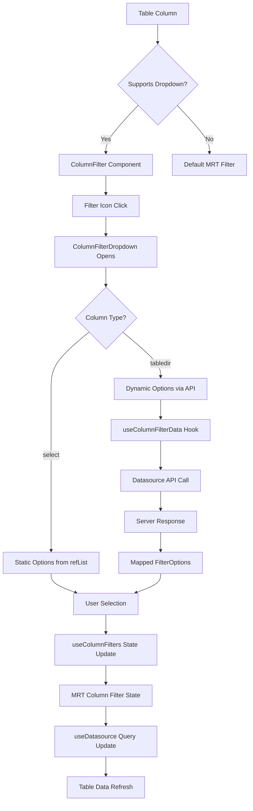

# Advanced Column Filters Implementation

This document provides a comprehensive overview of the advanced column filters system implemented for Material React Table in Etendo WorkspaceUI.

## Overview

The advanced column filters system provides dropdown-based multi-selection filters for `select` and `tabledir` columns, similar to Etendo Classic behavior. This allows users to filter table data using friendly dropdown interfaces instead of text-based filters.

## Architecture

### Core Components

#### 1. ColumnFilter Component (`packages/MainUI/components/Table/ColumnFilter.tsx`)
- Main filter component integrated into table columns
- Uses the existing Etendo design system components
- Handles filter state and option loading
- Provides interface between table and multi-select dropdown

#### 2. MultiSelect Component (`packages/MainUI/components/Form/FormView/selectors/components/MultiSelect.tsx`)
- Custom multi-select dropdown based on existing Select component
- Consistent with Etendo design system and styling
- Supports both `select` (static options) and `tabledir` (dynamic server options) columns
- Implements debounced search for `tabledir` columns
- Handles option loading states and empty states

#### 3. Column Filter Utilities (`packages/api-client/src/utils/column-filter-utils.ts`)
- `ColumnFilterUtils` class with static methods for filter operations
- Determines which columns support dropdown filters
- Extracts static options from `select` columns
- Creates filter criteria matching Etendo Classic format

#### 4. useColumnFilters Hook (`packages/api-client/src/hooks/useColumnFilters.ts`)
- Manages column filter state across the application
- Tracks selected options and loading states per column
- Provides methods to update filters and load options

#### 5. useColumnFilterData Hook (`packages/api-client/src/hooks/useColumnFilterData.ts`)
- Fetches dynamic options for `tabledir` columns from the server
- Uses same authentication pattern as `useDatasource`
- Handles selector definitions and search queries

### Data Flow



## Integration Points

### 1. Table Integration (`packages/MainUI/components/Table/index.tsx`)
- Integrates column filters with Material React Table
- Syncs column filter state with `useDatasource` hook
- Handles filter state changes and table refreshing
- Force-refreshes table after filter updates with timeout

### 2. Column Configuration (`packages/MainUI/hooks/table/useColumns.tsx`)
- Determines which columns should use advanced filters
- Configures MRT columns with custom `Filter` property
- Passes filter state and handlers to filter components

### 3. Data Fetching (`packages/MainUI/hooks/useDatasource.ts`)
- Receives column filter criteria from table component
- Combines filters with search and implicit filters
- Uses `LegacyColumnFilterUtils` to create proper criteria format

### 4. Search Utilities (`packages/api-client/src/utils/search-utils.ts`)
- `LegacyColumnFilterUtils.handleArrayFilter()` processes multi-select values
- Converts filter selections to Etendo Classic criteria format
- Uses `organization$_identifier` with `iEquals` operator for tabledir columns

## Column Types Support

### Select Columns
- **Type**: `select`
- **Data Source**: Static `refList` property in column metadata
- **Options**: Pre-defined list of id/label pairs
- **Filtering**: Client-side option filtering based on user input

### TableDir Columns  
- **Type**: `tabledir`
- **Data Source**: Dynamic API calls to referenced entity
- **Options**: Fetched from server using selector definitions
- **Filtering**: Server-side search with debounced input

## Filter Criteria Format

The system creates filter criteria that match Etendo Classic format:

### Single Selection
```javascript
{
  fieldName: "organization$_identifier",
  operator: "iEquals", 
  value: "F&B España - Región Sur"
}
```

### Multiple Selection (OR Logic)
```javascript
{
  operator: "or",
  criteria: [
    {
      fieldName: "organization$_identifier",
      operator: "iEquals",
      value: "F&B España - Región Sur"
    },
    {
      fieldName: "organization$_identifier", 
      operator: "iEquals",
      value: "F&B International Group"
    }
  ]
}
```

## API Communication

### TableDir Options Fetching
```javascript
// Request parameters
{
  startRow: 0,
  endRow: 20,
  textMatchStyle: "substring",
  requestId: 1,
  dataSource: "Organization",
  selectorDefinitionId: "ABC123",
  filterClass: "org.openbravo.userinterface.selector.SelectorDataSourceFilter",
  currentValue: "search query" // optional
}
```

### Authentication
- Uses same Bearer token authentication as other datasource requests
- Includes CSRF tokens via `getCombinedErpCookieHeader`
- Leverages existing `datasource.get()` method for consistency

## Performance Optimizations

### Debounced Search
- 300ms debounce for tabledir search queries
- Prevents excessive API calls during user typing

### State Management
- Column filter state isolated per column
- Efficient re-rendering with React hooks
- Minimal table refreshes with controlled timing

### Option Caching
- Filter options cached in component state
- Reuses loaded options until component unmount

## Error Handling

### API Errors
- Graceful fallback to empty options array
- Console error logging for debugging
- No user-facing errors for failed option loading

### Invalid Selections
- Filters cleared if column metadata changes
- Handles missing or invalid filter values
- Maintains table functionality if filters fail

## Testing Strategy

### Unit Tests
- Filter component rendering and interactions
- Option loading and state management
- Criteria generation accuracy

### Integration Tests  
- End-to-end filter workflows
- API communication and authentication
- Table data refresh verification

## Future Enhancements

### Potential Improvements
1. **Option virtualization** for large datasets
2. **Advanced search operators** (contains, starts with, etc.)
3. **Filter presets** and saved filter combinations
4. **Bulk filter operations** across multiple columns
5. **Filter export/import** functionality

### Performance Considerations
1. **Pagination** for tabledir options with large datasets
2. **Background option preloading** for commonly used filters
3. **Intelligent caching** with TTL for dynamic options

## Migration Notes

### From Default MRT Filters
- Advanced filters replace default text inputs for supported columns
- Existing filter logic preserved for unsupported column types
- Backward compatibility maintained with existing table configurations

### From Previous Implementation
- **Removed duplicate components**: Eliminated ColumnFilter components from ComponentLibrary 
- **Unified with design system**: Now uses existing Select components and Etendo styling
- **Better performance**: Leverages existing hooks and utilities from form selectors
- **Consistent UX**: Same look and feel as form selectors throughout the application

### Etendo Classic Compatibility
- Filter criteria format matches Classic exactly
- Same API endpoints and authentication patterns
- Consistent user experience across platforms

## Architecture Benefits

### Design System Consistency
- Uses existing Etendo Select components and styling
- Maintains consistent spacing, colors, and interaction patterns
- Integrates seamlessly with existing form components

### Code Reusability
- Leverages existing `useSelectFieldOptions` and `useTableDirDatasource` hooks
- Reuses debouncing, search, and infinite scroll functionality
- Reduces code duplication and maintenance burden

### Performance Optimizations
- Uses established patterns for data fetching and caching
- Efficient re-rendering with existing React optimization patterns
- Consistent loading states and error handling

## Troubleshooting

### Common Issues

#### Empty Filter Options
- Verify selector definition ID is present in column metadata
- Check datasource ID matches referenced entity
- Ensure proper authentication tokens

#### Filters Not Applied
- Confirm filter criteria format matches expected structure
- Verify table refresh is triggered after filter changes
- Check timing of state updates and API calls

#### Performance Issues
- Monitor API response times for tabledir options
- Verify debouncing is working correctly
- Check for excessive re-renders in filter components

### Debug Information
- Enable console logging in development mode
- Use browser network tab to inspect API requests
- Monitor React DevTools for state changes