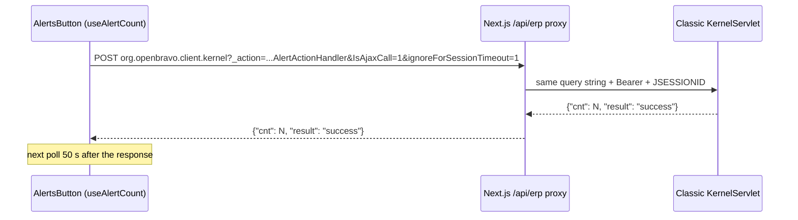

# Alerts Indicator (Navigation Bar)

**Jira:** ETP-5625 — [SEC-32] Alert icon with badge and real-time polling

The navigation bar shows a bell button with the number of pending alerts of the user. It is the new
UI counterpart of the classic `OBAlertIcon` (`ob-alert-manager.js`).

## Behavior

| Aspect | Behavior |
|--------|----------|
| Position | First button of the right-hand group of the navigation bar, always visible |
| Icon | `bell.svg` with no pending alerts (or before the first response); `bell-alert.svg` (bell with a red dot) when the count is greater than 0 |
| Label | Translated `UINAVBA_Alerts` (`"Alerts (%0)"`), used as tooltip and `aria-label`: `"Alerts (-)"` until the first response, then `"Alerts (N)"` |
| Click / shortcut | Opens the classic *Alert Management* view (`OBUIAPP_AlertManagement`) in a popup, the same way its menu entry does |
| Shortcut | `NavBar_OBAlertIcon` entry of the `UINAVBA_KeyboardShortcuts` preference; falls back to **F8** (classic default) when missing or when it uses Alt/Shift (not supported by `useKeyboardShortcuts`) |

## Polling

- One call on mount and then 50 seconds after each response (failed polls are rescheduled too and
  keep the last known count), mirroring `OB.AlertManager.schedule()`.
- A new call is made immediately when the role changes, since the count depends on it.
- Polling only runs while a session is active (token, role and no expired password) and stops on
  logout or unmount.
- The count rules (recipients by user/role, readable clients/organizations, status NEW, rule filter
  clause) and the `AD_Session.Last_Session_Ping` update are the classic `AlertActionHandler` ones:
  no backend change was needed.

## Session timeout

- **Classic session:** `SessionExpirationFilter` skips the inactivity reset only when the request has
  both `IsAjaxCall=1` and `ignoreForSessionTimeout=1`, so both flags are always sent.
- **New UI token:** renewal is driven by DOM input events only (see
  [session-keep-alive.md](./session-keep-alive.md)), so the polling never keeps an idle session alive.
- The call goes to the direct `/org.openbravo.client.kernel` servlet. The `/sws/...kernel` path must
  not be used, because it changes the shared session's `maxInactiveInterval`.

## Files

| File | Purpose |
|------|---------|
| `packages/MainUI/components/Header/AlertsButton.tsx` | Navigation bar button |
| `packages/MainUI/hooks/useAlertCount.ts` | Self-rescheduling polling hook |
| `packages/MainUI/utils/alerts/fetchAlertCount.ts` | `AlertActionHandler` call |
| `packages/MainUI/utils/alerts/resolveAlertShortcut.ts` | Shortcut resolution from the classic preference |
| `packages/MainUI/utils/alerts/constants.ts` | Constants |
| `packages/MainUI/utils/menu/openEtendoView.ts` | Opens a classic view popup (shared with the menu) |
| `packages/ComponentLibrary/src/assets/icons/bell-alert.svg` | Bell with notification dot |
