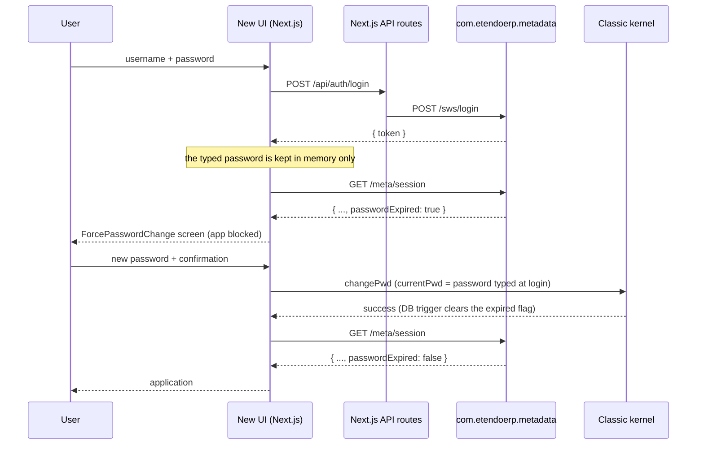

# Expired Password — Mandatory Change at Login (ETP-4619 / SEC-11)

A user whose password has expired must set a new one before reaching the application. This mirrors
Etendo Classic, where an expired password never yields a usable session.

## Expiration rule

The rule is owned by the backend and replicates
`org.openbravo.authentication.basic.DefaultAuthenticationManager#checkIfPasswordExpired`. A password
is expired when **either** condition holds:

- the administrator ticked *Password expired* on the user record (`AD_User.Isexpiredpassword = 'Y'`), or
- the client defines a validity window (`AD_Client.DaysToPasswordExpiration > 0`) and
  `AD_User.LastPasswordUpdate` plus those days has already been reached.

It lives in a single place: `com.etendoerp.metadata.utils.PasswordExpirationUtils#isExpired`.

## Flow

## Backend (`com.etendoerp.metadata`)

| File | Role |
|---|---|
| `utils/PasswordExpirationUtils.java` | The expiration rule, in one place |
| `builders/SessionBuilder.java` | Adds `passwordExpired` to the `/meta/session` payload |
| `http/BaseWebService.java` | Guard: every HTTP verb goes through `dispatch`, which rejects the request with `401` while the password is expired |
| `utils/Constants.java` | `PASSWORD_EXPIRED_ALLOWED_PATHS` and `PASSWORD_EXPIRED_ERROR` |

### Guard allowlist

While the password is expired only the endpoints the blocking screen needs stay reachable:
`/session`, `/labels`, `/language` and `/preferences`. Everything else served by `MetadataServlet`
(window, tab, menu, process, widget, dashboard…) and by `ForwarderServlet` (which is the path
`/api/datasource` takes) answers `401`.

The change-password request is **not** affected: it targets the Classic kernel directly
(`/api/erp/org.openbravo.client.kernel?command=changePwd`), never `/meta/*`.

### Known limitations

- The JWT is still issued by `/sws/login`, which lives in `com.smf.securewebservices` and is not
  modified here. The guard is what makes that token useless until the password is updated; closing
  the gap at token-issuance time would require a core change.
- `NotesServlet`, `AttachmentsServlet` and `LegacyProcessServlet` extend `HttpSecureAppServlet`
  instead of `BaseWebService` and are therefore outside the guard. They are only reachable from
  inside the application, which is blocked, and they require a Classic session of their own.

## Client

| File | Role |
|---|---|
| `screens/ForcePasswordChange/index.tsx` | Full-screen mandatory change, sibling of `screens/Login` |
| `contexts/user.tsx` | Holds the login password in memory, exposes `completeExpiredPasswordChange` and `hasPendingLoginPassword`, gates `renderContent`, and skips the auto-logout interceptor while the flag is set |
| `stores/userStore.ts` | `passwordExpired` flag, reset on logout |
| `utils/password.ts` | Validation, ERP-code → i18n mapping and submission, shared with the profile modal |

### Only new + confirmation

Classic does not ask for the current password again: credentials were already validated in the first
pass. The new UI does the same by keeping the password typed at login in a `useRef` (memory only,
never `localStorage`) and sending it as `currentPwd` to the existing ERP handler.

A page reload drops that value. In that case the screen logs the user out and shows
`login.errors.passwordExpired` on the login card, which is also how Classic behaves — it keeps no
session either.

### Reused, not duplicated

The change itself goes through the same
`UserInfoWidgetActionHandler?command=changePwd` action handler as the optional change from the
profile modal, so the ERP validations (different from the previous password, strength policy and any
`UserInfoWidgetHook` extension) apply unchanged, and the
`AD_USER_EXPIRATIONPASS_TRG` trigger clears `Isexpiredpassword` and stamps `lastpasswordupdate`
without any Java code doing it explicitly.

## Testing

- Java (run manually): `PasswordExpirationUtilsTest`, `BaseWebServiceGuardTest` and the new cases in
  `SessionBuilderTest`.
- Client: `utils/__tests__/password.test.ts`,
  `screens/ForcePasswordChange/__tests__/index.test.tsx` and the
  *expired password gate* suite in `contexts/__tests__/user.test.tsx`.

### Manual check

1. Tick *Password expired* on a test user in the Classic *User* window. For the time-based path, set
   `AD_Client.DaysToPasswordExpiration = 1` and an old `lastPasswordUpdate` instead.
2. Log in with that user: the mandatory change screen must replace the application. In the Network
   tab, `/meta/session` returns `passwordExpired: true` and any `/meta/window/...` or
   `/api/datasource` request returns `401`.
3. Submit a weak password, or the same one as before: the translated error appears and the screen
   stays open.
4. Submit a valid, different password: the application loads without logging in again, and in the
   database `Isexpiredpassword = 'N'` with a refreshed `lastpasswordupdate`.
5. Log in with a user whose password is valid: no intermediate screen.
6. Reload the page mid-flow: back to the login screen with the explanatory message.
