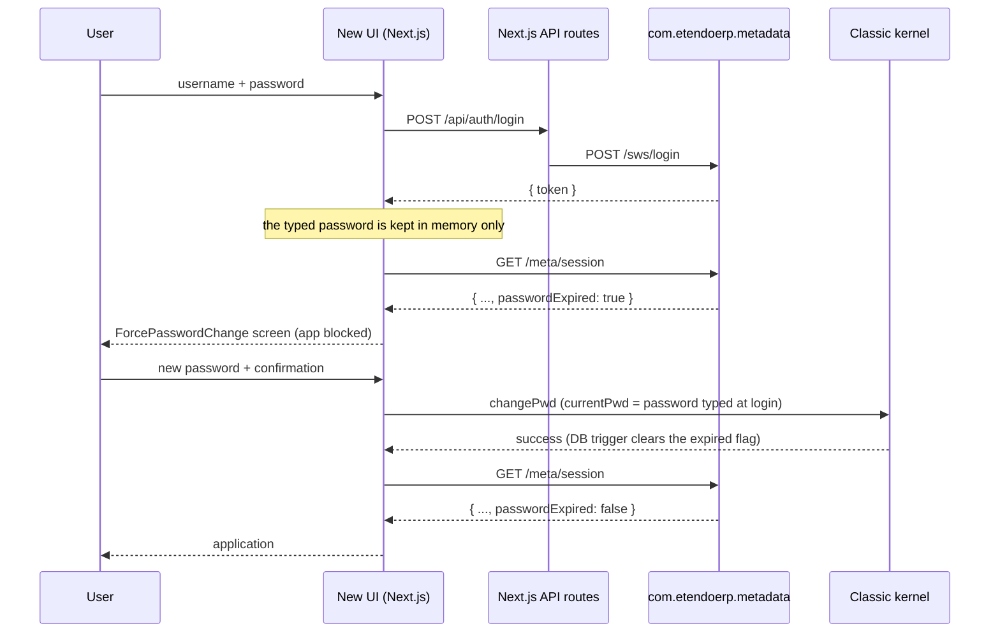

# Expired Password — Mandatory Change at Login (ETP-4619 / SEC-11)

A user whose password has expired must set a new one before reaching the application. This mirrors
Etendo Classic, where an expired password never yields a usable session.

## Expiration rule

The rule is owned by the backend and replicates
`org.openbravo.authentication.basic.DefaultAuthenticationManager#checkIfPasswordExpired`. A password
is expired when **either** condition holds:

- the administrator ticked *Password expired* on the user record (`AD_User.Isexpiredpassword = 'Y'`), or
- the client defines a validity window (`AD_Client.DaysToPasswordExpiration > 0`) and
  `AD_User.LastPasswordUpdate` plus those days has already been reached.

It lives in a single place: `com.etendoerp.metadata.utils.PasswordExpirationUtils#isExpired`.

## Flow



## Backend (`com.etendoerp.metadata`)

| File | Role |
|---|---|
| `utils/PasswordExpirationUtils.java` | The expiration rule, in one place |
| `builders/SessionBuilder.java` | Adds `passwordExpired` and `currentLanguage` to the `/meta/session` payload |
| `http/BaseWebService.java` | Guard: every HTTP verb goes through `dispatch`, which rejects the request with `401` while the password is expired |
| `utils/Constants.java` | `PASSWORD_EXPIRED_ALLOWED_PATHS` and `PASSWORD_EXPIRED_ERROR` |

### Guard allowlist

While the password is expired only the endpoints the blocking screen needs stay reachable:
`/session`, `/labels`, `/language` and `/preferences`. Everything else served by `MetadataServlet`
(window, tab, menu, process, widget, dashboard…) and by `ForwarderServlet` (which is the path
`/api/datasource` takes) answers `401`.

The change-password request is **not** affected: it targets the Classic kernel directly
(`/api/erp/org.openbravo.client.kernel?command=changePwd`), never `/meta/*`.

### Known limitations

- The JWT is still issued by `/sws/login`, which lives in `com.smf.securewebservices` and is not
  modified here. The guard is what makes that token useless until the password is updated; closing
  the gap at token-issuance time would require a core change.
- `NotesServlet`, `AttachmentsServlet` and `LegacyProcessServlet` extend `HttpSecureAppServlet`
  instead of `BaseWebService` and are therefore outside the guard. They are only reachable from
  inside the application, which is blocked, and they require a Classic session of their own.

## Client

| File | Role |
|---|---|
| `screens/ForcePasswordChange/index.tsx` | Full-screen mandatory change, sibling of `screens/Login` |
| `contexts/user.tsx` | Holds the login password in memory, exposes `completeExpiredPasswordChange` and `hasPendingLoginPassword`, gates `renderContent`, and handles the expired-password rejection in the interceptor |
| `stores/userStore.ts` | `passwordExpired` flag, reset on logout |
| `utils/password.ts` | Validation, error resolution and submission, shared with the profile modal |
| `utils/session/erpErrorCode.ts` | Reads the error code the ERP proxy forwards as a header |
| `contexts/language.tsx` | Loads the `AD_MESSAGE` dictionary the error messages are resolved against |

### Only new + confirmation

Classic does not ask for the current password again: credentials were already validated in the first
pass. The new UI does the same by keeping the password typed at login in a `useRef` (memory only,
never `localStorage`) and sending it as `currentPwd` to the existing ERP handler.

A page reload drops that value. In that case the screen logs the user out and shows
`login.errors.passwordExpired` on the login card, which is also how Classic behaves — it keeps no
session either. Note that `logout()` clears the store synchronously, so those messages must always be
written **after** calling it.

### Error messages come from the ERP catalog

The change-password handler reports failures as `AD_MESSAGE` search keys
(`{"result":"error","fields":[{"messageCode":"ETAS_PasswordAlreadyUsed"}]}`), and any module can add
new ones through a `UserInfoWidgetHook`. Classic renders them with
`OB.I18N.getLabel(field.messageCode)`; the new UI resolves them through the same dictionary:

```
AD_MESSAGE → I18NComponent.getLabels() → GET /meta/labels → Metadata.getLabels()
  → useBackendLabels() → useLanguage().getLabel(code)
```

`resolvePasswordErrorMessage` in `utils/password.ts` applies that resolution first and falls back to
the local translations only for codes the catalog does not define (of the ones this handler emits,
only `UINAVBA_IncorrectPwd` has no `AD_MESSAGE` row). `/labels` is in the guard allowlist, so this
works while the password is expired.

That chain has a prerequisite that is easy to lose: **the dictionary is only fetched once a language
is known** (`useBackendLabels`), and `AD_USER.DEFAULT_AD_LANGUAGE` is optional. A user without one
used to leave `labels` empty, so every ERP code silently degraded to the generic message — and so did
`OB.I18N.getLabel` in migrated process scripts. The session payload therefore also carries
`currentLanguage`, the language the ERP context resolved (user → client → system, never null), and
`updateSessionInfo` falls back to it. Two related details:

- `SessionBuilder#getLanguageCode` is the backend side of that contract.
- `LanguageProvider` declares the `Metadata.setLanguage` effect **before** calling
  `useBackendLabels`. Effects run in declaration order and `setLanguage` wipes the metadata cache, so
  the reverse order caches the dictionary under the previous language key and drops it immediately.

### Expired mid-session

When the password expires while a session is open, the change cannot be applied from the app (the ERP
handler needs the current password, which is no longer held), so the user is logged out with a clear
reason instead of the generic session-failure message. The metadata module returns the stable code
`PasswordExpired`, the ERP proxy forwards it as the `X-Etendo-Error-Code` header
(`route.helpers.ts#buildErpErrorCodeHeaders`), and the interceptor reads it. It has to be a header:
interceptors run **before** the response body is parsed (`client.ts`), so reading the body there
would break the parsing that follows.

### After a successful change

The session payload is excluded from the Next.js Data Cache (`isMutationRoute` in the ERP proxy):
its cache key is derived from the bearer token, which a password change does not rotate, so a cached
entry would keep reporting the pre-change state and the gate would never open. On success the user
gets a toast and is sent to the home page. `<Toaster/>` is mounted outside `UserProvider` in
`app/layout.tsx` precisely because the gate replaces that provider's subtree.

### Reused, not duplicated

The change itself goes through the same
`UserInfoWidgetActionHandler?command=changePwd` action handler as the optional change from the
profile modal, so the ERP validations (different from the previous password, strength policy and any
`UserInfoWidgetHook` extension) apply unchanged, and the
`AD_USER_EXPIRATIONPASS_TRG` trigger clears `Isexpiredpassword` and stamps `lastpasswordupdate`
without any Java code doing it explicitly.

## Testing

- Java (run manually): `PasswordExpirationUtilsTest`, `BaseWebServiceGuardTest` and the new cases in
  `SessionBuilderTest`.
- Client: `utils/__tests__/password.test.ts`,
  `screens/ForcePasswordChange/__tests__/index.test.tsx`,
  `contexts/__tests__/language.test.tsx`, and the *expired password gate* and *session language*
  suites in `contexts/__tests__/user.test.tsx`.

### Manual check

1. Tick *Password expired* on a test user in the Classic *User* window. For the time-based path, set
   `AD_Client.DaysToPasswordExpiration = 1` and an old `lastPasswordUpdate` instead.
2. Log in with that user: the mandatory change screen must replace the application. In the Network
   tab, `/meta/session` returns `passwordExpired: true` and any `/meta/window/...` or
   `/api/datasource` request returns `401`.
3. Submit a weak password, one already used, or the same one as before: the message shown is the ERP
   text for that `messageCode` and the screen stays open. Use a test user **without** a default
   language, which is the case that used to show the generic message instead.
4. Submit a valid, different password: a success toast appears, the app loads on the home page
   without logging in again, and in the database `Isexpiredpassword = 'N'` with a refreshed
   `lastpasswordupdate`.
5. Log in with a user whose password is valid: no intermediate screen.
6. Reload the page mid-flow: back to the login screen with the explanatory message.
7. With a session already open, tick *Password expired* and trigger any request: the user lands on
   the login screen with the expired-password message, not the generic system-error one.
