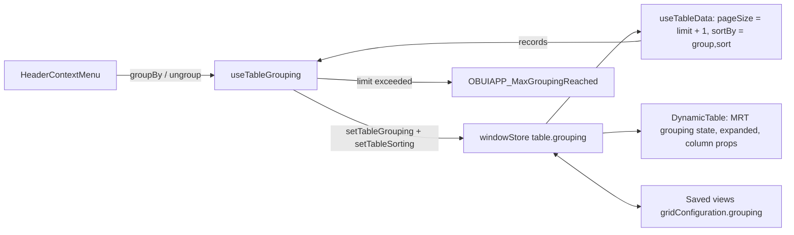

# Grid grouping ("Group by ‹column›")

Groups the main grid by a column, reproducing the classic UI (`ob-view-grid.js` `groupBy` / `clearGroupBy`).

## Behavior

| Rule | Classic | New UI |
|------|---------|--------|
| Enabled per window | Preference `OBUIAPP_GroupingEnabled` = `Y` | Same preference (`/meta/preferences`, resolved window-scoped first) |
| Record limit | `OBUIAPP_GroupingMaxRecords`, default 1000 | Same |
| Entry point | Header menu: "Group by ‹column›" / "Ungroup" | Header context menu (right click) and column actions menu (3 dots), same AD messages `OBUIAPP_GroupBy` / `OBUIAPP_ungroup` |
| Non-groupable columns | Checkbox, edit link, YesNo, Image | Selection, expand, actions, edit link, boolean, image |
| Grouped column | Moved first and locked | First (`groupedColumnMode: "reorder"`), cannot be hidden or reordered |
| Previous position | Restored on ungroup/regroup | `columnOrder` is never modified, so it is restored automatically |
| Order | Sorted by the grouped column | Sort set to the grouped column; datasource `_sortBy` = `group[,otherSort]` |
| Groups | Collapsible, first one opened when grouping changes | Same |
| Subtotals | Summary functions shown in the group header | Same (client side, over the loaded records) |
| Data loading | Fetches up to limit + 1 records | Same (`pageSize = limit + 1` while grouped) |
| Over the limit | Ungroups and shows `OBUIAPP_MaxGroupingReached` | Same |
| Create record in grid | Hidden while grouped | Blocked while grouped |
| Persistence | `storeViewState` / saved views | Window store (while the window is open) + saved views (`gridConfiguration.grouping`), including the auto-applied default view |

Grouping is ignored in tree mode.

## Implementation

- `utils/table/grouping.ts` — pure rules: preferences, groupable columns, sort, group values, subtotals, labels.
- `components/Table/hooks/useTableGrouping.ts` — group/ungroup, record limit, first group opening, group expanded state.
- `components/Table/utils/groupingColumns.tsx` — group header cell, subtotal cell, grouped column locking, group row props.
- `components/Table/HeaderContextMenu.tsx` — "Group by ‹column›" / "Ungroup" items and the shared menu rules.
- `components/Table/ColumnActionsMenuItems.tsx` — same summary and grouping actions in the column actions ("3 dots") menu.

Group header rows are built by TanStack's grouped row model and carry the group's first record as
`original`, so the grid treats them apart (`isGroupRow`): clicking them only toggles the group, they cannot be
selected and they open no cell context menu.
