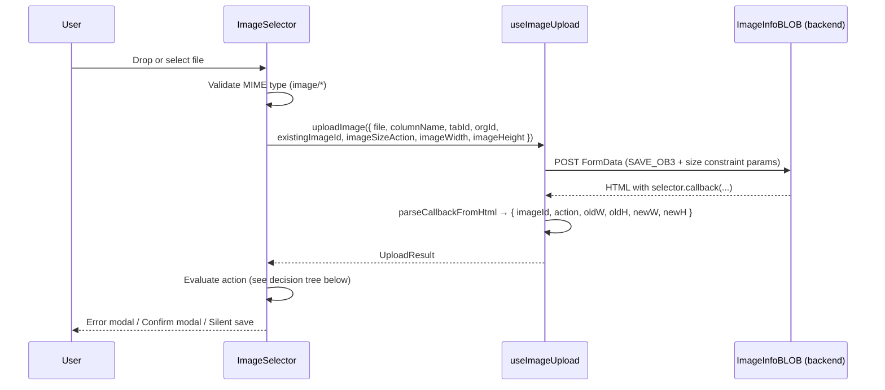
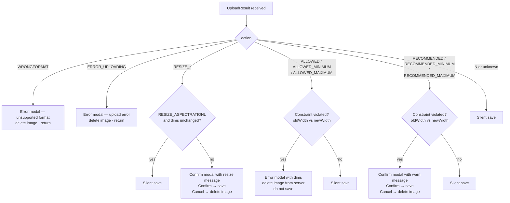

# Image Size Constraints (ETP-3598)

The `ImageSelector` component enforces server-side image size policies defined per column in the
ERP window configuration. When a user uploads an image, the frontend reads the column's constraint
metadata, forwards it to the backend during the upload request, and then reacts to the action code
the backend returns.

## Overview

Before this feature, the upload request always sent hardcoded values (`imageSizeAction = "N"`,
`imageWidth = 0`, `imageHeight = 0`), and the backend response was never parsed beyond extracting
the image ID. As a result, all size enforcement was silently ignored.

After this feature:

1. The column metadata fields `imageSizeValuesAction`, `imageWidth`, and `imageHeight` are read
   from `field.column` and forwarded to the `ImageInfoBLOB` servlet on every upload.
2. The full backend response is parsed: action code and four dimension integers
   (`oldWidth`, `oldHeight`, `newWidth`, `newHeight`).
3. The frontend reacts to the action code returned by the backend with a specific UX response:
   blocking error modal, confirmation dialog, or silent save.

## Architecture

| File | Responsibility |
|------|---------------|
| `packages/MainUI/hooks/useImageUpload.ts` | Builds the `FormData` payload (including size constraint params), calls `ImageInfoBLOB`, parses the HTML callback response |
| `packages/MainUI/components/Form/FormView/selectors/ImageSelector.tsx` | Reads column metadata, drives the upload via `useImageUpload`, and handles each action code with the appropriate UX |
| `packages/ComponentLibrary/src/components/StatusModal/ConfirmModal.tsx` | Modal used for both error dialogs (single Close button) and confirmation dialogs (Confirm + Cancel buttons) |
| `packages/ComponentLibrary/src/locales/en.ts` | English strings for all constraint messages |
| `packages/ComponentLibrary/src/locales/es.ts` | Spanish strings for all constraint messages |

### Backend endpoint

```
POST /api/erp/utility/ImageInfoBLOB
```

Relevant form fields added by this feature:

| Field | Type | Description |
|-------|------|-------------|
| `imageSizeAction` | `string` | Value of `imageSizeValuesAction` from column metadata (e.g. `"N"`, `"ALLOWED"`, `"RESIZE_ASPECTRATIO"`) |
| `imageWidthValue` | `string` | Configured width in pixels (`"0"` if not set) |
| `imageHeightValue` | `string` | Configured height in pixels (`"0"` if not set) |

The backend returns an HTML fragment containing a JavaScript callback:

```
selector.callback('<imageId>', '<action>', <p3>, <p4>, <p5>, <p6>)
```

The `parseCallbackFromHtml` function in `useImageUpload.ts` extracts these six values via a
single regex match. The dimension arguments are optional in the response — they default to `0`
when absent.

## Parameter Semantics (`p3`–`p6`)

The meaning of the four numeric parameters **depends on the action**:

### Validation actions (`ALLOWED_*`, `RECOMMENDED_*`)

| Parameter | Maps to | Represents |
|-----------|---------|------------|
| `p3` | `result.oldWidth` | **Configured** dimension (what was sent as `imageWidthValue`) |
| `p4` | `result.oldHeight` | **Configured** dimension (what was sent as `imageHeightValue`) |
| `p5` | `result.newWidth` | **Actual** uploaded image width |
| `p6` | `result.newHeight` | **Actual** uploaded image height |

Violation checks compare `result.oldWidth` (limit) against `result.newWidth` (actual).
Zero means "unconstrained on that axis" and is skipped in comparisons.

### Resize actions (`RESIZE_*`)

| Parameter | Maps to | Represents |
|-----------|---------|------------|
| `p3` | `result.oldWidth` | **Original** image width before resize |
| `p4` | `result.oldHeight` | **Original** image height before resize |
| `p5` | `result.newWidth` | **Resulting** width after resize |
| `p6` | `result.newHeight` | **Resulting** height after resize |

## Column Metadata Properties

| Property | Type | Description |
|----------|------|-------------|
| `imageSizeValuesAction` | `string` | Constraint mode (see action groups below). Defaults to `"N"` when absent. |
| `imageWidth` | `number` | Target or limit width in pixels. `0` = not constrained on this axis. |
| `imageHeight` | `number` | Target or limit height in pixels. `0` = not constrained on this axis. |

## Post-upload Modal Behavior

All user-facing messages after upload are shown via `ConfirmModal`:

- **Error modal** (`WRONGFORMAT`, `ERROR_UPLOADING`, `ALLOWED_*` violated): single **Close**
  button. The field is not updated and, where applicable, the uploaded image is deleted from
  the server.
- **Confirm modal** (`RECOMMENDED_*` violated, `RESIZE_*`): **Confirm** and **Cancel** buttons.
  Confirm saves the image; Cancel deletes it from the server and leaves the field unchanged.

When no constraint is violated the image is saved silently (no modal).

## Upload Flow



### Action decision tree



## Action Groups

### `N` — No constraint
Default behavior. The image is saved immediately without showing any modal.

---

### `RESIZE_*` — Automatic resize

The backend resized the image before storing it.

| Action value | Meaning |
|---|---|
| `RESIZE_NOASPECTRATIO` | Resized to exact width × height, may distort aspect ratio |
| `RESIZE_ASPECTRATIO` | Resized to fit within bounds, preserving aspect ratio (may enlarge small images) |
| `RESIZE_ASPECTRATIONL` | Resized to fit within bounds, preserving aspect ratio, never enlarges |

A **confirm modal** is shown with the original and target dimensions **unless** the action is
`RESIZE_ASPECTRATIONL` and `oldWidth === newWidth && oldHeight === newHeight` (the image was
already within bounds — the backend made no change).

- **Confirm**: image is saved (it already points to the resized version on the server).
- **Cancel**: `deleteUploadedImage` is called and the field is not updated.

---

### `ALLOWED_*` — Hard rejection

The constraint is enforced: images that do not comply are **rejected**.

Violation condition (per axis — a `0` configured value skips that axis):

| Action | Violated when |
|---|---|
| `ALLOWED` | `configDim !== 0 && configDim !== actualDim` |
| `ALLOWED_MINIMUM` | `configDim !== 0 && configDim > actualDim` |
| `ALLOWED_MAXIMUM` | `configDim !== 0 && configDim < actualDim` |

When a violation is detected:
- A blocking **error modal** is displayed with the configured and actual dimensions (single
  Close button — user cannot proceed with the image).
- `deleteUploadedImage` is called (fire-and-forget) to remove the image from the server.
- The form field is **not** updated.

When no violation is detected, the image is saved silently.

---

### `RECOMMENDED_*` — Soft warning (user choice)

Same violation conditions as `ALLOWED_*`. When a violation is detected, a **confirm modal** is
shown with the warning message and configured vs. actual dimensions.

- **Confirm**: image is saved.
- **Cancel**: `deleteUploadedImage` is called and the field is not updated.

When no violation is detected, the image is saved silently.

---

### `WRONGFORMAT` / `ERROR_UPLOADING` — Backend errors

| Action value | Displayed message |
|---|---|
| `WRONGFORMAT` | Unsupported format — lists accepted formats (JPG, PNG, GIF, BMP, SVG) |
| `ERROR_UPLOADING` | Generic upload error |

In both cases an **error modal** (single Close button) is shown, `deleteUploadedImage` is called
if an image ID was returned, and the function returns early without saving.

## `hideSecondaryButton` prop on `ConfirmModal`

Error modals (single Close button) use `ConfirmModal` with `hideSecondaryButton={true}`. This
causes `BasicModal` to render only the primary action button, omitting the Cancel button entirely.
Confirm modals use the default `hideSecondaryButton={false}` and render both buttons.

## Edge Cases

### SVG files
The backend forces `action = "N"` for SVG uploads (vector formats have no raster dimensions).
No post-upload dialog appears.

### Both `imageWidth` and `imageHeight` are zero
When both configured dimensions are zero, no axis is constrained. Violation checks evaluate to
`false` for all `ALLOWED_*` and `RECOMMENDED_*` actions.

### `RESIZE_ASPECTRATIONL` with unchanged dimensions
When the backend reports `RESIZE_ASPECTRATIONL` but `oldWidth === newWidth` and
`oldHeight === newHeight`, the image already fit within bounds. The confirmation dialog is
suppressed and the image is saved silently.

### Replacing an existing image
When an image already exists in the field, its ID is passed as `existingImageId` in the upload
call. The backend uses this to replace rather than create. Constraint rules apply to the
replacement upload as well.

## i18n Keys

All user-visible strings live under `image.sizeConstraints` with two sub-namespaces:

### `image.sizeConstraints.error.*` — Post-upload blocking error modal

Placeholders for `ALLOWED_*`: `{{configWidth}}`, `{{configHeight}}` (configured limit);
`{{actualWidth}}`, `{{actualHeight}}` (uploaded image size).

| Key | Used for |
|-----|---------|
| `error.WRONGFORMAT` | Unsupported file format |
| `error.ERROR_UPLOADING` | Server-side upload error |
| `error.ALLOWED` | Exact size violated |
| `error.ALLOWED_MINIMUM` | Minimum size violated |
| `error.ALLOWED_MAXIMUM` | Maximum size violated |

### `image.sizeConstraints.confirm.*` — Post-upload confirmation dialog

Placeholders for `RECOMMENDED_*`: `{{configWidth}}`, `{{configHeight}}`, `{{actualWidth}}`,
`{{actualHeight}}`.

Placeholders for `RESIZE`: `{{originalWidth}}`, `{{originalHeight}}` (before resize);
`{{targetWidth}}`, `{{targetHeight}}` (after resize).

| Key | Used for |
|-----|---------|
| `confirm.RECOMMENDED` | Exact size not matching recommendation |
| `confirm.RECOMMENDED_MINIMUM` | Below recommended minimum |
| `confirm.RECOMMENDED_MAXIMUM` | Above recommended maximum |
| `confirm.RESIZE` | Shared by all three `RESIZE_*` actions |

## Related

- [`components/form/README.md`](../../components/form/README.md) — form rendering and field
  group behavior
- [`features/field-references.md`](../field-references.md) — how field reference codes map to
  selector components
