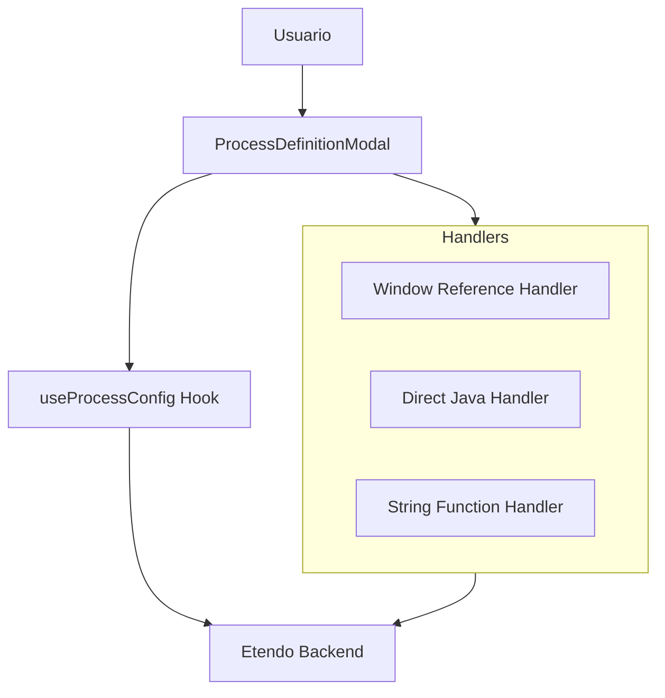
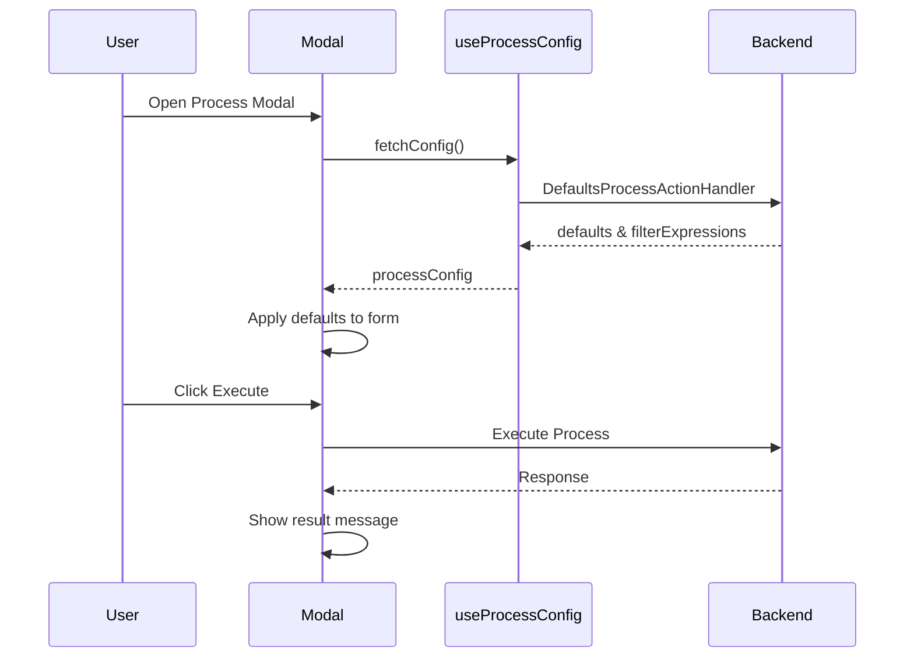

# Process Execution Feature

## Overview

The process execution feature allows users to execute business processes defined in Etendo Classic from the WorkspaceUI interface.

## Architecture

## Key Components

### 1. ProcessDefinitionModal
- **Location**: `packages/MainUI/components/ProcessModal/ProcessDefinitionModal.tsx`
- **Purpose**: Main modal for process execution
- **Documentation**: [process-definition-modal.md](./process-definition-modal.md)

### 2. useProcessConfig Hook
- **Location**: `packages/MainUI/hooks/datasource/useProcessDatasourceConfig.ts`
- **Purpose**: Process configuration retrieval via DefaultsProcessActionHandler
- **Documentation**: [defaults-action-handler.md](./defaults-action-handler.md)

### 3. Window Reference Grid
- **Location**: `packages/MainUI/components/ProcessModal/WindowReferenceGrid.tsx`
- **Purpose**: Grid for record selection in window reference processes
- **Documentation**: [window-references.md](./window-references.md)

## Process Types

### 1. Window Reference Processes
- Require record selection in a grid
- Use `WINDOW_REFERENCE_ID` in parameters
- Execute via servlet with selected records

### 2. Direct Java Processes  
- Have `javaClassName` but no `onProcess`
- Execute directly via servlet
- Example: `com.etendoerp.copilot.process.CheckHostsButton`

### 3. String Function Processes
- Have `onProcess` function defined
- Execute client-side JavaScript
- Use `executeStringFunction` utility

## Execution Flow

## Error Handling

- **Network Errors**: Captured and displayed as error messages
- **Process Errors**: Interpreted from `responseActions.showMsgInProcessView`
- **Validation Errors**: Handled by React Hook Form

## Related Documentation

- [ProcessDefinitionModal Detailed](./process-definition-modal.md)
- [DefaultsProcessActionHandler](./defaults-action-handler.md)
- [Window References](./window-references.md)
- [API Integration](../../api/kernel-servlet.md)