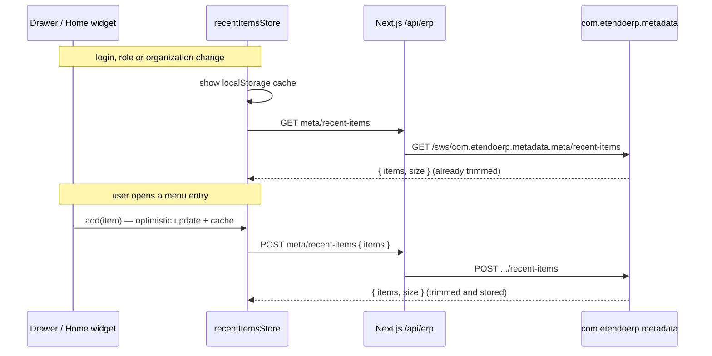

# Recently Viewed Items (ETP-4621)

How the new UI stores the "Recently viewed" list, how many entries it keeps, and how that limit
relates to the classic `UINAVBA_RecentListSize` preference.

## Where the list is shown

The same list is shown in two places:

- the **Recently viewed** section of the drawer (sidebar);
- the **Recently Viewed** dashboard widget on the Home screen.

It is the new-UI equivalent of the recent entries the classic UI shows at the top of the
**Application** menu (`UINAVBA_MenuRecentList`). It is **not** the equivalent of the classic
Workspace panels "Recent views" and "Recent documents" (`OBUIAPP_RecentViewList`,
`OBUIAPP_RecentDocumentsList`). Recent documents have their own feature (ETP-4622).

## When an entry is added

An entry is added when the user opens a menu entry from the drawer (window, process or report),
or clicks an entry of the "Recently viewed" list itself:

- the entry moves to the front (newest first);
- an existing entry with the same menu id is replaced, never duplicated;
- the oldest entries beyond the size limit are discarded.

Windows opened in other ways (Home widgets, breadcrumbs, links, a restored URL) are not added.

## Storage

The list is persisted server-side as an `AD_Preference`, the same way the classic UI persists its
recent lists through `StorePropertyActionHandler`:

| Field | Value |
|---|---|
| `PROPERTY` | `ETMETA_RecentItemsList` (added by `com.etendoerp.metadata` to the core "Property Configuration" list reference) |
| `ISPROPERTYLIST` | `Y` |
| `AD_CLIENT_ID` / `AD_ORG_ID` | `0` (owned by System, as classic) |
| `VISIBLEAT_CLIENT_ID` / `VISIBLEAT_ORG_ID` / `VISIBLEAT_ROLE_ID` / `AD_USER_ID` | current client, organization, role and user |
| `VALUE` | JSON array, newest first: `[{ id, name, windowId, type, processId?, processDefinitionId?, processUrl?, isModalProcess? }]` |

Consequences:

- the list follows the user across browsers and devices;
- each user + role + client + organization combination has its own list, as in classic.

The browser keeps a copy in `localStorage` (`recentlyViewedItems`, keyed by `user|role|organization`).
It is only a cache: it is shown immediately while the server responds, and it keeps local changes if
the server cannot be reached. The server list always wins once it arrives.

## Size limit

### Rule in the new UI

The limit is resolved by the backend (`RecentItemsService.readListSize`):

1. The default is **5**, like the classic Workspace recent lists.
2. The highest-priority `UINAVBA_RecentListSize` preference applicable to the current context is
   looked up (same priority rules as any preference).
3. If that preference is **System level** (no Visible at Organization, Role or User, and Visible at
   Client empty or `System`), it is **ignored** and the default 5 is used.
4. If it has any visibility (client, organization, role or user), its value is used.
5. Missing, non-numeric, zero or negative values fall back to 5.

Step 3 exists because core ships a System-level `UINAVBA_RecentListSize` row with value `3`
(`AD_PREFERENCE_ID = C5C3ECF98CB14B02B88D2FE46D810739`). Honouring it would make the effective
default 3 instead of 5.

The list is trimmed both when an entry is added and when the list is read, so a new limit applies on
the next load (login, role or organization change, page refresh) without having to open anything.

### Comparison with the classic UI

In classic, `UINAVBA_RecentListSize` ("Size of the recent list in quick launch and quick create")
only limits the navigation bar lists handled by `OB.RecentUtilities`:

| Classic list | Property | Limit |
|---|---|---|
| Application menu recents | `UINAVBA_MenuRecentList` | `UINAVBA_RecentListSize` |
| Quick Launch | `UINAVBA_RecentLaunchList` | `UINAVBA_RecentListSize` |
| Quick Create | `UINAVBA_RecentCreateList` | `UINAVBA_RecentListSize` |
| Workspace "Recent views" | `OBUIAPP_RecentViewList` | always 5 (`ob-view-manager.js`: `recentManager.recentNum = 5`) |
| Workspace "Recent documents" | `OBUIAPP_RecentDocumentsList` | always 5 |

Classic behaviour worth knowing:

- the value is read once per page load (`getRecentNum` caches it), so a change needs a refresh or a
  new login;
- a stored list is **not** trimmed when it is displayed, only when a new entry is added through that
  list (for Quick Launch, by opening something from the Quick Launch).

| `UINAVBA_RecentListSize` configuration | Classic navbar lists | New UI |
|---|---|---|
| Only the core System row (value 3) | 3 | 5 |
| A System-level row with another value (e.g. 2) | 2 | 5 (row ignored) |
| A row visible at a client, organization, role or user (e.g. 2) | 2 | 2 |
| Invalid, zero or negative value | 3 | 5 |

### How to change the limit

1. In the classic UI, open **General Setup > Application > Preference**.
2. Create a record with **Property** = "Size of the recent list in quick launch and quick create"
   and **Value** = the desired size.
3. Fill at least one of **Visible at Client** (other than System), **Visible at Organization**,
   **Visible at Role** or **User**. A row without visibility only affects the classic UI.
4. In the new UI, refresh the page or log in again.

Avoid editing the core row `C5C3ECF9…`: it is core data, so a database update may revert it, and it
has no effect on the new UI anyway.

## Request flow

- `meta/recent-items` is listed in `isMutationRoute` of the `/api/erp/[...slug]` proxy. Without it,
  the GET would be served from the Next.js data cache, which has no revalidation, and would return
  the list as it was at login for the whole life of the token.
- A server response is applied only if no other add or scope change happened while it was in flight,
  so a slow response never overwrites newer state.
- The backend writes the preference in admin mode **without** client/organization access check
  (`OBContext.setAdminMode()`), like `StorePropertyActionHandler`. With the check enabled, updating a
  row owned by client `0` fails with "Client (0) ... is not present in ClientList", which the backend
  returns as 401 and the UI turns into a logout.

## Code map

| Layer | File |
|---|---|
| Backend service | `com.etendoerp.metadata/src/com/etendoerp/metadata/service/RecentItemsService.java` |
| Backend route | `ServiceFactory` (`RECENT_ITEMS_PATH = "/recent-items"` in `Constants`) |
| Property definition | `com.etendoerp.metadata/src-db/database/sourcedata/AD_REF_LIST.xml` |
| API client | `packages/api-client/src/api/recentItems.ts` |
| Proxy cache bypass | `packages/MainUI/app/api/erp/[...slug]/route.ts` (`isMutationRoute`) |
| Store | `packages/MainUI/stores/recentItemsStore.ts` |
| Scope loading | `packages/MainUI/contexts/recentItems.tsx` (`RecentItemsProvider`, registered in `app/layout.tsx`) |
| Pure helpers and cache | `packages/MainUI/utils/recentItems.ts` |
| Drawer hook | `packages/MainUI/hooks/useRecentItems.ts` |
| Home widget | `packages/MainUI/screens/Home/widgets/renderers/RecentlyViewedRenderer.tsx` |

## Known limitations

- The `localStorage` lists stored before this feature (keyed by role only) are not migrated to the
  server.
- Translated names are refreshed locally from the menu; the server keeps the names in the language
  used when the entry was added.
