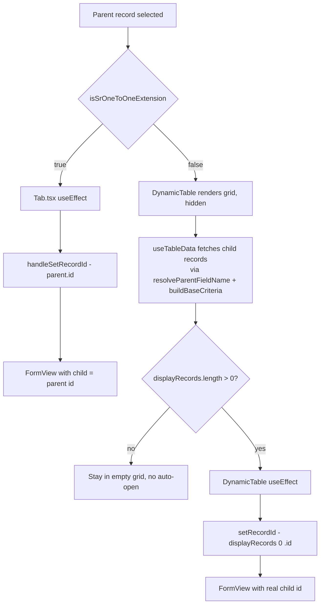

# SR (Single Record) Tabs

## Overview

An SR (Single Record) tab is a child tab whose `uIPattern === "SR"` and
`defaultEditMode === true`. SR tabs are expected to show **exactly one record
for each parent selection** and, by business rule, the UI must open the form
view directly (skipping the grid) as soon as the parent record is selected.

## Two variants

Although all SR tabs share the same UX contract, the underlying relation with
the parent entity can take two structurally different shapes. The
disambiguation matters because the auto-open strategy is different for each.

### 1:1 ID extension

The child table extends the parent by **sharing the primary key**: the same
column is both the child's PK and the FK to the parent (e.g.
`AD_ClientInfo.ad_client_id`). Consequently `child.id === parent.id`.

- **Example**: Window *Client* → child tab *Information* (entity
  `ClientInformation` / table `AD_ClientInfo`).
- **Tab metadata**: `parentColumns === ["client"]` and the field marked as PK
  in `tab.fields` has key `"client"` → PK ∈ `parentColumns`.
- **Auto-open**: handled eagerly by [`Tab.tsx`](../../../packages/MainUI/components/window/Tab.tsx)
  (`useEffect` that calls `handleSetRecordId(parentSelectedRecordId)` as soon as
  the parent selection changes).

### Logical relation

The child has its own PK and relates to the parent through an independent FK
column. `child.id !== parent.id`.

- **Example**: Window *Organization* → child tab *Certificado Digital* (entity
  `ETSG_Certificate`).
- **Tab metadata**: `parentColumns === ["organization"]` and the field marked
  as PK is a different column (the child's own id) → PK ∉ `parentColumns`.
- **Auto-open**: handled by [`DynamicTable`](../../../packages/MainUI/components/Table/index.tsx)
  after the child records are fetched, by picking `displayRecords[0].id` and
  calling the `setRecordId` prop (which is wired to `handleSetRecordId` in
  Tab.tsx and triggers the FORM/EDIT transition).

## Discriminating the two variants

The variant is decided by the helper
[`isSrOneToOneExtension`](../../../packages/MainUI/utils/window/utils.ts):

```ts
isSrOneToOneExtension(tab)
// true  → 1:1 ID extension (Tab.tsx path)
// false → logical relation (DynamicTable path)
```

The algorithm:

1. If `tab.parentColumns` is empty, treat as 1:1 (legacy behavior: no FK is
   modelled and `child.id === parent.id` by convention).
2. Otherwise, locate the child's primary-key field via the project-wide
   convention `field.column.keyColumn` truthy (same pattern used by
   [`useFormInitialization`](../../../packages/MainUI/hooks/useFormInitialization.ts)
   and
   [`useTableSelection/sessionSync.ts`](../../../packages/MainUI/utils/hooks/useTableSelection/sessionSync.ts)).
   If the PK field key is listed in `parentColumns`, the tab is 1:1; otherwise
   it is logical.

`parentColumns.length` alone is **not** a valid discriminator: both variants
frequently declare exactly one entry.

## Data flow



## Manual-close re-entry

Both paths track the last parent id for which auto-open fired via a ref
(`srAutoOpenedForParentRef`) so that closing the form view with the Back
button does not immediately re-open it for the same parent. Selecting a
different parent (or a parent that previously had no child and now does)
produces a fresh auto-open.

## Referenced files

- [`packages/MainUI/utils/window/utils.ts`](../../../packages/MainUI/utils/window/utils.ts) —
  `getKeyFieldName`, `isSrOneToOneExtension` helpers.
- [`packages/MainUI/components/window/Tab.tsx`](../../../packages/MainUI/components/window/Tab.tsx) —
  1:1 auto-open `useEffect` gated by `isSrOneToOneExtension`.
- [`packages/MainUI/components/Table/index.tsx`](../../../packages/MainUI/components/Table/index.tsx) —
  logical-SR auto-open `useEffect`.
- [`packages/MainUI/hooks/table/useTableData.tsx`](../../../packages/MainUI/hooks/table/useTableData.tsx) —
  child record query (already handles both variants).
- [`packages/MainUI/utils/criteriaUtils.ts`](../../../packages/MainUI/utils/criteriaUtils.ts) —
  `resolveParentFieldName`, `buildBaseCriteria`.
