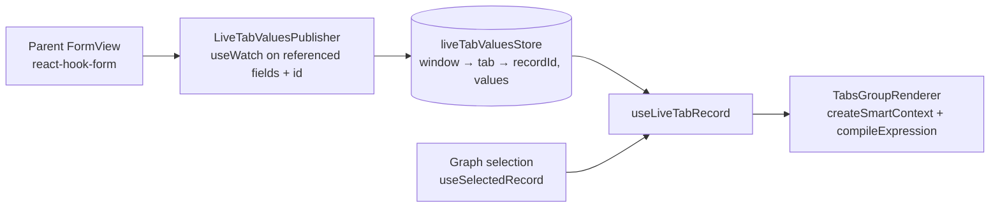

# Tab Display Logic

_Last updated: 2026-10-08 (ETP-5614)_

## Overview

A child tab can define a display logic (`AD_Tab.DisplayLogic`, exposed as `tab.displayLogic` or
`tab.displayLogicExpression`) that is evaluated against its **parent record**. When it evaluates to
false the tab is not rendered; when a hidden tab is the parent of deeper tabs, those are hidden too.

Example (core): window *Country and Region* (`AD_Window_ID = 122`), child tab **Region** with
`@HasRegion@='Y'`.

## Behavior

| Situation | Values the expression is evaluated against |
|-----------|--------------------------------------------|
| Parent shown as a grid, or form without edits | Persisted parent record (graph selection) |
| Parent form with unsaved edits | Persisted record overlaid with the form's current values |
| Discard / reload of the parent form | Persisted record again (the form is reset) |

- Editing a header field referenced by a child tab's display logic shows/hides the tab immediately,
  without saving (e.g. unchecking *Has Region* hides **Region**; checking it again shows it).
- Cascade hide still applies: the parent tab's own display logic is evaluated against the
  grandparent's live values, and if it is hidden all its children are hidden.
- When the active child tab becomes hidden, `Tabs` falls back to the first visible tab of the level.
- Tabs without display logic are unaffected.

## How it works

1. `LiveTabValuesPublisher` (mounted inside the form's `FormProvider`) finds the child tabs of the
   form's tab (`getChildTabs`) and the parent fields their display logic reads
   (`getTabDisplayLogicDependencies`, based on `extractDependenciesFromExpression`).
2. It watches only those fields plus `id` and publishes `{ recordId, values }` to
   `liveTabValuesStore`. Nothing is published while the form is initializing, and the entry is
   cleared when the form holds no saved record or unmounts.
3. `TabsGroupRenderer` reads the parent (and grandparent, for the cascade) through
   `useLiveTabRecord`, which overlays the live values on the persisted record with
   `mergeDefinedValues` **only when they belong to the same record id**.
4. The resulting values go through the existing engine (`createSmartContext`, `compileExpression`,
   `toClassicBoolean`), so value normalization (`true` → `'Y'`, column ↔ property names) is unchanged.
   See [Display Logic Expression Parsing](../display-logic-expression-parsing.md).

## Decisions

- **Window-level store instead of context.** The child tabs are rendered outside the parent form's
  provider, and `TabContext.formValues` is per tab, so a small dedicated zustand store is used. It is
  separate from `windowStore` to keep it volatile and out of URL/state persistence.
- **Subscribe only to referenced fields.** Forms whose child tabs have no display logic render no
  watcher and never write to the store. Publishing identical values is a no-op.
- **Record id taken from the form itself.** The `id` is watched together with the values so both
  come from the same form state; values from a previous record (while switching) or from a new
  record never apply to the selected one.
- **Stable tab list.** `TabsGroupRenderer` keeps passing the same array to `Tabs` while the visible
  tabs do not change (`haveSameTabs`), so edits that do not affect visibility do not re-render the
  child tab groups.
- **`mergeDefinedValues` shared with field display logic.** `useDisplayLogic` already skipped
  `undefined` watched values; that logic is now the shared helper.

## Differences with Classic

Classic (`ob-view-form.js#handleItemChange` → `ob-standard-view.js#updateSubtabVisibility`) evaluates
`showTabIf` with `getContextInfo()` of the form, which also includes the form's session attributes and
auxiliary inputs. The new UI evaluates the record values (persisted + live) and the user session
context only, as it did before for persisted records.

## Configuration

None. Any tab display logic defined in the Application Dictionary is supported.

## Main files

| File | Role |
|------|------|
| `packages/MainUI/components/window/TabsContainer.tsx` | Evaluates tab display logic per level (`TabsGroupRenderer`) |
| `packages/MainUI/components/Form/FormView/LiveTabValuesPublisher.tsx` | Publishes the referenced form values |
| `packages/MainUI/stores/liveTabValuesStore.ts` | Live values per window and tab |
| `packages/MainUI/hooks/useLiveTabRecord.ts` | Persisted record + live values for a tab |
| `packages/MainUI/utils/expressions/mergeLiveValues.ts` | `mergeDefinedValues` |
| `packages/MainUI/utils/tabUtils.ts` | `getTabDisplayLogic`, `getChildTabs`, `getTabDisplayLogicDependencies`, `haveSameTabs` |
