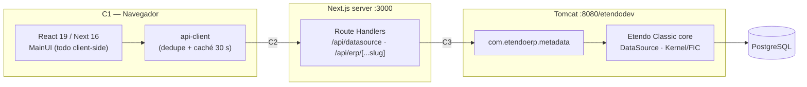

# Guía de medición de performance — Etendo WorkspaceUI

> **Estado:** borrador de trabajo (v3). No versionado aún en el repo.
> **Alcance:** cómo medir. Las propuestas de optimización van en documentos posteriores.
> **Idioma:** español (excepción temporal a la regla de docs en inglés; ver `docs/README.md`).
>
> **Documentos relacionados:**
> - [`02-profiling-c3-backend.md`](./02-profiling-c3-backend.md) — profiling de ERP y base de
>   datos. Solo aplica si la medición demuestra que el cuello está en C3.
> - [`03-window-selection.md`](./03-window-selection.md) — qué ventanas medir y por qué.
> - [`metrics-template.md`](./metrics-template.md) — plantilla para anotar una pasada.

---

## 1. Objetivo

Antes de optimizar hay que poder responder tres preguntas con números:

1. **¿Cuánto tarda hoy?** — línea base reproducible por pantalla.
2. **¿Dónde se va el tiempo?** — atribución por capa: ¿es JavaScript, es el proxy, es el ERP?
3. **¿Mejoró?** — comparación honesta antes/después, que distinga una mejora real del ruido.

### 1.1 La frase que queremos poder decir

El entregable de esta primera pasada no es una lista de optimizaciones. Es la capacidad de
afirmar, con evidencia, algo de esta forma:

> **"Abrir un registro en modo formulario tarda 3,2 s (p50, caché caliente). De esos: 1,1 s
> con requests en vuelo repartidos en 14 llamadas — la más lenta, el FIC, 620 ms — y 1,8 s
> de hilo principal bloqueado en 3 long tasks, la peor de 780 ms. El presupuesto de bloqueo
> para que la UI no se sienta congelada es 200 ms de TBT: estamos 7x arriba. El cuello está
> en el render, no en el backend."**

Esa frase lleva a una acción concreta. **"El formulario tarda 3 segundos" no lleva a nada**,
porque no distingue entre esperar la red y quemar CPU, y esas dos cosas se arreglan de
formas completamente distintas.

### 1.2 Qué NO es este documento

- No es un análisis de optimización. No propone cambios de código.
- No cubre pruebas de carga ni capacity planning. El entorno es un dev local; medir
  throughput acá no dice nada sobre producción.
- No cubre profiling de JVM ni de PostgreSQL. Eso está en
  [`02-profiling-c3-backend.md`](./02-profiling-c3-backend.md) y solo tiene sentido
  **después** de comprobar que el cuello está ahí.

---

## 2. Modelo: las tres capas

Todo lo que el usuario percibe como "lento" se reparte en tres capas. Optimizar sin saber
en cuál está el costo es tirar tiempo.



| Capa | Qué abarca | Dónde se observa |
|------|-----------|------------------|
| **C1** | Ejecución de JS, render de React, layout y paint | Solo desde el navegador |
| **C2** | Browser → Next: red local + serialización + lógica del route handler | Navegador (pero **incluye C3**) |
| **C3** | Next → ERP: Tomcat, módulo `metadata`, core Openbravo, PostgreSQL | Solo desde el servidor |

### 2.1 Qué hay realmente dentro de C2

"C2" suena a "latencia de red", pero en este proyecto la red local es la parte más chica.
Son tres cosas distintas:

**a) Red local (browser ↔ `:3000`).** En local es loopback: ~0–2 ms, despreciable. En
producción es red real + TLS. El efecto que sí importa es el **encolado de HTTP/1.1**: 6
conexiones concurrentes por host. Si abrir el formulario dispara 14 requests, se procesan en
tandas de 6 y eso aparece en el waterfall como "Queueing", no como requests lentas.

**b) Serialización.** Es la parte que se subestima. En `/api/datasource/route.ts` el payload
se transforma varias veces:

| Paso | Dónde | Qué hace |
|---|---|---|
| 1 | `route.ts:261` | `await request.json()` → parsea el body |
| 2 | `route.ts:126` | `createFormData()` → convierte el objeto a `URLSearchParams` |
| 3 | `route.ts:89` | `ensureCriteriaConstructor` → `JSON.parse` + `JSON.stringify` **por cada criteria** |
| 4 | `route.ts:158` | `fetch(...)` ← **esto ya es C3** |
| 5 | `route.ts:164` | `await response.text()` → materializa **toda** la respuesta como string |
| 6 | `route.ts:165` | `JSON.parse` de ese string completo |
| 7 | `route.ts:302` | `NextResponse.json(...)` → `JSON.stringify` de vuelta |

La respuesta se materializa, se parsea y se re-serializa entera en el servidor: **no hay
streaming**. Sumado a que `next.config.ts` tiene `compress: !DEBUG_MODE`, hay además gzip.

Y el runtime es `nodejs` (`route.ts:10`): un solo event loop. Un `JSON.parse` grande
**bloquea las otras requests en vuelo**, cosa que se nota con el fan-out del formulario.

**c) Lógica del route handler.** `getUserContext` decodifica el JWT en cada request
(`lib/auth.ts:109`), lookup en el `sessionStore`, y sobre todo
`executeWithSessionAndCsrfRetry` — ver §5.9, que es el que puede romper la aritmética de la
medición.

### 2.2 La consecuencia crítica: C3 está *dentro* de C2

En las pantallas que nos interesan, **el navegador nunca habla directamente con el ERP**.
Verificado: `Metadata.setBaseUrl()` apunta todos los clientes a `window.location.origin`, y
el datasource va a `/api/datasource`. Todo pasa por Next.

> *Excepciones marginales, fuera de las pantallas medidas:* páginas legacy abiertas con el
> flag `erpHosted` en pestaña nueva, y el SSE de mensajes de proceso
> (`hooks/useProcessMessage.ts:49`, `hooks/Toolbar/useProcessExecution.ts:54`), que sí usan
> `ETENDO_CLASSIC_HOST` directo.

Por lo tanto, cuando DevTools muestra "`/api/datasource` tardó 400 ms", ese número **ya
contiene** el tiempo del ERP. **No se pueden separar C2 y C3 desde el navegador.** Hay dos
formas de partirlos:

| Método | Precisión | Coste |
|--------|-----------|-------|
| **`curl` comparado**: mismo endpoint contra `:3000/api/erp/...` vs `:8080/sws/...`. La diferencia es C2. | Buena para endpoints puntuales. No captura reintentos. | Cero — funciona hoy (§6.4) |
| **`Server-Timing`** en los route handlers | Exacta, por request, automática, visible en DevTools | Bajo, requiere código (§8.1) |

**Sin una de las dos, C2 y C3 son un solo número, y la conclusión va a ser siempre "el
backend está lento" — que puede ser falso.**

### 2.3 C1 no es un número, son dos

Si medís "el formulario tarda 3 s" con un cronómetro, esos 3 s incluyen el tiempo que el
navegador estuvo **esperando la red sin hacer nada**. Atribuirlos a "ejecución de
JavaScript" es incorrecto.

C1 se mide con dos números distintos, y ambos importan:

| Métrica | Qué es | Unidad |
|---------|--------|--------|
| **Tiempo bloqueante** | Suma de las *long tasks* (> 50 ms) dentro del escenario. Es literalmente el tiempo en que la UI no puede responder a nada. | ms + cantidad + peor tarea |
| **Latencia de interacción (INP)** | Peor retardo entre un click/tecla y el próximo frame pintado | ms |

> **Nota sobre precisión:** la API de Long Tasks **solo reporta tareas > 50 ms**. La suma de
> long tasks es un *límite inferior* del CPU total, no el CPU total. Es la métrica correcta
> para "cuánto se congela la UI" (que es lo que importa) y para automatizar. Para el CPU
> total exacto hay que usar el resumen del panel Performance de DevTools sobre el rango
> seleccionado.

### 2.4 Cómo se leen los tres números juntos

Las tres mediciones **se solapan** (el JS puede ejecutar mientras hay requests en vuelo), así
que no forman una suma limpia. La regla de diagnóstico es de proporciones:

| Observación | Diagnóstico | Dónde mirar |
|-------------|-------------|-------------|
| `red ≈ wall clock` | Dominado por red | Partir C2/C3. Si C3 domina → [`02-profiling-c3-backend.md`](./02-profiling-c3-backend.md). Si C2 domina → serialización, reintentos, encolado |
| `bloqueo ≈ wall clock` | Dominado por C1 | React DevTools Profiler, panel Performance |
| `red + bloqueo << wall clock` | Serialización / esperas | Waterfall: requests encadenadas en vez de paralelas, esperas de efectos de React, timeouts |

Ese tercer caso es el más común en apps con muchos `useEffect` encadenados, y es
invisible si solo mirás el total.

---

## 3. Qué se mide: 4 puntos × 3 capas

La aplicación tiene tres pantallas relevantes. La de `Window` se mide en sus dos modos, y
además en el tránsito entre ellos.

| # | Punto de medición | Estado de caché | Por qué está |
|---|-------------------|-----------------|--------------|
| **P1** | Login → Home renderizado | siempre frío | Única pantalla donde el peso del bundle y el LCP importan de verdad |
| **P2** | Window, **modo grilla** | **frío** y **caliente** | El TTL de 1 h de metadata en `localStorage` cambia el resultado en un orden de magnitud (§5.3). Son dos mediciones, no una |
| **P3** | Window, **modo formulario** (EDIT) | caliente | El sospechoso principal: FIC + una request por cada combo/selector |
| **P4** | Grilla ↔ formulario (ida y vuelta) | caliente | **Puro C1**: no debería haber red. Aísla el costo de render sin contaminación |

P4 es el que da la frase más limpia, porque si aparece red ahí ya es en sí mismo un hallazgo.

**Qué ventana usar para P2, P3 y P4 no es indiferente:** el diccionario tiene 386 ventanas
activas que varían en dos órdenes de magnitud en campos, combos, tabs y filas. La selección
y su justificación con datos están en [`03-window-selection.md`](./03-window-selection.md).

Resumen (elegido el 2026-08-27): **Sales Invoice** como principal — es donde se observó una
lentitud reproducible en modo formulario — con **Sales Order** y **Product** como contrastes
obligatorios. Los tres forman un experimento: Sales Order tiene más combos (23 vs 18) y
Product casi los mismos campos (77 vs 88), y ambas son rápidas. Eso ya descarta el fan-out
de combos y la cantidad de campos como causa, y deja dos candidatos en capas distintas que la
medición separa en una sola pasada.

Los resultados se anotan en la tabla de la **§9**.

### 3.1 La columna extra que vale oro: Etendo Classic

Etendo Classic está corriendo en `:8080/etendodev`, con **la misma base de datos, los mismos
datos y en la misma máquina**. Es literalmente la aplicación que esta UI viene a reemplazar.

Medir el mismo flujo en Classic convierte la tabla en un argumento. Si abrir la grilla de
Sales Order en Classic tarda 900 ms y en la UI nueva 3,2 s, eso es un hallazgo que no admite
discusión y no necesita ninguna norma externa.

> **Caveat honesto:** Classic es server-rendered (SmartClient). La comparación es válida a
> nivel de **"tiempo hasta ver la grilla con datos"**, no a nivel de capas — Classic no
> tiene C2, y su C1 es otra arquitectura. No compares "bloqueo de JS" entre ambos.

---

## 4. Métricas de referencia: qué existe y qué no

Esta es la parte donde es fácil inventar números. Separo lo que es estándar de lo que es
criterio.

### 4.1 C1 — hay referencias reales

| Métrica | Umbral | Fuente |
|---------|--------|--------|
| **INP** | < 200 ms (p75) | Web Vitals — Google, derivado de datos de campo |
| **Long task** | > 50 ms ya es bloqueo perceptible | definición de la Long Tasks API |
| **TBT** (suma de `duración − 50` de cada long task) | < 200 ms bueno · > 600 ms malo | scoring de Lighthouse |
| **Frame** | 16,7 ms | 60 fps |
| **LCP** (solo P1) | < 2,5 s (p75) | Web Vitals |
| **Wall clock percibido** | 0,1 s = instantáneo · 1 s = flujo no interrumpido · 10 s = pérdida de atención | Nielsen (1993, sigue siendo el canon de UX) |

### 4.2 C2 y C3 — no hay referencias de industria

**No existe ningún estándar que diga cuánto "debería" tardar un endpoint de metadata de un
ERP.** Cualquier número que se presente como tal está inventado.

Los sustitutos legítimos, en orden de fuerza:

1. **Etendo Classic** (§3.1). El más fuerte: mismo dato, misma máquina, mismo usuario.
2. **La propia baseline como trinquete.** Se fija el número actual como techo; cada cambio
   debe bajarlo o al menos no subirlo. Poco glamoroso, pero es lo que previene regresiones.
3. **Criterio de ingeniería** — lo marco explícitamente como tal, no como norma: un proxy
   que solo reenvía y reserializa debería estar en **5–30 ms**. Si C2 da 200 ms hay algo
   mal, y el sospechoso número uno son los reintentos de sesión/CSRF (§5.9).

### 4.3 Presupuestos de partida sugeridos

Valores para arrancar. Se ajustan al ver la baseline real; el objetivo de esta pasada es
**medir**, no cumplir.

| Métrica | Objetivo |
|---------|----------|
| INP en cualquier interacción | < 200 ms |
| Bloqueo (TBT) al abrir grilla o formulario | < 200 ms |
| P4 — grilla ↔ formulario (wall clock) | < 300 ms, **0 requests** |
| P2 caliente — grilla con datos | < 1.000 ms |
| P3 — formulario listo | < 1.500 ms |
| Overhead del proxy (C2) | < 30 ms |
| JS de primera carga (gzip) | < 500 KB |

---

## 5. Estado actual: hechos verificados que condicionan la medición

No son propuestas de mejora. Son cosas comprobadas en el código que hay que conocer para no
medir mal.

### 5.1 Peso del bundle (medido)

Build de producción actual (`client/dist`):

| Métrica | Valor |
|---------|-------|
| JS total en `static/chunks` | 3,2 MB sin comprimir / **~966 KB gzip** |
| Chunk más grande | 748 KB raw / **223 KB gzip** |
| 2º / 3º chunk | 171 KB gzip / 105 KB gzip |

No todo se carga en el primer paint, pero esos tres chunks concentran el riesgo de P1.
Candidatos por inspección: `@mui/material` + `@mui/icons-material`, `material-react-table` +
`@tanstack/react-table`, `framer-motion`.

### 5.2 La caché de datasource está desactivada por completo

`app/api/_utils/datasourceCache.ts`:

```ts
export function shouldCacheDatasource(entity: string, _params?: any): boolean {
  return false;   // ← siempre
}
```

El `unstable_cache` de Next en `/api/datasource` **nunca se usa**. Toda lectura de grilla
llega al ERP. No asumir ningún efecto de caché de servidor al medir.

### 5.3 Las cachés que sí existen están en el cliente

| Caché | Dónde | TTL / alcance |
|-------|-------|---------------|
| Respuestas de datasource | `api-client/src/api/datasource.ts` | **30 s** en memoria + dedupe de requests en vuelo |
| Metadata (window/tab/menu/labels/toolbar) | `api-client/src/api/metadata.ts` → `localStorage` | **1 h** (`NEXT_PUBLIC_CACHE_DURATION`, default 3.600.000 ms), clave incluye `roleId` |

**Esto es lo que obliga a medir P2 en frío y en caliente por separado.** El mismo click da
resultados de órdenes de magnitud distintos.

### 5.4 ETags solo en tres endpoints

`HttpCacheSupport.java` implementa 304 condicional para `/meta/menu`, `/meta/session` y
`/meta/labels`. **`/meta/window/{id}` y `/meta/tab/{id}` no tienen ETag** — y son los
payloads pesados de P2 en frío.

### 5.5 Tamaños de página

| Lugar | Valor |
|-------|-------|
| Grilla principal (`useTableData.tsx:480`) | `DEFAULT_PAGE_SIZE = 100` |
| Default de `useDatasource` si no se pasan `params` | **1000** |
| Dropdown de filtro por columna | 20 |
| Conteo total de filas | desactivado (`_noCount: "true"`) |

### 5.6 Componentes con riesgo de re-render

- `components/Table/index.tsx`: **3.897 líneas** en un solo componente.
- Virtualización de filas **condicional**: se desactiva al editar
  (`canUseVirtualScrollingWithEditing`). `enableColumnVirtualization` siempre activa.
- Árbol de 11 providers anidados en `app/layout.tsx`: `RuntimeConfig` → `ApiProviderWrapper`
  → `Theme` → `Preferences` → `Language` → `User` → `Datasource` → `MetadataStore` →
  `Window` → `Favorites` → `RecentDocuments`.

### 5.7 Las ventanas nunca se desmontan

`app/(main)/window/page.tsx` mantiene un `Set` de ventanas visitadas y solo alterna
visibilidad por CSS. Con N ventanas abiertas conviven N árboles React completos.
**Medir P4 con 1 ventana y con 5** — la diferencia es el costo real de esta decisión.

### 5.8 Home tiene fan-out propio

`screens/Home/index.tsx:72` usa `useDashboard(currentRole?.id)` con widgets que traen sus
propios datos (`QueryListRenderer`, `RecentDocsRenderer`, `FavoritesRenderer`). Por eso P1
mide "login → Home renderizado" y no simplemente "login".

### 5.9 Reintentos invisibles de sesión/CSRF

`executeWithSessionAndCsrfRetry` puede convertir **una XHR del navegador en hasta 3 requests
al ERP**:

1. Ejecuta la request → 1er viaje
2. Si detecta `InvalidCSRFToken` → `recoverFromCsrfError` → 2º viaje
3. Re-ejecuta la request completa → 3er viaje

(Hay una rama equivalente para sesión expirada, con `recoverSession`.)

En DevTools se ve **una sola línea**. Consecuencia directa para la medición: si eso pasa, la
resta `C2 = total − C3` da un número inflado, porque restás un C3 cuando hubo tres. Vas a
leer "C2 = 800 ms" y concluir que el proxy es lento, cuando el overhead real es ~20 ms.

Por eso el `Server-Timing` de §8.1 debería emitir también **el número de intentos**.

### 5.10 No existe telemetría de cliente

En todo `packages/` no hay `web-vitals`, ni `useReportWebVitals`, ni `performance.mark`, ni
`PerformanceObserver`. Hoy **no hay ningún dato de usuarios reales**: todo lo medido en esta
etapa es sintético y solo comparable contra sí mismo.

---

## 6. Herramientas

### 6.1 Qué hay instalado (verificado)

| Herramienta | Estado |
|-------------|--------|
| Node 24.11.1 / pnpm 9.15.2 | ✅ |
| Google Chrome | ✅ |
| `@next/bundle-analyzer` | ✅ ya configurado (`ANALYZE=true`) |
| `curl` 8.5, `jq` 1.7 | ✅ |
| `web-vitals` / RUM / instrumentación de timing | ❌ no existe |

Servicios corriendo:
- Next.js **build de producción standalone** (`node dist`) en `:3000` ← correcto para medir
- Tomcat (Etendo Classic) en `:8080/etendodev`
- PostgreSQL en `:5432`

### 6.2 El instrumento principal: snippet de medición

Pegar en la consola de DevTools. Produce los tres números de una pasada.

```js
window.__perf = (() => {
  const net = [], tasks = [], events = [];
  let t0 = 0;

  new PerformanceObserver(l => { for (const e of l.getEntries()) if (e.name.includes("/api/")) net.push(e); })
    .observe({ type: "resource", buffered: true });
  new PerformanceObserver(l => { for (const e of l.getEntries()) tasks.push(e); })
    .observe({ type: "longtask", buffered: true });
  // `interactionId > 0` filtra los eventos que cuentan como interacción real
  // (click, tecla, tap) y descarta scroll, mousemove, etc.
  new PerformanceObserver(l => { for (const e of l.getEntries()) if (e.interactionId > 0) events.push(e); })
    .observe({ type: "event", durationThreshold: 16, buffered: true });

  // Unión de intervalos: cuánto tiempo hubo AL MENOS una request en vuelo.
  // Sumar duraciones sería incorrecto porque las requests se solapan.
  const union = (iv) => {
    if (!iv.length) return 0;
    const s = iv.slice().sort((a, b) => a[0] - b[0]);
    let total = 0, [cs, ce] = s[0];
    for (let i = 1; i < s.length; i++) {
      const [a, b] = s[i];
      if (a > ce) { total += ce - cs; cs = a; ce = b; } else { ce = Math.max(ce, b); }
    }
    return total + (ce - cs);
  };

  return {
    start() { t0 = performance.now(); net.length = 0; tasks.length = 0; events.length = 0; },
    stop() {
      const wall = performance.now() - t0;
      const reqs = net.filter(e => e.startTime >= t0);
      const lt = tasks.filter(e => e.startTime >= t0);
      const ev = events.filter(e => e.startTime >= t0);
      const r = {
        wall: +wall.toFixed(0),
        redUnion: +union(reqs.map(e => [e.startTime, e.responseEnd || e.startTime + e.duration])).toFixed(0),
        requests: reqs.length,
        kb: +(reqs.reduce((a, e) => a + e.transferSize, 0) / 1024).toFixed(1),
        reqMasLenta: reqs.length ? Math.round(Math.max(...reqs.map(e => e.duration))) : 0,
        bloqueo: Math.round(lt.reduce((a, e) => a + e.duration, 0)),
        tbt: Math.round(lt.reduce((a, e) => a + Math.max(0, e.duration - 50), 0)),
        longTasks: lt.length,
        peorTask: lt.length ? Math.round(Math.max(...lt.map(e => e.duration))) : 0,
        peorInteraccion: ev.length ? Math.round(Math.max(...ev.map(e => e.duration))) : 0,
      };
      console.table([r]);
      console.table(reqs.map(e => ({ url: e.name.replace(location.origin, ""), ms: Math.round(e.duration), kb: +(e.transferSize / 1024).toFixed(1) })));
      return r;
    },
  };
})();

// Uso:
//   __perf.start()   → ejecutar la acción → __perf.stop()
```

Dos aclaraciones sobre la precisión de estos números:

- `bloqueo` y `tbt` son **límites inferiores** del CPU real (§2.3). Para el CPU total exacto,
  usar el resumen del panel Performance sobre el rango.
- `peorInteraccion` **aproxima** el INP, no lo calcula. El INP oficial descarta el percentil
  más alto en páginas con muchas interacciones y aplica reglas extra; acá tomamos
  simplemente la peor interacción del escenario, que para medir un flujo corto es
  equivalente en la práctica. Además, la spec redondea `duration` a múltiplos de 8 ms.

### 6.3 Chrome DevTools

| Panel | Para qué |
|-------|----------|
| **Performance** | Grabar la acción, ver el flame chart, obtener CPU total del rango. **CPU throttling 4x** siempre. |
| **Network** | Waterfall, nº de requests, tamaños, columna "Queueing". Filtrar `Fetch/XHR`. Muestra `Server-Timing` cuando exista (§8.1). |
| **Coverage** | Cuánto del JS descargado no se ejecuta (relevante para P1). |
| **Memory** | Heap snapshots con N ventanas abiertas (§5.7). |

**React DevTools Profiler** con *"Record why each component rendered"* activado, para
responder "¿por qué re-renderiza?" en P3 y P4.

Configuración obligatoria: ventana de incógnito o perfil sin extensiones (distorsionan mucho).

### 6.4 `curl` — separar C2 de C3 sin tocar código

```bash
cat > /tmp/curl-fmt.txt <<'EOF'
   ttfb:  %{time_starttransfer}s
  total:  %{time_total}s
   size:  %{size_download} bytes
 status:  %{http_code}
EOF

# C3 solo — directo al ERP
curl -s -o /dev/null -w "@/tmp/curl-fmt.txt" \
  -X POST "http://localhost:8080/etendodev/sws/com.etendoerp.metadata.meta/window/143" \
  -H "Authorization: Bearer $TOKEN"

# C2 + C3 — a través del proxy de Next
curl -s -o /dev/null -w "@/tmp/curl-fmt.txt" \
  -X POST "http://localhost:3000/api/erp/meta/window/143" \
  -H "Authorization: Bearer $TOKEN"

# C2 = diferencia entre ambos
```

`$TOKEN`: copiarlo del header `Authorization` de cualquier XHR (DevTools → botón derecho →
Copy → Copy as cURL).

Hacer esto para los 2–3 endpoints dominantes de cada punto de medición. Con eso se completa
aproximadamente la columna "C3" de la tabla de resultados sin instrumentar nada. La versión
exacta y automática llega con `Server-Timing` (§8.1).

### 6.5 Bundle analyzer (ya configurado)

```bash
cd client/packages/MainUI && ANALYZE=true pnpm build
```

Peso actual sin rebuild:

```bash
cd client/dist/packages/MainUI/.next/static/chunks
for f in $(ls -S *.js | head -10); do echo "$f $(( $(gzip -c $f | wc -c) / 1024 ))KB gz"; done
```

---

## 7. Metodología

### 7.1 Reglas no negociables del entorno

1. **Siempre build de producción.** `next dev` (Turbopack, sin minificar, con HMR) es entre
   3x y 10x más lento y no representa nada. Hoy ya corre `node dist` — correcto.
2. **`DEBUG_MODE` desactivado.** En `next.config.ts`, `DEBUG_MODE=true` desactiva `compress`
   y conserva los `console.*`.
3. **Una sola variable por vez.** Nunca cambiar código, datos y entorno en la misma tanda.
4. **Mismo dataset.** Documentar el volumen de las tablas medidas (`SELECT count(*)`).
   Una grilla de 50 filas y una de 50.000 son mediciones distintas, no ruido.
5. **Máquina en reposo.** Sin builds, sin Gradle, sin IDE indexando en paralelo.
6. **Chrome limpio.** Incógnito o perfil sin extensiones.
7. **CPU throttling 4x** en la corrida "realista". Medir también sin throttling para
   atribuir capas.

### 7.2 Estados de caché

| Estado | Cómo llegar | Qué representa |
|--------|-------------|----------------|
| **Frío** | `localStorage` limpio + hard reload | Primer uso del día / deploy nuevo |
| **Caliente** | `localStorage` con metadata cacheada, navegando dentro de la SPA | Uso normal continuo |

Reset a frío:

```js
Object.keys(localStorage).filter(k => k.startsWith("etendo_metadata_")).forEach(k => localStorage.removeItem(k));
```

**Un número sin su estado de caché es inútil.** Etiquetarlo siempre.

### 7.3 Repeticiones y estadística

**p50 = mediana**: ordenadas todas las mediciones, la del medio. El 50% tardó menos, el 50%
más.

**No usar promedio.** La latencia tiene cola larga a la derecha. Con estas 10 mediciones:

```
820  850  870  880  900  910  940  980  1100  4200
```

| Estadístico | Valor | Qué dice |
|---|---|---|
| Promedio | 1.145 ms | **Miente doble**: peor que 9 de las 10 muestras, y esconde la de 4,2 s |
| p50 | 905 ms | "Así se siente normalmente" |
| Máximo | 4.200 ms | "Así se siente cuando sale mal" — es lo que el usuario reporta |

**Reportar `p50 + máximo + n`.** Ejemplo: `P3 formulario: p50 905 ms, max 4200 ms (n=10, caliente)`.

> **No usar p95 con 10 muestras.** Con n=10 el p95 es prácticamente el valor más alto: no es
> un percentil, es el peor caso con nombre elegante. Para un p95 con sentido estadístico
> hacen falta ~50–100 muestras. Eso llega recién con RUM (§8.2).

**Mínimo 10 corridas.** Descartar la primera o reportarla aparte como "frío" — es otra
métrica, no ruido.

**Cuándo una diferencia es significativa:** si los rangos p50–max de antes y después no se
solapan. Una mejora del 5% con rangos solapados es ruido.

```js
const p50 = (a) => [...a].sort((x, y) => x - y)[Math.floor(a.length / 2)];
```

### 7.4 Procedimiento por punto de medición

1. Poner el sistema en el estado de caché elegido (§7.2).
2. DevTools → Network limpio, filtro `Fetch/XHR`. CPU throttling 4x.
3. Pegar el snippet de §6.2.
4. `__perf.start()` → ejecutar la acción → `__perf.stop()`.
5. Anotar la fila en la tabla de §9.
6. Repetir 10 veces. Calcular p50 y máximo.
7. Para los 2–3 endpoints dominantes que aparezcan, correr §6.4 para separar C2 de C3.
8. Repetir el mismo flujo en Etendo Classic (`:8080/etendodev`) para la columna comparativa
   de wall clock.

---

## 8. Cómo se obtiene cada dato

El objetivo es llenar la tabla de §9. Esta es la lista de tareas, ordenada por esfuerzo. No
hay dependencias entre ellas: se pueden hacer en cualquier orden.

| Dato a obtener | Cómo | Toca código |
|----------------|------|-------------|
| Wall clock, bloqueo, INP, red, nº requests, KB | Snippet de §6.2 + procedimiento de §7.4 | No |
| CPU total exacto (si el bloqueo no alcanza) | Panel Performance de DevTools sobre el rango | No |
| Endpoints dominantes por escenario | Segundo `console.table` del snippet de §6.2 | No |
| Columna C3 — **aproximada** | `curl` comparado (§6.4) sobre los 2–3 endpoints dominantes | No |
| Peso y composición del bundle (P1) | `ANALYZE=true pnpm build` (§6.5) | No |
| Columna Classic | Mismo flujo en `:8080/etendodev`, cronómetro | No |
| Columna C3 — **exacta y automática** | `Server-Timing` (§8.1) | Sí |
| Datos de usuarios reales, p75/p95 | RUM (§8.2) | Sí |

Las primeras seis filas llenan la tabla entera. Las dos últimas la mejoran: **§8.1 convierte
una columna aproximada y manual en una exacta y automática**, y §8.2 es otra categoría de
dato (campo, no laboratorio) que solo tiene sentido más adelante.

### 8.1 `Server-Timing` en los route handlers

El cambio con mejor relación valor/esfuerzo. El header se muestra nativamente en la pestaña
Timing de DevTools, sin herramientas extra.

Objetivo: que cada respuesta de `/api/datasource` y `/api/erp/[...slug]` lleve

```
Server-Timing: erp;dur=412, proxy;dur=18, total;dur=430, attempts;desc="1"
```

Puntos de inserción: `app/api/datasource/route.ts` (alrededor de
`executeWithSessionAndCsrfRetry`) y `app/api/erp/[...slug]/route.ts`. Agregar también un
`X-Request-Id` propagado al ERP para correlacionar con los logs de Tomcat.

Qué resuelve, concretamente:

- **C2 y C3 quedan separados automáticamente** en toda medición futura, sin `curl` manual.
- **Los reintentos invisibles de §5.9 dejan de serlo** (`attempts`). Es lo único que impide
  interpretar mal la resta `C2 = total − C3`.
- Se puede medir **en producción**, no solo en laboratorio: el header es barato y no expone
  nada sensible.

### 8.2 RUM — datos de usuarios reales

Otra categoría de dato. No reemplaza nada de lo anterior: el laboratorio dice *por qué*, el
RUM dice *a cuántos les pasa y con qué hardware*.

1. `pnpm add web-vitals` en MainUI.
2. Un client component con `useReportWebVitals` de `next/web-vitals` (INP, LCP, TTFB).
3. Un helper `perf.ts` que envuelva `performance.mark/measure` en los puntos ya
   identificados: `useDatasource.fetchData`, `useFormInitialization.fetch`, montaje de
   `components/Table/index.tsx`, `window/page.tsx`.
4. Endpoint `POST /api/telemetry` con `sendBeacon` (batch, no bloqueante).

Es lo único que permite hablar de p75/p95 con sentido estadístico (§7.3), y lo que convierte
la optimización en un proceso continuo en vez de una foto.

---

## 9. Tabla de resultados

Este es el entregable. Se completa con el procedimiento de §7.4.

> **Para anotar una pasada real, usar
> [`metrics-template.md`](./metrics-template.md)** — es la versión imprimible y rellenable
> de esta sección, con el checklist de setup, el helper que acumula las 10 corridas y calcula
> p50/max, y los targets al lado de cada campo. Se copia una vez por ventana y por
> configuración de throttling:
> `results-sales-order-2026-08-27-cpu1x.md`.
>
> Lo que sigue explica **qué significa cada número**; el template es dónde se anotan.

### 9.1 Contexto de la medición

Rellenar **antes** de empezar. Sin esto los números no son comparables entre tandas, ni con
los de otra persona.

| Campo | Valor | Por qué importa |
|-------|-------|-----------------|
| Fecha | | Para ordenar tandas sucesivas |
| Commit / versión de la UI | | Sin esto no sabés qué código produjo el número |
| Build | `node dist` (producción) · `DEBUG_MODE` = | Un build de dev invalida todo (§7.1) |
| Ventana medida | ej. Sales Order | P2/P3/P4 dependen totalmente de qué ventana |
| Volumen de la tabla | `SELECT count(*)` = | 50 filas y 50.000 son mediciones distintas |
| Máquina | CPU, RAM, y si corre también Tomcat + PostgreSQL | Ver §9.1.2 |
| CPU throttling | sin throttling · 4x | Ver §9.1.1 |
| Navegador | Chrome, incógnito, sin extensiones | Las extensiones distorsionan mucho |
| n (corridas por celda) | 10 | Menos de eso no da una mediana confiable |

#### 9.1.1 Qué es el CPU throttling

Es una opción del panel Performance de DevTools que **ralentiza artificialmente el hilo
principal del navegador** por un factor. Con "4x slowdown", cada operación de JavaScript
tarda 4 veces más de lo que tardaría en tu máquina.

No cambia la red ni el servidor: **solo afecta a C1**. Sirve para simular el hardware de un
usuario real sin tener ese hardware. Tu máquina de desarrollo es casi con seguridad más
rápida que la de la persona que usa el ERP ocho horas por día.

Se activa en DevTools → Performance → ícono de engranaje → "CPU: 4x slowdown". Queda activo
también para las mediciones del snippet de §6.2, no solo para la grabación.

**Medir siempre en las dos configuraciones**, porque responden preguntas distintas:

| Configuración | Para qué sirve |
|---------------|----------------|
| **Sin throttling** | Atribuir capas. Es la medición limpia: si acá C1 ya es alto, es un problema estructural |
| **4x** | Objetivo de UX. Es lo que va a sentir el usuario real |

#### 9.1.2 ¿Conviene medir en otra computadora?

Para la línea base, **no**. Y no por la razón que parece.

Medir en dos máquinas distintas introduce varias variables no controladas a la vez (CPU,
versión de Chrome, carga de fondo, red), y mezclar resultados de ambas en la misma tabla la
vuelve inútil. El CPU throttling resuelve el mismo problema de forma **determinista y
repetible**, que es lo que se necesita para comparar antes y después.

Ahora bien, hay una distorsión más grande que la velocidad del CPU y conviene tenerla
presente: **en tu entorno el navegador, Next, Tomcat y PostgreSQL corren en la misma
máquina**. Eso produce dos sesgos en direcciones opuestas:

- **C2 y C3 salen artificialmente bajos**: la red es loopback, latencia ~0. En producción,
  con el ERP en otro host, esos números suben.
- **C1 sale artificialmente alto**: cuando abrís una ventana pesada, la JVM y PostgreSQL
  están quemando CPU **al mismo tiempo** que el navegador intenta renderizar. Compiten por
  los mismos núcleos.

Ese segundo sesgo es el que más ensucia. Dos formas de acotarlo:

1. **P4 es inmune**: es puro C1 y no toca el backend, así que la JVM está en reposo. Es la
   medición de render más limpia que vas a tener.
2. Si querés un contraste barato, corré **solo P4** en otra máquina. Si da parecido, tu
   entorno es representativo para C1. Si da muy distinto, sabés que tus números de C1 están
   contaminados por la competencia de recursos. **No mezcles esa medición en la tabla**:
   anotala aparte como control.

Separar cliente y servidor en máquinas distintas sería lo correcto, pero es bastante más
trabajo y no hace falta para esta primera pasada.

---

### 9.2 Matriz principal

| Punto | Wall clock p50 / max | C1 — bloqueo / nº tasks / peor | C2+C3 — red unión / nº req / KB | C3 solo | INP aprox. | Classic |
|-------|---------------------|--------------------------------|----------------------------------|---------|------------|---------|
| **P1** Login → Home | / | / / | / / | | | |
| **P2** Grilla — frío | / | / / | / / | | | |
| **P2** Grilla — caliente | / | / / | / / | | | |
| **P3** Formulario EDIT | / | / / | / / | | | |
| **P4** Grilla ↔ formulario | / | / / | / / | | | — |

**Qué es cada columna:**

- **Punto** — cuál de los 4 escenarios de §3. `P2` va dos veces porque frío y caliente son
  mediciones distintas, no la misma con ruido.

- **Wall clock p50 / max** — el cronómetro puro: desde que hacés el click hasta que la
  pantalla está lista. Es lo que el usuario siente y de lo que se queja.
  *De dónde sale:* campo `wall` del snippet, sobre 10 corridas → mediana y máximo.
  *Para qué sirve:* es el titular. Pero por sí solo no dice nada sobre qué arreglar — para
  eso están las tres columnas siguientes.

- **C1 — bloqueo / nº tasks / peor** — cuánto tiempo la interfaz estuvo **congelada**: no
  responde clicks, no anima, no scrollea. Son tres números: milisegundos totales de
  congelamiento, en cuántos tirones se repartieron, y cuánto duró el peor.
  *De dónde sale:* campos `bloqueo`, `longTasks`, `peorTask`.
  *Para qué sirve:* si este número se acerca al wall clock, **el problema es JavaScript y
  React**, no el backend. `1400 / 3 / 780` se lee como "estuvo congelado 1,4 s en tres
  tirones, el peor de 780 ms" — y un tirón de 780 ms es medio segundo largo de aplicación
  muerta.

- **C2+C3 — red unión / nº req / KB** — cuánto tiempo hubo **al menos una request en
  vuelo**, cuántas requests se dispararon y cuántos KB se movieron.
  *De dónde sale:* campos `redUnion`, `requests`, `kb`.
  *Para qué sirve:* si `red unión` se acerca al wall clock, el problema es esperar al
  servidor. **Ojo con la unión:** no es la suma de las duraciones. Si 10 requests de 200 ms
  salen en paralelo, la suma daría 2.000 ms pero la unión da 200 ms, que es el tiempo que
  realmente se esperó. Sumar sobreestimaría por un factor de 10.
  El **nº de requests** es aparte el mejor predictor de lentitud percibida: 40 requests para
  abrir un formulario es un problema aunque cada una tarde poco.

- **C3 solo** — de esos milisegundos de red, cuántos son responsabilidad del ERP.
  *De dónde sale:* `curl` comparado (§6.4) sobre los endpoints dominantes; exacto cuando se
  implemente `Server-Timing` (§8.1).
  *Para qué sirve:* es la columna que evita la conclusión perezosa. Si `red unión` = 1.100 ms
  y `C3` = 950 ms, el proxy está bien y hay que ir al backend. Si `C3` = 200 ms, los otros
  900 ms son del proxy: serialización, encolado o reintentos (§2.1, §5.9).

- **INP aprox.** — el peor retardo entre un click o una tecla y el siguiente frame pintado
  dentro del escenario.
  *De dónde sale:* campo `peorInteraccion`.
  *Para qué sirve:* es la única columna con un umbral externo real (**< 200 ms**, §4.1). Es
  la métrica de "la app responde" vs "la app está trabada". Puede ser mala aunque el wall
  clock sea bueno: una pantalla que carga en 800 ms pero donde el primer click tarda 500 ms
  en responder se percibe como rota.

- **Classic** — wall clock del mismo flujo en Etendo Classic (`:8080/etendodev`).
  *De dónde sale:* cronómetro, mismo procedimiento, misma ventana, mismos datos.
  *Para qué sirve:* la referencia externa más fuerte que tenés (§3.1). Vacía en P4 porque es
  un tránsito interno de la SPA que no tiene equivalente en Classic.

**Dos lecturas rápidas de esta tabla:**

- Si en **P4** el `nº req` no es `0`, eso ya es un hallazgo: cambiar de modo no debería
  pegarle al servidor.
- Si `bloqueo + red unión` es mucho menor que el `wall clock`, no está ni en C1 ni en la
  red: hay **esperas encadenadas** (requests en serie, `useEffect` en cascada). Ver §2.4.

---

### 9.3 Endpoints dominantes

Los 2–3 endpoints más pesados de cada punto. Es el zoom sobre la columna C2+C3.

| Punto | Endpoint | Veces | ms p50 (C2+C3) | ms C3 (curl) | C2 = diferencia | KB |
|-------|----------|-------|----------------|--------------|-----------------|-----|
| P2 frío | `POST /api/erp/meta/window/{id}` | | | | | |
| P2 | `POST /api/datasource` (grilla) | | | | | |
| P3 | `POST /api/erp/org.openbravo.client.kernel` (FIC) | | | | | |
| P3 | `POST /api/datasource` (combos) | | | | | |

**Qué es cada columna:**

- **Endpoint** — la URL, agrupada. Las 20 llamadas a `/api/datasource` de los combos van en
  una sola fila, no en veinte.
  *De dónde sale:* segundo `console.table` del snippet de §6.2.

- **Veces** — cuántas veces se llama a ese endpoint en **un solo** escenario.
  *Para qué sirve:* acá aparecen los N+1 del lado del cliente. Si abrir un formulario llama
  22 veces a `/api/datasource`, el problema no es que cada llamada sea lenta: es que son 22.
  Un número alto acá suele tener solución más barata que optimizar el endpoint.

- **ms p50 (C2+C3)** — cuánto tarda una llamada, medido desde el navegador.
  *De dónde sale:* columna `ms` del `console.table`. Si hay varias llamadas al mismo
  endpoint, la mediana de esas.

- **ms C3 (curl)** — la misma llamada, pero disparada directamente contra Tomcat.
  *De dónde sale:* `curl` de §6.4.
  *Para qué sirve:* es la mitad de la resta que separa las capas.

- **C2 = diferencia** — `ms p50` menos `ms C3`. El costo del proxy para ese endpoint.
  *Para qué sirve:* comparar contra el criterio de 5–30 ms de §4.2. Si da mucho más, mirá
  primero el tamaño del payload (serialización, §2.1) y después los reintentos (§5.9).
  **Cuidado:** si hubo reintentos, esta resta da un número inflado y no es interpretable.
  Contrastar con el access log de Tomcat, o esperar a `Server-Timing`.

- **KB** — bytes transferidos por llamada.
  *Para qué sirve:* si el KB es grande, el costo de C2 probablemente sea serialización y no
  lógica. Y es el input para decidir si conviene bajar el `pageSize` (§5.5) o recortar
  campos del payload de metadata.

---

### 9.4 Diagnóstico

Una línea por punto. Acá la tabla deja de ser datos y pasa a ser una decisión.

| Punto | Capa dominante | Evidencia | Siguiente paso |
|-------|----------------|-----------|----------------|
| P1 | | | |
| P2 frío | | | |
| P2 caliente | | | |
| P3 | | | |
| P4 | | | |

**Qué es cada columna:**

- **Capa dominante** — una de: `C1` (render), `C2` (proxy), `C3` (ERP), `serialización` o
  `encadenamiento`. Se decide aplicando la regla de §2.4 sobre la fila de §9.2 — no es una
  impresión, es una comparación de proporciones.

- **Evidencia** — el número concreto que justifica lo anterior, en una frase. No "parece que
  el render está lento", sino "bloqueo 1.800 ms sobre un wall clock de 2.100 ms". Si no
  podés escribir un número acá, todavía no mediste lo suficiente.

- **Siguiente paso** — la acción concreta que se desprende. Ejemplos según el diagnóstico:

  | Capa dominante | Siguiente paso típico |
  |----------------|----------------------|
  | C1 | React DevTools Profiler sobre ese escenario: qué componente re-renderiza y por qué |
  | C2 | Revisar tamaño de payload y reintentos. Implementar `Server-Timing` (§8.1) para confirmar |
  | C3 | [`02-profiling-c3-backend.md`](./02-profiling-c3-backend.md) |
  | Encadenamiento | Waterfall de DevTools: qué request espera a cuál, y por qué |
  | Muchas requests | Revisar el fan-out en §9.3 antes que la latencia individual |

Cuando esta tabla esté completa, el documento cumplió su función: ya sabés dónde hay que
trabajar, y podés abrir el documento de propuestas de optimización con datos en vez de
intuiciones.

---

## 10. Trampas específicas de este proyecto

1. **Medir en `next dev`.** Inválido. Siempre `node dist` o `pnpm start`.
2. **No distinguir frío de caliente.** El TTL de 1 h en `localStorage` cambia el resultado
   en un orden de magnitud.
3. **Atribuir a "JavaScript lento" el wall clock completo.** Incluye la espera de red (§2.3).
4. **Concluir "el backend está lento" sin separar C2 de C3.** Desde el navegador son
   indistinguibles (§2.2).
5. **Ignorar los reintentos de sesión/CSRF.** Convierten 1 XHR en hasta 3 viajes al ERP y
   rompen la resta `C2 = total − C3` (§5.9).
6. **Confundir dedupe con caché.** `datasource.get()` deduplica requests en vuelo: dos
   componentes pidiendo lo mismo se ven como uno. Mejora los números pero oculta el fan-out
   real del render.
7. **Medir con una sola ventana abierta.** El costo real aparece con N ventanas montadas (§5.7).
8. **Usar promedio, o p95 con 10 muestras.** Ver §7.3.
9. **Comparar contra otro dataset.** Documentar siempre el volumen de filas.
10. **Comparar capas contra Classic.** La comparación con Classic es válida a nivel de wall
    clock, no de C1/C2/C3 (§3.1).

---

## 11. Próximos pasos

1. Copiar [`metrics-template.md`](./metrics-template.md) y medir P1–P4 con el snippet de
   §6.2, incluida la columna Classic.
2. Completar §9.4: una capa dominante y un siguiente paso por punto.
3. Si el diagnóstico apunta a C3 → [`02-profiling-c3-backend.md`](./02-profiling-c3-backend.md).
4. Implementar `Server-Timing` (§8.1), que hace permanente la capacidad de atribuir y elimina
   el `curl` manual de todas las mediciones futuras.
5. Recién entonces abrir el documento de propuestas de optimización.

---

> **Documento previo:** `client/DOCUMENTO_TECNICO_PERFORMANCE_MEJORAS.md` (enero 2025)
> contiene propuestas de mejora, pero está **desactualizado**: describe una arquitectura de
> conexión directa browser → ERP que el proxy de Next (`/api/erp`, `/api/datasource`) ya
> reemplazó. No usarlo como referencia del estado actual.
