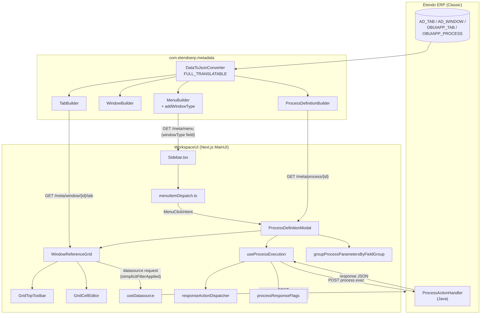

# Pick and Execute (P&E) — Complete Implementation Reference

> **Branch**: `feature/ETP-3751` (parent: `epic/ETP-3931`)
> **Last updated**: 2026-05-14
> **Status**: Feature complete. This document covers every commit on `feature/ETP-3751` and serves as the authoritative reference for how Pick and Execute works in the new Next.js UI. Open items from the previous snapshot have been resolved or explicitly deferred below.

---

## 1. TL;DR

Pick and Execute (P&E) is the Etendo process pattern in which a user opens a dialog, picks records from one or more embedded grids, optionally fills inline values into those rows, and executes a server-side action against the selection. In Etendo Classic this is the `OBUIAPP_PickAndExecute` UI pattern.

This branch reproduces P&E in the new Next.js UI with the following capabilities:

1. **Menu-driven and button-driven entry** — P&E processes can be opened from a sidebar menu entry (window of type `OBUIAPP_PickAndExecute`) and from a Process Definition button rendered on a window form.
2. **Multi-grid support** — a single P&E process stacks multiple Window Reference grids (e.g. Add Payment shows three grids: orders/invoices, GL items, credit-to-use), each independently selecting and validating records.
3. **Inline row editing** — when the user selects a row in a server-fetched grid, every cell in that row switches to the appropriate cell editor (text, number, selector, date, boolean). The editor is gated on selection state, not open at all times.
4. **Local-row grids (GL Items)** — grids driven by `AD_Tab.obuiappCanAdd = true` support adding, editing during creation, and deleting rows entirely client-side without hitting the backend. Confirmed rows become read-only and can only be removed by clicking the trash icon.
5. **Mandatory cell validation on create-row** — when the user saves a new row with empty mandatory fields, the create-row remains open, the affected cells turn red, and the system auto-fills `0` for numeric mandatory fields before checking.
6. **Search modal for selector fields in grid cells** — selector fields whose backing table has related records show a magnifying-glass button next to the dropdown editor; clicking it opens the full SelectorModal with filters.
7. **Dynamic column visibility (display logic)** — each grid column is shown or hidden based on the field's `displayLogicExpression` and `gridDisplayLogicExpression`, evaluated server-side and re-evaluated on every context change.
8. **Parameter field groups with collapsible sections** — process parameters are organized by `AD_FieldGroup`, matching classic UI behavior. Sections backed by `AD_FieldGroup.IsCollapsed = true` open collapsed by default.
9. **Per-row mandatory cell validation for execution gating** — the Execute button is disabled while any selected row in any grid has an empty mandatory cell.
10. **Single-record vs multi-record selection** — grid selection mode is driven by `tab.obuiappSelectionType`; execution mode by the process's `isMultiRecord` flag.
11. **Implicit filter toggle** — a funnel button disables the tab's implicit HQL/SQL filter for the modal session.
12. **Auto-select from `onLoad`** — a JavaScript hook can pre-select records matching a predicate when the process opens.
13. **Structured response actions** — the post-execute response is parsed into a typed action list (messages, grid refreshes, tab navigation, etc.).

---

## 2. End-to-End Architecture



Changes landed exclusively in the client and in the metadata adapter. The classic backend (`ProcessActionHandler`) was not modified.

---

## 3. Backend Changes (`com.etendoerp.metadata`)

### 3.1 [MenuBuilder.java](../../../../erp/modules/com.etendoerp.metadata/src/com/etendoerp/metadata/builders/MenuBuilder.java)

Added a private helper `addWindowType(JSONObject json, Window window)` called inside the window-menu emission path. When the menu entry has an associated `AD_WINDOW`, the JSON includes:

```json
{ "windowType": "OBUIAPP_PickAndExecute" }
```

The constant `JSON_WINDOW_TYPE_KEY = "windowType"` lives in `Constants.java`. The key is absent when `Window.getWindowType()` is null.

**Why**: the sidebar must discriminate a P&E menu entry from a regular window entry *before* the modal is opened, so it can route the click to `ProcessDefinitionModal` instead of opening a normal window screen.

### 3.2 ProcessDefinitionBuilder — contract locked by tests

`ProcessDefinitionBuilder.toJSON()` already invokes the converter with `DataResolvingMode.FULL_TRANSLATABLE`, which serializes every column of `OBUIAPP_PROCESS`, including `uIPattern` and `isMultiRecord`. No Java code change was needed. A new test file [ProcessDefinitionBuilderPickAndExecuteTest.java](../../../../erp/modules/com.etendoerp.metadata/src-test/src/com/etendoerp/metadata/builders/ProcessDefinitionBuilderPickAndExecuteTest.java) locks the contract.

### 3.3 ParameterBuilder — `fieldGroupCollapsed`

[ParameterBuilder.java](../../../../erp/modules/com.etendoerp.metadata/src/com/etendoerp/metadata/builders/ParameterBuilder.java) already serializes parameters via `FULL_TRANSLATABLE`. A dedicated `addFieldGroupCollapsed` method was added to emit `fieldGroupCollapsed: true/false` when a parameter belongs to a `FieldGroup` whose `AD_FieldGroup.IsCollapsed` is `true`. The client reads this flag to decide whether to start the collapsible section expanded or collapsed.

### 3.4 Existing builders unchanged

`TabBuilder` and `WindowBuilder` already serialize `hqlfilterclause`, `sQLWhereClause`, `obuiappSelectionType`, `filterName`, `obuiappCanAdd`, `obuiappCanDelete`, `obuiappShowSelect`, and `windowType` via `FULL_TRANSLATABLE`. New tests in `MenuBuilderTest.java` and `WindowBuilderTest.java` verify these fields are present in the API response.

---

## 4. API Client Type Surface

[packages/api-client/src/api/types.ts](../../../packages/api-client/src/api/types.ts) was extended to mirror the JSON fields exposed by the metadata adapter:

| Type | New field | Source column | Purpose |
|---|---|---|---|
| `UIPattern` (enum) | `PICK_AND_EXECUTE = "OBUIAPP_PickAndExecute"` | — | Discriminator constant |
| `WindowType` (enum) | `PICK_AND_EXECUTE = "OBUIAPP_PickAndExecute"` | `AD_WINDOW.WindowType` | Menu-level discriminator |
| `Menu` | `windowType?: string` | `AD_WINDOW.WindowType` | Surfaces window classification at menu API |
| `Tab` | `filterName?: string` | `OBUIAPP_TAB.FILTERNAME` | Human-readable implicit-filter label |
| `Tab` | `obuiappSelectionType?: "M" \| "S" \| "N" \| null` | `OBUIAPP_TAB.OBUIAPP_SELECTIONTYPE` | Grid row-selection UI mode |
| `Tab` | `obuiappCanAdd?: boolean` | `OBUIAPP_TAB.OBUIAPP_CANADD` | Whether the "+" button is visible for this tab |
| `Tab` | `obuiappCanDelete?: boolean` | `OBUIAPP_TAB.OBUIAPP_CANDELETE` | Whether the trash icon is visible per row |
| `Tab` | `obuiappShowSelect?: boolean` | `OBUIAPP_TAB.OBUIAPP_SHOWSELECT` | Whether the row-selection checkbox column is rendered |
| `ProcessDefinition` | `uIPattern?: UIPattern \| string` | `OBUIAPP_PROCESS.UIPattern` | P&E discriminator at the process level |
| `ProcessDefinition` | `isMultiRecord?: boolean \| "Y" \| "N"` | `OBUIAPP_PROCESS.IsMultiRecord` | Execution-mode flag (legacy string shape supported) |
| `ProcessParameter` | `fieldGroup?: string` | `OBUIAPP_PARAMETER.AD_FIELDGROUP_ID` | FieldGroup id for section grouping |
| `ProcessParameter` | `fieldGroup$_identifier?: string` | — (identifier via conv) | Human-readable FieldGroup name |
| `ProcessParameter` | `fieldGroupCollapsed?: boolean` | `AD_FIELDGROUP.IsCollapsed` | Whether section starts collapsed |

---

## 5. Menu Dispatch

### 5.1 `menuItemDispatch.ts`

[utils/menu/menuItemDispatch.ts](../../../packages/MainUI/utils/menu/menuItemDispatch.ts) is the pure function that maps a sidebar menu entry to a typed intent:

```ts
type MenuClickIntent =
  | { kind: "pick-and-execute"; button: ProcessDefinitionButton }
  | { kind: "process-definition"; button: ProcessDefinitionButton; processType: ProcessType }
  | { kind: "none" };

resolveMenuClickIntent(item: ExtendedMenu): MenuClickIntent;
```

Decision precedence:
1. **P&E** wins first — `item.windowType === "OBUIAPP_PickAndExecute"` even if `item.type === "ProcessDefinition"`.
2. **Process Definition** — `item.type === "ProcessDefinition" && item.id`.
3. **Report and Process** (legacy `Process` type) — both share the modal; intent carries `processType` so the modal selects the right payload shape.
4. Everything else returns `{ kind: "none" }`.

### 5.2 `menuItemTypes.ts`

Type constants (`MENU_ITEM_TYPES.PROCESS_DEFINITION`, `MENU_ITEM_TYPES.PROCESS`, etc.) live here so the dispatch logic compares against named constants rather than magic strings.

### 5.3 Sidebar integration

[Sidebar.tsx](../../../packages/MainUI/components/Sidebar.tsx) was refactored to call `resolveMenuClickIntent` and centralize modal opening behind a single `openProcessModal` callback. Both P&E and Process Definition intents call `openProcessModal`; the difference is which `processType` is carried in the intent.

---

## 6. P&E Discrimination & Mode Predicates

[utils/processes/definition/pickAndExecute.ts](../../../packages/MainUI/utils/processes/definition/pickAndExecute.ts) hosts three pure predicates:

### 6.1 `isPickAndExecute(process)`

```ts
const PICK_AND_EXECUTE_UI_PATTERN = "OBUIAPP_PickAndExecute";

export const isPickAndExecute = (process: ProcessDefinition | null | undefined): boolean => {
  if (!process) return false;
  if (process.uIPattern === PICK_AND_EXECUTE_UI_PATTERN) return true;
  return hasWindowReferenceParameter(process);
};
```

Primary discriminator is `uIPattern`. The fallback (checking for a Window Reference parameter via `FIELD_REFERENCE_CODES.WINDOW.id`) covers legacy seeds where `OBUIAPP_PROCESS.UIPattern` is not populated but the process has a Window Reference parameter.

### 6.2 `allowsMultipleRecords(process)`

Normalizes the legacy `"Y"` / `"N"` shape into a boolean. Default is `true` to match Etendo Classic. This flag controls **execution behaviour** — whether the handler receives one record ID or many. It does not control grid selection mode.

### 6.3 `tabAllowsMultipleSelection(tab)`

Controls the grid's row-selection UI mode by mapping `obuiappSelectionType`:

| `obuiappSelectionType` | Grid behaviour |
|---|---|
| `"M"` or absent | Multi-row (checkboxes) |
| `"S"` | Single-row |
| `"N"` | No selection (treated as single) |

---

## 7. Parameter Field Groups & Collapsible Sections

This feature (commits `b525e6d6`, `9e3f1dda`) mirrors classic UI behavior where process parameters can be organized under named `AD_FieldGroup` sections.

### 7.1 `groupProcessParametersByFieldGroup`

[utils/groupProcessParametersByFieldGroup.ts](../../../packages/MainUI/components/ProcessModal/utils/groupProcessParametersByFieldGroup.ts) is a pure function that takes the sorted list of visible parameters and returns a `ProcessParameterGroup[]`:

```ts
export interface ProcessParameterGroup {
  id: string;          // FieldGroup id, or "_main" sentinel for the default bucket
  identifier: string;  // FieldGroup display name
  sequenceNumber: number;
  fieldGroupCollapsed?: boolean;  // from AD_FieldGroup.IsCollapsed
  parameters: ProcessParameter[];
}
```

**Sticky-inheritance rule**: parameters are walked in sequence-number order. When a parameter has an explicit `fieldGroup`, it opens that section as the current group. Subsequent parameters with a null `fieldGroup` are appended to that same section — this is how the classic SmartClient renderer works sequentially through the parameter list.

Parameters appearing before any explicit FieldGroup are placed in the `DEFAULT_PROCESS_PARAM_GROUP_ID = "_main"` bucket, which is rendered without a collapsible wrapper (as a flat grid directly in the modal body).

### 7.2 `CollapsibleSection`

[components/CollapsibleSection.tsx](../../../packages/MainUI/components/ProcessModal/components/CollapsibleSection.tsx) is an uncontrolled component: its `initiallyExpanded` prop initializes local state, but after mount it responds only to user clicks.

- `initiallyExpanded = true` (default) mirrors `AD_FieldGroup.IsCollapsed = false` or absent.
- `initiallyExpanded = false` mirrors `AD_FieldGroup.IsCollapsed = true`.

The component was extracted from `ProcessDefinitionModal.tsx` into its own file so it can be unit-tested independently and reused.

### 7.3 Rendering pipeline in `ProcessDefinitionModal`

The `renderParameters()` function:
1. Filters parameters through `isParameterRenderable` (active, bulk-completion logic, display-logic for Window References).
2. Sorts by `sequenceNumber`.
3. Groups with `groupProcessParametersByFieldGroup`.
4. For each group, calls `renderGroup`, which splits members into `scalars` (non–Window Reference) and `windowRefs`, then renders:
   - Scalars in a 3-column grid via `renderScalarParameter` → `ProcessParameterSelector`.
   - Window References stacked vertically via `renderWindowReferenceParameter` → `WindowReferenceGrid`.
5. The default group (`_main`) is rendered as a plain `<div>`; named groups are wrapped in `CollapsibleSection`.

---

## 8. Window Reference Grid

[components/ProcessModal/WindowReferenceGrid.tsx](../../../packages/MainUI/components/ProcessModal/WindowReferenceGrid.tsx) renders the embedded grid for a single Window Reference parameter. It is built on top of Material React Table (MRT) and `useDatasource`. The component is large (~2,300 lines) and mixes data fetching, column building, row editing, and UI rendering; the key sub-systems are described below.

### 8.1 Fixed paper height

The outer MRT paper is fixed at `TABLE_PAPER_HEIGHT = 350px`. Previously, height was calculated dynamically from row count using per-row heights, which caused layout collapse when placed inside a flex container. The fixed height avoids this — the container's `flex-1` fills remaining space below the toolbar.

### 8.2 Selection modes

The component reads `tabAllowsMultipleSelection(stableWindowReferenceTab)` and sets MRT's `enableMultiRowSelection`. When multi-selection is disabled (or `!allowsMultipleRecords`), `clampToSingleRecord(next, prev)` keeps only the most recently toggled row.

When `tab.obuiappShowSelect === false`, rows are visually inert (no click-to-toggle, no blue highlight). The grid still propagates every record as `_allRows` for the backend payload — selection here is purely cosmetic, as the datasource pre-fills `obSelected = true` for all rows.

### 8.3 Column visibility — `isFieldVisibleForContext`

```ts
export function isFieldVisibleForContext(
  field: any,
  session: Record<string, unknown>,
  context: Record<string, unknown>
): boolean
```

This exported pure function (commit `92c4c52f`) decides whether a grid column should render. It checks in order:
1. `field.isActive === false` → hidden.
2. `field.displayed === false` → hidden.
3. `!field.showInGridView` → hidden.
4. `field.displayLogicExpression` evaluated — if `false`, hidden.
5. `field.gridDisplayLogicExpression` evaluated — if `false`, hidden.

Both expressions arrive **pre-rewritten from the backend**: `DynamicExpressionParser` (Java) expands session-variable placeholders like `@ACCT_DIMENSION_DISPLAY@` into JS that references `context['$Element_BP_APP_L']`-style keys. The `session` object from `useUserContext` carries those keys because `SessionBuilder` exposes them via `attributes`.

The `evaluateExpression` helper wraps `compileExpression` in a try/catch and **fails open** (returns `true`) on malformed expressions — keeping columns visible rather than silently hiding them on bad metadata.

The context passed to `isFieldVisibleForContext` is `{ ...user, ...session, ...recordValues }`. The `recordValues` slice lets expressions reference fields on the parent record (e.g. `@IsSOTrx@`).

### 8.4 Cell rendering architecture — `GridCellRenderer` and `InteractiveGridCellRenderer`

This was the most complex sub-system to get right. The challenge: MRT's `useColumns` hook installs a `Cell` function for each column (color tags, reference buttons, client-class links, etc.). That upstream `Cell` doesn't know about row selection, so it can't switch to an editor when the user picks a row.

**Solution** (commit `50ade9fb`): when building `finalColumns`, preserve the upstream `Cell` under a new key `fallbackCell`, then unconditionally set `Cell = GridCellRenderer`.

```
useColumns result:
  { ..., Cell: <upstream color/ref wrapper> }
            ↓
finalColumns override:
  { ..., Cell: GridCellRenderer, fallbackCell: <upstream wrapper> }
```

`GridCellRenderer` (module-level, not inside the component) reads `row.getIsSelected()` and `row.original?._locallyAdded` and decides:

```
if (isSelected && !isLocallyAdded)  → StableGridCellEditorRenderer  (shows editor)
else if (isDateColumn)              → <span> with formatted date
else if (fallbackCell)              → fallbackCell(props)  (upstream Cell)
else                                → InteractiveGridCellRenderer  (plain text)
```

`InteractiveGridCellRenderer` (for the plain-text fallback) also checks `!isFieldReadOnly` before the editor branch.

**Why `_locallyAdded`?** When `handleCreateRow` confirms a new row, it calls `setRowSelection((prev) => ({ ...prev, [id]: true }))` — so newly confirmed rows are immediately selected. Without the `_locallyAdded` guard, those rows would render as editors (breaking the "confirmed rows are read-only" requirement). Setting `_locallyAdded: true` on `row.original` when the row is added via `addRecordLocally` provides a stable, per-row flag that module-level renderers can read without needing component state from closures.

The `parameterDBColumnName` column-def key (the parent P&E parameter's DB column name, same for every column in the grid) is distinct from `dbColumnName` (the field's own DB column name). Both are stored on the column-def to avoid key collision.

### 8.5 `StableGridCellEditorRenderer` and `WindowReferenceGridContext`

Because `GridCellRenderer` is defined at module level (outside the component), it cannot access component state via closure. Instead, state is funneled through `WindowReferenceGridContext`:

```ts
interface WindowReferenceGridContextValue {
  effectiveRecordValuesRef: MutableRefObject<any>;
  parametersRef: MutableRefObject<any>;
  fieldsRef: MutableRefObject<any[]>;
  handleRecordChangeRef: MutableRefObject<((row, changes) => void) | null>;
  validationsRef: MutableRefObject<any[]>;
  validations: any[];
  session: any;
  tabId: string | undefined;
  tab?: Tab | null;
  fieldReadOnlyMap: Record<string, boolean>;
  shouldSendOrg: boolean;
  createRowErrors: Set<string>;
  clearCellError: (columnName: string) => void;
}
```

`Ref`-based fields (`effectiveRecordValuesRef`, `fieldsRef`, `handleRecordChangeRef`) are used for dynamic data that changes frequently — storing them as refs avoids triggering context re-renders on every keystroke. The `validations` array is stored both as a ref (for reads inside event handlers) and as plain state (to trigger re-renders when validation changes).

`StableGridCellEditorRenderer` consumes the context and delegates to `GridCellEditor`, forwarding:
- `cell`, `row`, `column` from MRT.
- `forceError` — true when the cell's `columnName` appears in `createRowErrors` (mandatory-empty validation for the active create-row).
- `onCellEdit` — set to `clearCellError` for creating rows, so the red border disappears as the user types.

### 8.6 `GridCellEditor` — inline cell editor

[GridCellEditor.tsx](../../../packages/MainUI/components/ProcessModal/GridCellEditor.tsx) resolves the matching field definition from `fieldsRef`, computes `fieldType` via `getFieldReference`, assembles `handleChange` (which calls `onRecordChange` to persist into `localRecords`), and renders:

```
<div className="flex w-full items-center gap-1">
  <div className="flex-grow min-w-0">
    <CellEditorFactory ... />
  </div>
  {showSearchButton && <IconButton onClick={() => setIsSearchModalOpen(true)} />}
</div>
```

**Search button** (commit `a6730a76`): shown when `matchingField.selector?.hasTableRelated === true && !isFieldReadOnly`. The same condition used by `GenericSelector` in form mode. When the user clicks it, `SelectorModal` opens with the field's selector definition, current context, and the tab from `WindowReferenceGridContext`. On selection, `handleModalSelect` resolves the real ID via `selector.valueField`, builds an option with the displayable label via `selector.displayField`, and routes it through the same `handleChange` used by the dropdown editor — unifying `$_identifier` propagation and `onRecordChange` notification across both paths.

**`BooleanCellEditor`**: was refactored to use the same `onChange(value, option)` signature as other editors so it integrates cleanly with `handleChange` in `GridCellEditor`.

### 8.7 Local-row grid — Add/Delete row (the GL Items pattern)

This sub-system (commit `08c6b1e0`) enables grids whose tabs have `obuiappCanAdd = true` and/or `obuiappCanDelete = true` to work entirely client-side, without backend round-trips.

**Tab capability detection** (computed from tab metadata, not hardcoded):

```ts
const isReadOnlyTab = windowReferenceTab?.uIPattern === UIPattern.READ_ONLY;
const canAdd    = windowReferenceTab?.obuiappCanAdd === true    && !isReadOnlyTab;
const canDelete = windowReferenceTab?.obuiappCanDelete === true && !isReadOnlyTab;
const enableRowSelectionFromMetadata = windowReferenceTab?.obuiappShowSelect !== false;
```

**"+" button**: rendered by `GridTopToolbar` when `canAdd`. Clicking it calls `handleAddRow`, which pre-fills `0` for every mandatory numeric field (see §8.8) and calls `table.setCreatingRow(initialRow)` to open MRT's creating-row scaffold.

**Creating-row scaffold**: MRT shows an inline row with an editor in every cell. When the user fills the fields and clicks the save icon (or MRT's own Save/Cancel chrome), `onCreatingRowSave` fires.

**`handleCreateRow`** (called by `onCreatingRowSave`):
1. Merges `values` from MRT with `row.original` (inline edits from custom cell editors).
2. Applies `applyNumericMandatoryDefaults` — pre-fills `0` for any mandatory numeric field not yet filled.
3. Calls `collectMissingMandatory` — finds mandatory fields still empty.
4. If any missing: sets `createRowErrors` (a `Set<string>` of `columnName`s) and **aborts** — the creating-row stays open with red cells.
5. If none missing: calls `buildLocalGridRecord` to generate a UUID-based id, calls `addRecordLocally({ ...record, _locallyAdded: true })`, selects the new row via `setRowSelection`, and closes the creating-row with `table.setCreatingRow(null)`.

The `_locallyAdded: true` flag is critical — it tells `GridCellRenderer` and `InteractiveGridCellRenderer` that this row is confirmed and should render as read-only even though it is selected.

**Trash icon**: rendered by `renderRowActions` when `canDelete`. For the creating-row scaffold (where `isCreating || !row.original?.id`), `MRT_EditActionButtons` are rendered instead so the user can save or cancel the new row. For confirmed rows, the trash icon calls `handleDeleteRow`.

**`handleDeleteRow`**:
1. Removes the record from `useDatasource`'s local buffer via `removeRecordLocally`.
2. Removes it from `localRecords` state.
3. Removes it from `persistentSelectionRef` and `rowSelection`.
4. Removes it from the parent's `GridSelectionStructure` (both `_selection` and `_allRows`).

**Why no backend save**: these grids are a batch input surface. All rows are held in memory and delivered at once when the surrounding process is executed. The pattern matches classic Openbravo P&E behavior for GL Items in Add Payment.

**Action column sizing**: `displayColumnDefOptions["mrt-row-actions"]` fixes the column at `100px` non-resizable, so the action column doesn't grow or shrink with content.

### 8.8 Mandatory validation for creating rows

Two utilities in [utils/validateMandatoryFields.ts](../../../packages/MainUI/components/ProcessModal/utils/validateMandatoryFields.ts):

**`collectMissingMandatory(fields, values): Set<string>`** — returns the set of `columnName`s for mandatory fields with no filled value. Checks all four key shapes (`columnName`, `hqlName`, `name`, `_key`) because MRT, custom cell editors, and the field definition each use different naming transforms. The empty predicate (`isEmptyValue`) treats `null`, `undefined`, and empty string as empty; `0` and `false` are valid.

**`applyNumericMandatoryDefaults(fields, values): Record<string, unknown>`** — returns a copy of `values` with `0` filled for every mandatory field whose `type` is `FieldType.NUMBER` or `FieldType.QUANTITY` and that is currently empty. This mirrors classic UI behavior where the unused side of mutually-exclusive amount fields (e.g. `received_in` / `paid_out`) stays at `0` without forcing the user to type it.

Both functions check all key shapes, so their lookups land regardless of which naming transform the value was written under.

**`createRowErrors` state and `clearCellError`** — when `handleCreateRow` aborts due to missing mandatory fields, `setCreateRowErrors(missing)` fires. This bubbles into `WindowReferenceGridContext`, where `StableGridCellEditorRenderer` reads it via `createRowErrors.has(colDef.columnName)` to set `forceError = true` on the cell. When the user edits the cell, `onCellEdit = clearCellError` is called, removing the column from the error set. On `onCreatingRowCancel`, `setCreateRowErrors(new Set())` clears all errors.

### 8.9 Default values for numeric fields on row creation

Before opening the creating-row scaffold (commit `9e498891`), `handleAddRow` in `GridTopToolbar` walks `visibleFieldsFromTab` and pre-fills `0` for every mandatory field whose `type` is `FieldType.NUMBER` or `FieldType.QUANTITY`:

```ts
const handleAddRow = () => {
  const initialValues: Record<string, unknown> = {};
  for (const field of visibleFieldsFromTab) {
    if (field.isMandatory && (field.type === FieldType.NUMBER || field.type === FieldType.QUANTITY)) {
      const keys = [field.columnName, field.hqlName, field.name, field._key].filter(Boolean);
      for (const k of keys) initialValues[k] = 0;
    }
  }
  const initialRow = Object.keys(initialValues).length > 0
    ? createRow(table, initialValues as EntityData)
    : undefined;
  table.setCreatingRow(initialRow ?? true);
};
```

`visibleFieldsFromTab` is passed from `WindowReferenceGrid` into `GridTopToolbar` as a prop, since the toolbar doesn't own the tab data. The `createRow` helper from MRT constructs a fully initialized row with the given values so the cells show `0` immediately when the scaffold opens.

**Why `visibleFieldsFromTab`?** The field type resolution (`getFieldReference(field.column?.reference)`) requires the full field definition with the `column.reference` chain, which is only available after `parseColumns` runs. Passing already-resolved fields avoids re-running that logic inside the toolbar.

### 8.10 `generateLocalRecordId` / `buildLocalGridRecord`

[utils/generateLocalRecordId.ts](../../../packages/MainUI/components/ProcessModal/utils/generateLocalRecordId.ts):

- `generateLocalRecordId()`: uses `crypto.randomUUID()` when available; falls back to a Math.random-based v4 UUID for environments without crypto. Output is uppercased and dash-stripped to match the id shape expected by `useDatasource`.
- `buildLocalGridRecord(values, rowOriginal)`: merges MRT-tracked values with inline edits from `row.original` (custom cell editors write directly into `row.original`), attaches the generated id, and returns both the id and the merged record separately so callers can use the id for selection without re-reading the record.

### 8.11 Implicit filter button

**Gating**: the button is rendered only when `stableWindowReferenceTab?.hqlfilterclause || stableWindowReferenceTab?.sQLWhereClause` — tabs without an implicit filter never show it (unlike classic, which shows a non-functional funnel everywhere).

**State machine** (one-shot toggle, cannot be re-enabled in the same session):

| State | `isImplicitFilterApplied` | Icon | Clickable |
|---|---|---|---|
| Initial | `undefined` (treated as `true`) | `FilterAlt` (colored) | yes |
| After click | `false` | `FilterAltOff` (grey) | **no** (disabled) |

The `<span>` wrapper around the disabled `IconButton` is required for MUI's `Tooltip` to receive pointer events over a disabled element.

**Datasource integration**: the grid passes `isImplicitFilterApplied ?? true` to `useDatasource`, so the default before the user has interacted is "filter on."

### 8.12 Datasource integration details

`useDatasource` is called with:
- `entity`: the tab's `entityName`.
- `params`: built by `buildDatasourceOptions` from the process context, parent record values, defaults, and current form values.
- `columns`: `rawColumns` (Column[] from the tab's metadata).
- `activeColumnFilters`: `appliedTableFilters` (the column filters the user has explicitly applied).
- `skip`: `shouldSkipFetch` (true when essential parameters are missing or the tab/entity is not resolved).
- `isImplicitFilterApplied`: controlled value, falling back to `true`.

The grid subscribes to `records`, `hasMoreRecords`, `fetchMore`, `addRecordLocally`, and `removeRecordLocally` from the hook. `addRecordLocally` and `removeRecordLocally` operate on the datasource's local buffer without re-fetching.

### 8.13 Sorting and criteria

`getSortByString(sorting, rawColumns, hasCriteria)` converts MRT's `MRT_SortingState` to the Etendo sortBy query param:
- Looks up each sort item against `column.filterFieldName`, `column.columnName`, or `column.header`.
- Prefixes with `-` for descending.
- Returns `-documentNo` as a default when there are criteria but no explicit sorting (matches classic default sort for filtered grids).

---

## 9. Modal Orchestration (`ProcessDefinitionModal`)

### 9.1 Grid selection model

```ts
export type GridSelectionStructure = {
  [parameterName: string]: {
    _selection: EntityData[];  // rows currently picked
    _allRows: EntityData[];    // all visible rows (used for auto-select / payscript)
  };
};
```

Each `WindowReferenceGrid` updates only its own slot via `setGridSelection`. `_allRows` is populated in an `useEffect` when `records` are loaded; `_selection` is updated on row toggle.

### 9.2 Execute button gating

Disabled when any of the following hold:
1. `hasInvalidSelection` from `useGridRowValidation` — any selected row has an empty mandatory cell.
2. Required P&E process has zero selected rows across all grids.
3. Execution is in flight.

### 9.3 Display logic for Window Reference parameters

`evaluateWindowReferenceDisplay(options)` evaluates a parameter's `displayLogicExpression` against current modal values so a grid can appear/disappear dynamically (e.g. the Credit To Use grid in Add Payment is hidden when there is nothing to credit).

### 9.4 Auto-select from `onLoad`

A JavaScript hook on the process (`eTMETAOnload`) may return:
```js
{ autoSelectConfig: { table: "order_invoice", logic: { field: "salesOrderNo", operator: "=", valueFromContext: "documentNo" } } }
```

Two shapes:
- **Predicate-based**: `{ field, operator, value | valueFromContext }`.
- **Explicit ID list**: `{ ids: ["id1", "id2"] }`.

Filter expressions from `onLoad` are stored in `onLoadFilterExpressionsRef` and re-applied to the grid's filter state so the user sees the same slice.

---

## 10. Execution Pipeline (`useProcessExecution`)

### 10.1 Four execution paths

1. **Window Reference (P&E)**: `handleWindowReferenceExecute`. Builds payload from `GridSelectionStructure`, appends extra parameters, POSTs to the classic process servlet.
2. **Direct Java handler**: `executeJavaProcess`. Sends parameter values as a flat map.
3. **String function (legacy)**: looks up the function on `OB` namespace and invokes it.
4. **Report and Process**: emits a download request.

### 10.2 Response parsing (`responseActionDispatcher`)

[utils/responseActionDispatcher.ts](../../../packages/MainUI/components/ProcessModal/utils/responseActionDispatcher.ts) normalizes the `responseActions[]` array from Etendo Classic handlers:

| Key | Effect |
|---|---|
| `showMsgInProcessView` | Message inside the modal |
| `showMsgInView` | Toast in parent window |
| `openDirectTab` | Navigate to a record |
| `refreshGrid` | Refresh parent window's grid |
| `refreshGridParameter` | Refresh a specific P&E grid by name |
| `setSelectorValueFromRecord` | Patch selector in parent form |
| `smartclientSay` | Generic alert |

`readResponseActions(data)` handles three nested paths used by Etendo Classic. Unknown keys are silently dropped.

### 10.3 Response flags (`processResponseFlags`)

[utils/processResponseFlags.ts](../../../packages/MainUI/components/ProcessModal/utils/processResponseFlags.ts):

- `shouldRefreshAfterProcess(data)`: default `true` — refresh parent window unless handler returns `refreshParent: false`.
- `shouldRetryAfterProcess(data)`: default `false` — keep modal open only when handler returns `retryExecution: true`.

| `refreshParent` | `retryExecution` | Modal | Parent grid |
|---|---|---|---|
| `true` | `false` | Closes | Refreshes |
| `false` | `false` | Closes | No refresh |
| `true` | `true` | Stays open | Refreshes |
| `false` | `true` | Stays open | No refresh |

---

## 11. Tests

### 11.1 Client (Jest + React Testing Library)

| File | What it locks in |
|---|---|
| [pickAndExecute.test.ts](../../../packages/MainUI/utils/processes/definition/__tests__/pickAndExecute.test.ts) | All three predicates; `uIPattern`, Window Reference fallback, `"Y"`/`"N"` normalization, `obuiappSelectionType` |
| [menuItemDispatch.test.ts](../../../packages/MainUI/utils/menu/__tests__/menuItemDispatch.test.ts) | Intent decision tree; P&E-over-ProcessDefinition precedence; legacy type fallback |
| [responseActionDispatcher.test.ts](../../../packages/MainUI/components/ProcessModal/utils/__tests__/responseActionDispatcher.test.ts) | All 7 action types; nested-path extraction; unknown keys dropped |
| [processResponseFlags.test.ts](../../../packages/MainUI/components/ProcessModal/utils/__tests__/processResponseFlags.test.ts) | Default-true / default-false semantics; triple-path precedence |
| [useGridRowValidation.test.ts](../../../packages/MainUI/components/ProcessModal/hooks/__tests__/useGridRowValidation.test.ts) | Single/multi-grid validation; empty detection; ignored fields |
| [useProcessExecution.responseFlags.test.ts](../../../packages/MainUI/components/ProcessModal/hooks/__tests__/useProcessExecution.responseFlags.test.ts) | `retryExecution` × `refreshParent` interaction |
| [ProcessDefinitionModal.singleSelect.test.ts](../../../packages/MainUI/components/ProcessModal/__tests__/ProcessDefinitionModal.singleSelect.test.ts) | `clampToSingleRecord` invariants (CT-AD-2) |
| [ProcessDefinitionModal.multiGrid.test.ts](../../../packages/MainUI/components/ProcessModal/__tests__/ProcessDefinitionModal.multiGrid.test.ts) | Multi-grid selection isolation and aggregated validation (CT-AD-3) |
| [groupProcessParametersByFieldGroup.test.ts](../../../packages/MainUI/components/ProcessModal/utils/__tests__/groupProcessParametersByFieldGroup.test.ts) | Grouping rules, sticky inheritance, fieldGroupCollapsed propagation |
| [CollapsibleSection.test.tsx](../../../packages/MainUI/components/ProcessModal/__tests__/CollapsibleSection.test.tsx) | Initial expanded/collapsed state; toggle interaction |
| [validateMandatoryFields.test.ts](../../../packages/MainUI/components/ProcessModal/utils/__tests__/validateMandatoryFields.test.ts) | Missing detection across all 4 key shapes; `isEmptyValue`; numeric defaults |
| [generateLocalRecordId.test.ts](../../../packages/MainUI/components/ProcessModal/utils/__tests__/generateLocalRecordId.test.ts) | UUID format; `buildLocalGridRecord` merging order |
| [GridCellEditor.test.tsx](../../../packages/MainUI/components/ProcessModal/__tests__/GridCellEditor.test.tsx) | Search modal visibility; `handleModalSelect` ID/label resolution; `forceError` propagation |
| [GridTopToolbar.test.tsx](../../../packages/MainUI/components/ProcessModal/__tests__/GridTopToolbar.test.tsx) | "+ button" visibility; implicit filter button state machine |
| [CellEditors.test.tsx](../../../packages/MainUI/components/Table/__tests__/CellEditors.test.tsx) | `BooleanCellEditor` signature alignment |
| [TableDirCellEditor.test.tsx](../../../packages/MainUI/components/Table/__tests__/TableDirCellEditor.test.tsx) | TableDir cell editor inline behavior |
| [WindowReferenceGrid.test.tsx](../../../packages/MainUI/components/ProcessModal/__tests__/WindowReferenceGrid.test.tsx) | `GridCellRenderer` selection-gated editability; `_locallyAdded` blocks editor; exported utility functions |

Run all with `pnpm test:mainui` from the repo root.

### 11.2 Adapter (JUnit)

- `ProcessDefinitionBuilderPickAndExecuteTest.java` — `uIPattern` + `isMultiRecord` round-trip.
- `MenuBuilderTest.java` — `windowType` emitted for P&E and Maintain windows.
- `WindowBuilderTest.java` — `windowType` passthrough.

---

## 12. File Index

### New files (client)

```
packages/MainUI/utils/processes/definition/pickAndExecute.ts
packages/MainUI/utils/processes/definition/__tests__/pickAndExecute.test.ts
packages/MainUI/utils/menu/menuItemDispatch.ts
packages/MainUI/utils/menu/menuItemTypes.ts
packages/MainUI/utils/menu/__tests__/menuItemDispatch.test.ts
packages/MainUI/components/ProcessModal/hooks/useGridRowValidation.ts
packages/MainUI/components/ProcessModal/hooks/__tests__/useGridRowValidation.test.ts
packages/MainUI/components/ProcessModal/hooks/__tests__/useProcessExecution.responseFlags.test.ts
packages/MainUI/components/ProcessModal/utils/responseActionDispatcher.ts
packages/MainUI/components/ProcessModal/utils/processResponseFlags.ts
packages/MainUI/components/ProcessModal/utils/groupProcessParametersByFieldGroup.ts
packages/MainUI/components/ProcessModal/utils/generateLocalRecordId.ts
packages/MainUI/components/ProcessModal/utils/validateMandatoryFields.ts
packages/MainUI/components/ProcessModal/utils/__tests__/responseActionDispatcher.test.ts
packages/MainUI/components/ProcessModal/utils/__tests__/processResponseFlags.test.ts
packages/MainUI/components/ProcessModal/utils/__tests__/groupProcessParametersByFieldGroup.test.ts
packages/MainUI/components/ProcessModal/utils/__tests__/generateLocalRecordId.test.ts
packages/MainUI/components/ProcessModal/utils/__tests__/validateMandatoryFields.test.ts
packages/MainUI/components/ProcessModal/components/CollapsibleSection.tsx
packages/MainUI/components/ProcessModal/__tests__/CollapsibleSection.test.tsx
packages/MainUI/components/ProcessModal/__tests__/ProcessDefinitionModal.singleSelect.test.ts
packages/MainUI/components/ProcessModal/__tests__/ProcessDefinitionModal.multiGrid.test.ts
packages/MainUI/components/ProcessModal/__tests__/GridCellEditor.test.tsx
packages/MainUI/components/ProcessModal/__tests__/GridTopToolbar.test.tsx
packages/MainUI/components/ProcessModal/__tests__/WindowReferenceGrid.test.tsx
packages/MainUI/components/ProcessModal/__tests__/WindowReferenceGridContext.test.tsx
packages/MainUI/components/Table/__tests__/CellEditors.test.tsx
packages/MainUI/components/Table/__tests__/TableDirCellEditor.test.tsx
```

### Modified files (client)

```
packages/api-client/src/api/types.ts                                   (UIPattern, WindowType, Tab, ProcessDefinition, ProcessParameter fields)
packages/MainUI/components/ProcessModal/ProcessDefinitionModal.tsx     (field groups, collapsible sections, parameter rendering pipeline)
packages/MainUI/components/ProcessModal/WindowReferenceGrid.tsx        (inline editing, local rows, display logic, fixed height, fallbackCell)
packages/MainUI/components/ProcessModal/GridCellEditor.tsx             (search modal button, BooleanCellEditor alignment)
packages/MainUI/components/ProcessModal/WindowReferenceGridContext.tsx (createRowErrors, clearCellError, tab prop)
packages/MainUI/components/ProcessModal/types.ts                       (new prop types)
packages/MainUI/components/ProcessModal/imports.ts                     (isPickAndExecute export)
packages/MainUI/components/ProcessModal/hooks/useProcessExecution.ts   (response parsing extraction, refresh flags)
packages/MainUI/components/Sidebar.tsx                                 (menu dispatch refactor)
packages/MainUI/components/Table/CellEditors/BooleanCellEditor.tsx     (onChange signature alignment)
packages/MainUI/components/Table/CellEditors/CellEditorFactory.tsx     (selector integration)
packages/MainUI/components/Table/CellEditors/SelectCellEditor.tsx      (option propagation)
packages/MainUI/components/Table/CellEditors/TableDirCellEditor.tsx    (inline behavior)
packages/MainUI/components/Table/EmptyState.tsx                        (containerStyle prop)
packages/ComponentLibrary/src/locales/en.ts                            (addRow / deleteRow translations)
packages/ComponentLibrary/src/locales/es.ts                            (addRow / deleteRow translations)
```

### New files (adapter)

```
src-test/src/com/etendoerp/metadata/builders/ProcessDefinitionBuilderPickAndExecuteTest.java
```

### Modified files (adapter)

```
src/com/etendoerp/metadata/builders/MenuBuilder.java          (addWindowType helper)
src/com/etendoerp/metadata/builders/ParameterBuilder.java     (addFieldGroupCollapsed)
src/com/etendoerp/metadata/utils/Constants.java               (JSON_WINDOW_TYPE_KEY)
src-test/src/com/etendoerp/metadata/builders/MenuBuilderTest.java    (windowType coverage)
src-test/src/com/etendoerp/metadata/builders/WindowBuilderTest.java  (windowType passthrough)
```

---

## 13. Known Limitations and Deferred Items

1. **`refreshGridParameter` not yet routed**: the action is parsed by `responseActionDispatcher` but the side-effect dispatcher in `useProcessExecution` does not yet route it to a specific P&E grid refresh — it falls through to the generic refresh path. To be wired once a backend handler actually emits it.
2. **`filterName` not rendered**: the field is exposed on the `Tab` type and emitted by the adapter, but the implicit-filter button uses generic translations rather than the human-readable name. Consider adding to `aria-label` or tooltip.
3. **Per-row display logic in validation**: `useGridRowValidation` does not evaluate per-row display logic — it applies mandatory checks regardless of field visibility per row. The code comment notes the path forward (`compileExpression` + `createSmartContext` per row).
4. **Single-record execution payload shape**: when `allowsMultipleRecords === false`, the payload normalizes to an array of one; a parity audit against every classic process in the catalog is planned.
5. **Payscript integration**: `etmetaPayscriptLogic` on `OBUIAPP_PROCESS` is parsed but its integration with the modal's recompute loop is tracked separately.

---

## 14. Glossary

| Term | Meaning |
|---|---|
| **P&E** | Pick and Execute. UI pattern where the user picks records from one or more grids and triggers a server-side action. |
| **Window Reference** | Reference type (`FF80818132D8F0F30132D9BC395D0038`) used by process parameters to embed an `AD_WINDOW` inside the process dialog. |
| **Implicit filter** | Server-side HQL/SQL where-clause on a tab (`OBUIAPP_TAB.HQL_FILTERCLAUSE` / `AD_TAB.WhereClause`). Can be disabled from the toolbar funnel in the modal session. |
| **`uIPattern`** | Column on `OBUIAPP_PROCESS`. `"OBUIAPP_PickAndExecute"` flags the process as P&E. |
| **`isMultiRecord`** | Column on `OBUIAPP_PROCESS`. Controls execution payload: whether the handler receives 1 or N record IDs. Independent of grid selection mode. |
| **`obuiappSelectionType`** | Column on `OBUIAPP_TAB`. Controls grid selection UI: `"M"` (multi), `"S"` (single), `"N"` (none). |
| **`obuiappCanAdd`** | Column on `OBUIAPP_TAB`. When true, the "+" button appears in the grid toolbar and rows can be added locally. |
| **`obuiappCanDelete`** | Column on `OBUIAPP_TAB`. When true, a trash icon appears per row so locally-added rows can be removed. |
| **`obuiappShowSelect`** | Column on `OBUIAPP_TAB`. When false, the row-selection checkbox column is hidden; all rows are implicitly included in `_allRows`. |
| **`_locallyAdded`** | Field on `row.original` set to `true` when a row is confirmed via the creating-row scaffold. Tells cell renderers that the row is read-only even when selected. |
| **Local-row grid** | A P&E grid that holds rows entirely in client memory, without backend round-trips, until the surrounding process is executed. GL Items in Add Payment is the canonical example. |
| **`createRowErrors`** | Set of `columnName`s that were empty when the user tried to save a creating row. Drives the red-cell visual. Cleared on edit or cancel. |
| **`fallbackCell`** | The original `Cell` function installed by `useColumns` (color tags, reference buttons, etc.), stashed on the column-def so `GridCellRenderer` can delegate to it for non-selected, non-editing cells. |
| **`responseActions`** | Structured array emitted by classic handlers; replaces the legacy SmartClient HTML parser. |
| **`refreshParent` / `retryExecution`** | Boolean flags on the process response controlling modal lifecycle post-execute. Defaults: `true` / `false`. |
| **`fieldGroupCollapsed`** | Property on a parameter (surfaced from `AD_FieldGroup.IsCollapsed`) and on `ProcessParameterGroup`. Controls whether the collapsible section starts expanded or collapsed. |
| **CT-AD-2 / CT-AD-3** | Internal acceptance criteria IDs for single-record clamping and multi-grid isolation respectively. |
