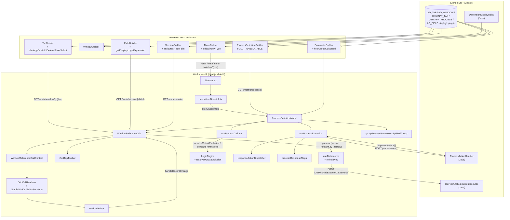

# Pick and Execute (P&E) — Complete Implementation Reference

> **Branch**: `feature/ETP-3751` (target: `epic/ETP-3931`)
> **Last updated**: 2026-05-20
> **Status**: Feature complete. This document is the authoritative reference for how Pick and Execute works in the new Next.js UI. Read top-to-bottom, it should answer: what is P&E, where does each piece live, what decisions were taken at each layer, and why.

---

## 1. TL;DR

Pick and Execute (P&E) is the Etendo pattern where a user opens a dialog, picks rows from one or more embedded grids, optionally edits cells inline, and triggers a server-side action against the selection. In Etendo Classic this is `OBUIAPP_PickAndExecute`.

The implementation reproduces P&E in the new UI with these capabilities:

1. **Menu-driven and button-driven entry** — opens from a sidebar entry (`AD_WINDOW.WindowType = "OBUIAPP_PickAndExecute"`) and from a Process Definition button on a window form.
2. **Multi-grid composition** — a single process stacks several Window Reference grids (e.g. Add Payment shows Order/Invoice, GL Items, Credit-to-use).
3. **Inline cell editing** — when a row is selected, every cell switches to the matching editor. Read-only fields and confirmed local rows stay inert.
4. **Local-row grids** — tabs with `OBUIAPP_TAB.OBUIAPP_CANADD = true` allow adding/removing rows entirely in client memory; backend round-trip only happens at Execute time.
5. **Single-pass initial load** — spinner → table-with-records-and-defaults in one visible transition (no empty-flash, no late-applied default amount).
6. **Cell edits never refetch the datasource** — the datasource fires only on initialization, filter change, sort change, or explicit refresh. Editing an Amount does **not** trigger an HTTP request.
7. **Mandatory validation per cell** — empty mandatory cells get a red border on save; the row stays open until filled.
8. **Selector search modal in grid cells** — selector editors expose a lupa button that opens the full SelectorModal with default filters.
9. **Dynamic column visibility** — both `displayLogic` and `gridDisplayLogic` are evaluated against the user session + accounting-dimension attributes.
10. **Field groups with collapsible sections** — parameters are bucketed by `AD_FieldGroup`; sections honor `AD_FieldGroup.IsCollapsed`.
11. **Declarative cell-edit reactions** — payscripts declare mutually-exclusive column pairs; the grid zeroes the sibling synchronously, no script round-trip.
12. **Implicit-filter toggle, auto-select from onLoad, structured `responseActions`** — all wired.

The two halves of the implementation live in:

- `com.etendoerp.metadata` — adapter that exposes the existing `OBUIAPP_*` columns over the JSON metadata API the new UI consumes.
- `client/packages/MainUI` — the consumer. Everything UI-side is wired around `ProcessDefinitionModal` and `WindowReferenceGrid`.

The classic backend (`ProcessActionHandler`) was **not** modified. The new UI talks to it through the same `/OBPickAndExecuteDataSource` and process-execute servlets Etendo Classic uses.

---

## 2. End-to-End Architecture



---

## 3. Backend Adapter (`com.etendoerp.metadata`)

The new UI is metadata-driven: every UI decision (which fields are mandatory, which columns are hidden, whether a tab supports "+" or trash, what FieldGroup a parameter belongs to, etc.) is computed by reading the JSON the adapter publishes. The adapter's job is to expose every relevant column on the Etendo Classic models without invalidating the existing classic UI that reads the same tables.

### 3.1 `MenuBuilder.addWindowType`

When emitting a menu entry that backs an `AD_WINDOW`, the adapter inlines `windowType: <Window.windowType>` when present. Driven by `Constants.JSON_WINDOW_TYPE_KEY`. The field is omitted when null.

**Why at menu level**: the sidebar needs to decide *before* clicking whether to open a normal window screen or the P&E modal. The window type is the discriminator, and the menu is the only metadata the sidebar has at that point.

### 3.2 `TabBuilder` — selection / row-management capabilities

Already serialized via `FULL_TRANSLATABLE`, but the implementation explicitly emits `obuiappCanAdd` as a boolean (defaulting to `false`) because the converter omits it when null on tabs that don't set it. The other booleans (`obuiappCanDelete`, `obuiappShowSelect`, `obuiappSelectionType`) and the implicit-filter strings (`hqlfilterclause`, `sQLWhereClause`, `filterName`) flow through the full-translatable path.

### 3.3 `FieldBuilder.addGridDisplayLogic`

Adds `gridDisplayLogicExpression` to each field JSON when `AD_FIELD.displaylogicgrid` is non-blank. The expression is **pre-rewritten** by `DynamicExpressionParser` (Java) so client-side variable placeholders like `@ACCT_DIMENSION_DISPLAY@` are expanded to JS expressions that reference `context['$Element_BP_APP_L']`-style keys.

This is what allows the new UI to evaluate per-field grid visibility (e.g. accounting-dimension columns that depend on whether the client maintains dimensions centrally) without re-implementing the placeholder engine in the browser.

### 3.4 `SessionBuilder.buildAcctDimensionSessionAttributes`

Adds an `attributes` map to the `/meta/session` payload, populated from `DimensionDisplayUtility`. Contains:
- `IsAcctDimCentrally` → `"Y"` / `"N"`.
- One entry per accounting-dimension element (e.g. `$Element_BP_APP_L: "Y"`) when central maintenance is on.

This is the runtime context that `gridDisplayLogicExpression` (and any other server-rewritten expression) expects. Without it, every accounting-dimension column would fail evaluation and either appear (fail-open semantics) or disappear silently — neither is right.

### 3.5 `ParameterBuilder.addFieldGroupCollapsed`

Emits `fieldGroupCollapsed: true/false` when the parameter belongs to an `AD_FieldGroup`. Mirrors classic `OBViewParameterHandler.OBViewParamGroup.isExpanded()`. Read by the client to decide the initial `<details>` state of the collapsible section.

### 3.6 `ProcessDefinitionBuilder`

Unchanged from the previous epic. `FULL_TRANSLATABLE` already serializes every column of `OBUIAPP_PROCESS` including `uIPattern`, `isMultiRecord`, and `etmetaPayscriptLogic`. The new test `ProcessDefinitionBuilderPickAndExecuteTest` locks the contract.

---

## 4. API Client Type Surface

`packages/api-client/src/api/types.ts` exposes every backend field the client needs to type-check against. The current shape:

| Type | Field | Source | Purpose |
|---|---|---|---|
| `UIPattern` | `PICK_AND_EXECUTE = "OBUIAPP_PickAndExecute"` | enum constant | Process-level discriminator |
| `WindowType` | `PICK_AND_EXECUTE = "OBUIAPP_PickAndExecute"` | `AD_WINDOW.WindowType` | Menu-level discriminator |
| `Menu` | `windowType?: string` | `AD_WINDOW.WindowType` | Surfaces window classification at menu API |
| `Tab` | `filterName?: string` | `OBUIAPP_TAB.FILTERNAME` | Human-readable implicit-filter label |
| `Tab` | `obuiappSelectionType?: "M"\|"S"\|"N"\|null` | `OBUIAPP_TAB` | Grid row-selection UI mode |
| `Tab` | `obuiappCanAdd?: boolean` | `OBUIAPP_TAB` | "+" button visibility |
| `Tab` | `obuiappCanDelete?: boolean` | `OBUIAPP_TAB` | Trash icon visibility |
| `Tab` | `obuiappShowSelect?: boolean` | `OBUIAPP_TAB` | Whether the row-checkbox column is rendered |
| `Field` | `gridDisplayLogicExpression?: string` | `AD_FIELD.displaylogicgrid` (rewritten) | Per-row grid-column visibility |
| `ProcessDefinition` | `uIPattern?: UIPattern\|string` | `OBUIAPP_PROCESS.UIPattern` | P&E flag |
| `ProcessDefinition` | `isMultiRecord?: boolean\|"Y"\|"N"` | `OBUIAPP_PROCESS.IsMultiRecord` | Execution-mode flag |
| `ProcessParameter` | `fieldGroup?: string` | `OBUIAPP_PARAMETER.AD_FIELDGROUP_ID` | Section grouping |
| `ProcessParameter` | `fieldGroup$_identifier?: string` | derived | Section display name |
| `ProcessParameter` | `fieldGroupCollapsed?: boolean` | `AD_FIELDGROUP.IsCollapsed` | Initial section state |
| `Session.attributes` | `Record<string, string>` | `DimensionDisplayUtility` | Acct-dim context for expressions |

---

## 5. Menu Dispatch

`utils/menu/menuItemDispatch.ts` is the pure decision function that maps a sidebar menu entry to a typed intent:

```ts
type MenuClickIntent =
  | { kind: "pick-and-execute"; button: ProcessDefinitionButton }
  | { kind: "process-definition"; button: ProcessDefinitionButton; processType: ProcessType }
  | { kind: "none" };
```

Decision precedence (in order):
1. **P&E** wins first — `item.windowType === "OBUIAPP_PickAndExecute"`, even if `item.type === "ProcessDefinition"`. P&E is opened in the same modal but with a different parameter-rendering path.
2. **Process Definition** — `item.type === "ProcessDefinition" && item.id`.
3. **Report and Process** (legacy `Process` type) — shares the modal; `processType` is carried in the intent so the modal selects the right payload shape.
4. Everything else → `{ kind: "none" }`.

`menuItemTypes.ts` exports the `MENU_ITEM_TYPES` constants so the dispatcher uses named constants, not strings.

`Sidebar.tsx` was refactored to delegate to `resolveMenuClickIntent` and route P&E + Process Definition intents through a single `openProcessModal` callback.

---

## 6. P&E Discrimination & Mode Predicates

`utils/processes/definition/pickAndExecute.ts` exposes three pure predicates, all unit-tested.

### 6.1 `isPickAndExecute(process)`

Primary signal: `process.uIPattern === "OBUIAPP_PickAndExecute"`.
Fallback: `hasWindowReferenceParameter(process)` — covers legacy seeds that never set `UIPattern` but do attach a Window Reference parameter (`FIELD_REFERENCE_CODES.WINDOW.id`).

### 6.2 `allowsMultipleRecords(process)`

Normalizes `isMultiRecord` across its legacy shapes (`true` / `false` / `"Y"` / `"N"`) into a boolean. Default is `true` to match Etendo Classic.

This controls **execution semantics** — whether the handler is called with one record id or many. It does **not** drive grid selection mode.

### 6.3 `tabAllowsMultipleSelection(tab)`

Maps `obuiappSelectionType`:

| Value | Grid behaviour |
|---|---|
| `"M"` or absent | Multi-row (checkboxes) |
| `"S"` | Single-row (clamp to last toggled) |
| `"N"` | No selection (treated as single) |

Independent from `allowsMultipleRecords` — the same process can have a single-record execution but a multi-select grid (the backend picks one), or vice versa.

---

## 7. Parameter Field Groups & Collapsible Sections

### 7.1 `groupProcessParametersByFieldGroup`

Pure function in `components/ProcessModal/utils/`. Takes the sequence-sorted list of visible parameters and returns:

```ts
interface ProcessParameterGroup {
  id: string;          // FieldGroup id, or "_main" sentinel
  identifier: string;  // FieldGroup display name
  sequenceNumber: number;
  fieldGroupCollapsed?: boolean;
  parameters: ProcessParameter[];
}
```

**Sticky-inheritance rule**: parameters are walked in sequence-number order. The first parameter with a non-null `fieldGroup` opens that section as the active group. Subsequent parameters with null `fieldGroup` are appended to that same section — this is how the classic SmartClient renderer works.

Parameters appearing before any explicit FieldGroup land in the sentinel bucket `DEFAULT_PROCESS_PARAM_GROUP_ID = "_main"`, which is rendered as a flat region (no collapsible chrome) directly inside the modal body. This kept the default-bucket from looking like an unnamed section labelled "Main".

### 7.2 `CollapsibleSection`

Uncontrolled component (its own file under `components/ProcessModal/components/` so it can be unit-tested without mounting the entire modal). `initiallyExpanded` initializes the local toggle state; after mount it only responds to user clicks. Mapping:

- `initiallyExpanded = true` (default) — `AD_FieldGroup.IsCollapsed = false` or absent.
- `initiallyExpanded = false` — `AD_FieldGroup.IsCollapsed = true`.

### 7.3 Rendering pipeline in `ProcessDefinitionModal`

`renderParameters()`:
1. Filters via `isParameterRenderable` (active + bulk-completion + Window Reference display logic).
2. Sorts by `sequenceNumber`.
3. Groups via `groupProcessParametersByFieldGroup`.
4. For each group, splits members into `scalars` (rendered in a 3-column grid via `ProcessParameterSelector`) and `windowRefs` (rendered stacked, full-width, via `WindowReferenceGrid`).
5. `_main` is rendered as a plain `<div>`; named groups are wrapped in `CollapsibleSection`.

---

## 8. Window Reference Grid — the heart of the implementation

`components/ProcessModal/WindowReferenceGrid.tsx` (~2,600 lines) wraps Material React Table (MRT) v3 and `useDatasource` into a single component that handles fetching, columns, selection, inline editing, local rows, mandatory validation, payscript reactions, and toolbar. Because it's large, the design extracts every piece of pure logic to module-level helpers (exported and tested) and threads state through `WindowReferenceGridContext` so the renderer functions can live outside the React component (and avoid the per-render allocation MRT triggers when you put them inline).

This section walks each sub-system and the reasoning behind it.

### 8.1 Initial load — single visible transition

The legacy load flow had three visible steps: empty table → records appear → default Amount fills in. Three causes were eliminated.

**Cause A — premature spinner exit.** The previous predicate `(tabLoading || processConfigLoading || !isDataReady) && !records` short-circuited as soon as `localRecords` was initialized to `[]` (truthy in JS), so the empty table rendered before the first datasource fetch resolved. Replaced with a predicate that includes a real "have we received the first page yet?" signal:

```
hasReceivedFirstPage = rawRecordsStringRef.current !== ""
isInitialLoading = tabLoading || processConfigLoading || !isDataReady
                || (datasourceLoading && !hasReceivedFirstPage)
```

`rawRecordsStringRef` is the JSON-stringified snapshot of the latest `rawRecords` — it stays at `""` until `useDatasource` resolves at least once. Crucially, the `datasourceLoading && !hasReceivedFirstPage` clause keeps the spinner active *only* on the very first fetch; subsequent filter/sort fetches don't reopen the spinner.

**Cause B — late-applied default Amount.** The Classic SmartClient applies `payment = expectedAmount ?? outstanding ?? 0` on every row pre-flagged with `obSelected = true`. The previous code only applied that default inside `handleRowSelection`, which fires on user toggle — not on the initial sync of `rawRecords → localRecords`. The fix extracts the logic into a module-level helper:

```ts
export function buildSelectedRecord(record: EntityData): EntityData {
  const hasNonZeroPayment = record.payment != null && Number(record.payment) !== 0;
  const defaultPayment = hasNonZeroPayment
    ? record.payment
    : (record.expectedAmount ?? record.outstanding ?? 0);
  if (record.obSelected === true && record.payment === defaultPayment) return record;
  return { ...record, obSelected: true, payment: defaultPayment };
}
```

The function is reused by:
- The initial sync effect (`rawRecords → localRecords`) — every row with `obSelected = true` is mapped through it before `setLocalRecords`.
- `handleRowSelection` — when the user clicks a checkbox.

Returning the same reference when no change is needed lets downstream React memos bail out.

**Cause C — 100 ms cosmetic stall.** A `setTimeout(setIsDataReady, 100)` existed to mask the empty-flash. With the strengthened guard it's no longer needed, and `setIsDataReady(true)` is called synchronously once `processConfig` lands.

### 8.2 Selection modes

`tabAllowsMultipleSelection(stableWindowReferenceTab)` drives MRT's `enableMultiRowSelection`. When false (or `!allowsMultipleRecords`), `clampToSingleRecord(next, prev)` keeps only the row most recently toggled by the user.

When `tab.obuiappShowSelect === false`, the row-selection column is hidden entirely. The grid still propagates every record as `_allRows` so the backend handler sees them — selection is implicit ("all of them"). This is the mode used by the GL Items grid in Add Payment: every row is meaningful input.

### 8.3 Fixed paper height

The MRT paper container is fixed at `TABLE_PAPER_HEIGHT = 350px`. The earlier implementation computed height from row count, which collapsed inside flex containers. The fixed-paper approach defers the remaining space to the flex parent.

### 8.4 Column visibility — `isFieldVisibleForContext`

Exported pure function. Checks, in order:

1. `field.isActive === false` → hidden.
2. `field.displayed === false` → hidden.
3. `!field.showInGridView` → hidden.
4. `field.displayLogicExpression` evaluated → if false, hidden.
5. `field.gridDisplayLogicExpression` evaluated → if false, hidden.

Both expressions arrive **already rewritten** from the backend by `DynamicExpressionParser`. The browser only compiles + evaluates the JS. `evaluateExpression` wraps `compileExpression` in try/catch and **fails open** (returns `true`) on broken expressions — never silently hides a column due to bad metadata.

The context passed to the predicate is `{ ...user, ...session, ...recordValues }`:
- `user` — current user data.
- `session` — `currentClient`, `currentRole`, `currentOrganization`, plus the `attributes` map (`$Element_BP_APP_L`, `IsAcctDimCentrally`, etc.) emitted by `SessionBuilder`.
- `recordValues` — fields on the parent record (e.g. `@IsSOTrx@`).

This is what makes accounting-dimension columns turn on/off correctly per-row in the GL Items grid.

### 8.5 Cell rendering architecture

The most architecturally delicate sub-system. The challenge: MRT's `useColumns` hook (from the metadata layer) installs a `Cell` function for each column (color tags, reference buttons, client-class links, etc.). That upstream `Cell` doesn't know about row selection, so it can't switch to an editor when the user picks a row.

**Solution**: when building `finalColumns`, preserve the upstream `Cell` under a new key `fallbackCell`, then unconditionally set `Cell = GridCellRenderer`.

```
useColumns:    { ..., Cell: <upstream wrapper> }
                          ↓
finalColumns:  { ..., Cell: GridCellRenderer, fallbackCell: <upstream wrapper> }
```

`GridCellRenderer` is **module-level**, not nested inside the component. The reason: MRT mounts `Cell` as part of the column definition, and a function created inside the component body would be a new identity every render — MRT would re-mount the cell tree and inputs would lose focus on every keystroke. Module-level keeps identity stable.

But module-level means no closure access to component state. So state flows through `WindowReferenceGridContext` (next section).

`GridCellRenderer` decides what to render:

```
isFieldReadOnly?     → fallbackCell (or plain text)
isLocallyAdded row?  → fallbackCell (confirmed local rows are read-only)
isSelected row?      → StableGridCellEditorRenderer  (editor on)
isDateColumn?        → formatted span
otherwise            → fallbackCell  (or InteractiveGridCellRenderer)
```

The exported pure helper `shouldRenderCellEditor(isSelected, isFieldReadOnly, isLocallyAdded)` encapsulates this decision so it's testable in isolation.

**Why `_locallyAdded`?** When `handleCreateRow` confirms a new row, it calls `setRowSelection((prev) => ({ ...prev, [id]: true }))` so the row is immediately selected (the user expects the new row to feel "active"). Without a separate marker, the row would render as an editor — but the requirement is that confirmed local rows stay read-only and can only be removed via the trash icon. Setting `_locallyAdded: true` on `row.original` when the row is added via `addRecordLocally` gives module-level renderers a stable per-row flag they can read from `row.original` without needing closure state.

### 8.6 `WindowReferenceGridContext` — the bridge

Because cell renderers and the inline editor are module-level (or wrapped in `memo`), state and callbacks have to flow through context:

```ts
interface WindowReferenceGridContextValue {
  effectiveRecordValuesRef: MutableRefObject<any>;
  parametersRef: MutableRefObject<any>;
  fieldsRef: MutableRefObject<any[]>;
  handleRecordChangeRef: MutableRefObject<((row, changes) => void) | null>;
  validationsRef: MutableRefObject<any[]>;
  validations: any[];
  session: any;
  tabId: string | undefined;
  tab?: Tab | null;
  fieldReadOnlyMap: Record<string, boolean>;
  shouldSendOrg: boolean;
  createRowErrors: Set<string>;
  clearCellError: (columnName: string) => void;
  siblingPatchVersion: number;
}
```

**Refs vs values.** Frequently-mutated data (`effectiveRecordValuesRef`, `fieldsRef`, `handleRecordChangeRef`) is stored as refs so reads inside event handlers always see the latest snapshot **without** invalidating context consumers. The `validations` array is exposed both as a ref (for handlers) and as plain state (so `StableGridCellEditorRenderer` re-renders when validations change).

`siblingPatchVersion` is a single integer that bumps when a payscript-driven mutual-exclusion patch fires on a cell that lives in a row not yet in `localRecords` (the MRT create-row scaffold). The version flows through context and feeds `GridCellEditor`'s `memo` comparator — bumping it forces the sibling cell to re-read `row.original` on the next paint, which is how the zero shows up in the UI for create-row siblings. See §8.10.

### 8.7 `GridCellEditor` — the inline editor

Lives in `components/ProcessModal/GridCellEditor.tsx`. Wrapped in `memo` with a custom comparator that includes `siblingPatchVersion`. The component:

1. Resolves the matching field definition from `fieldsRef` (looks up by header / `_key` / `columnName`).
2. Computes `fieldType` via `getFieldReference(field.column?.reference)`.
3. Builds `handleChange(newValue, selectedOption?)`, which:
   - Writes both the HQL camelCase key (`receivedIn`) AND the DB snake_case key (`received_in`) on `row.original` — see §8.8 below.
   - For TableDir/Search/Product/Selector references, also writes `<key>$_identifier` and `<dbKey>$_identifier` so the displayable label is in sync with the resolved id.
   - Calls `handleRecordChangeRef.current(row, changes)` to propagate to `setLocalRecords` and `onSelectionChange`.
   - Calls `onCellEdit(columnName)` when the cell belongs to the create-row, clearing its red-border error.
4. Renders `<CellEditorFactory>` plus, when applicable, a magnifying-glass `IconButton` that opens the full `SelectorModal`.

The error indicator is **border-only** (no message text below). `validationError` flips a `hasError` flag that inner editors propagate to their `border-red-500` className. The previous text variant was removed because validation messages were too long and broke layout; a richer indicator (tooltip / aggregated panel) is a deferred task.

### 8.8 Dual-key writes — DB and HQL shapes

`parseColumns` stores both names on each `Column`:
- `column.columnName` = HQL camelCase (e.g. `paidOut`) — used by accessors and form-level handlers.
- `column.dbColumnName` = DB snake_case (e.g. `paid_out`) — used by the row-data path and the payload sent to the datasource.

`getRawCellValue` (the column's `accessorFn`) reads `value[dbColumnName] ?? value[hqlName]`. The `??` chain matters: it falls back to HQL only when the DB key is nullish.

The implication: if a write hits only one of the two keys, the accessor still reads the *other* key on the next render, and the cell appears unchanged. This bit the GL Items grid because `handleAddRow` (toolbar) seeds `0` for mandatory numeric fields under both shapes, and a subsequent user edit that touches only the HQL key leaves `value.paid_out === 0` and the cell still reads `0`.

Resolution: `handleChange` in `GridCellEditor` mirrors every write to both keys:

```
row.original[col.columnName] = newValue;
if (col.dbColumnName && col.dbColumnName !== col.columnName) {
  row.original[col.dbColumnName] = newValue;
}
```

The same mirroring is applied to `$_identifier` writes for selector fields.

### 8.9 HQL property-name resolution

The metadata API ships `field.hqlName` that is sometimes a broken display label (`"g/LItem"`, `"orderNo."`). The corresponding metadata key in `tab.fields["<key>"]` IS the canonical HQL property name by Etendo convention — it's what backend handlers expect (e.g. `glItem.getString("gLItem")`).

`resolveHqlName(field, metadataKey)` chooses the best candidate:

1. If the metadata key matches the canonical shape (`/^[a-z][a-zA-Z0-9]*$/`), trust it.
2. Else if `field.hqlName` matches the canonical shape, use it.
3. Else if `field.columnName` matches, use it.
4. Else fall back to the metadata key (or empty string).

`isValidHqlName` is the predicate (exported, unit-tested). It strictly rejects DB snake_case (`c_glitem_id`), display labels with separators (`"G/L Item"`, `"orderNo."`), and anything containing whitespace or dots.

The result is assigned to the parsed field's `hqlName`, then propagated into the column object as both `accessorKey` and `columnName`. The `column.dbColumnName` is kept distinct (it's the actual DB column, used for the dual-key writes).

### 8.10 Declarative cell-edit reactions (mutual exclusion)

Some grids have columns that are mutually exclusive — for example, in the GL Items grid, "Received In" and "Paid Out" can't both be non-zero on the same row. Classic SmartClient implements this with imperative JS that runs in the form layer and writes the sibling to zero. The new implementation makes it **declarative**.

A payscript can declare:

```ts
interface FieldInteractionsConfig {
  [gridName: string]: {
    mutualExclusion?: [string, string][];
  };
}
```

`gridName` is the `dBColumnName` of the Window Reference parameter (`"glitem"`, `"order_invoice"`). Each pair lists two columns; column names may be DB or HQL shapes.

For the Add Payment script (`AddPaymentRulesClean.js`):

```ts
fieldInteractions: {
  glitem: {
    mutualExclusion: [
      ["received_in", "paid_out"],
      ["receivedIn", "paidOut"],
    ],
  },
}
```

Both naming shapes are declared because `handleRecordChange` only sees one of them in the `changes` patch, and the engine matches by exact string.

**Runtime path**:

1. `LogicEngine.resolveMutualExclusion(rules, gridName, changes)` is pure: given `rules`, the grid name, and the changes patch, returns a `{ siblingKey: 0 }` patch when the edited column is in a pair AND its value is non-zero.
2. `WindowReferenceGrid.applyFieldInteractions(processId, gridName, row, changes)` looks up the rules registered for `processId` via `getPayScriptRules`, calls `resolveMutualExclusion`, expands each emitted key to **both** snake_case and camelCase via `expandKeyVariants`, mutates `row.original[key] = 0` for each variant, mirrors the write to `row._valuesCache[key]` (MRT's per-cell value cache), and returns the merged patch (`{ ...changes, ...siblingPatch }`).
3. `handleRecordChange` calls `applyFieldInteractions` BEFORE looking up `localRecords`. The reason: MRT create-rows (id `"mrt-row-create"`) haven't entered `localRecords` yet, so the sibling-zeroing has to happen on `row.original` + `_valuesCache`, not on state.
4. When `applyFieldInteractions` returns a different reference from `changes` (i.e. it actually emitted a patch), `setSiblingPatchVersion((v) => v + 1)` bumps. The bumped version flows through context into the `memo` comparator of every `GridCellEditor`, forcing the sibling cell to invalidate and re-read `row.original` on the next paint.
5. For rows already in `localRecords`, the normal `setLocalRecords` + `onSelectionChange` path runs with the merged patch — `siblingPatchVersion` is redundant but harmless.

The same logic is applied as a defense-in-depth net at create-row save time inside `handleCreateRow` — if an edit was dispatched while the rules registry was momentarily empty (e.g. timing edge cases during process bootstrap), the save-time pass closes the gap.

**Why declarative rather than imperative**: the rule lives next to the rest of the payscript logic (compute, transform, format), it's pure and unit-testable in isolation, and the runtime can apply it synchronously inside the React update cycle — no intermediate frame ever shows the pre-rule state.

### 8.11 Local-row grids — the GL Items pattern

Tabs with `obuiappCanAdd = true` and/or `obuiappCanDelete = true` operate entirely in client memory.

Capability detection (computed from tab metadata, never hardcoded by parameter name):

```ts
const isReadOnlyTab = windowReferenceTab?.uIPattern === UIPattern.READ_ONLY;
const canAdd    = windowReferenceTab?.obuiappCanAdd === true    && !isReadOnlyTab;
const canDelete = windowReferenceTab?.obuiappCanDelete === true && !isReadOnlyTab;
const enableRowSelectionFromMetadata = windowReferenceTab?.obuiappShowSelect !== false;
```

The previous implementation hardcoded a `GL_ITEM_PARAMETER_DB_NAME === "glitem"` check to enable always-editable cells; that constant was removed once the `_locallyAdded` flag carried the same semantics correctly. The new design is fully metadata-driven.

**"+" button** — rendered by `GridTopToolbar` when `canAdd`. `handleAddRow`:
1. Walks `visibleFieldsFromTab` (passed from `WindowReferenceGrid` as a prop, since the toolbar doesn't own field metadata).
2. For each mandatory `NUMBER` / `QUANTITY` field, seeds `0` under all four key shapes (`columnName`, `hqlName`, `name`, `_key`) — covering every accessor lookup pattern. The dual-key seeding under both DB and HQL shapes is crucial to defeat `getRawCellValue`'s `??` fallback (see §8.8).
3. Calls `table.setCreatingRow(createRow(table, initialValues))` to open MRT's creating-row scaffold with the seeded values already visible in the cells.

**Creating-row scaffold** — MRT shows an inline row with an editor in every cell. The user fills the non-zero side, MRT/our chrome fires `onCreatingRowSave`.

**`handleCreateRow`**:
1. Merges `values` from MRT with `row.original` (custom cell editors write directly into `row.original`).
2. Applies `applyNumericMandatoryDefaults` — pre-fills `0` for any mandatory numeric field still empty.
3. Applies `resolveMutualExclusion` as a defense-in-depth pass (see §8.10).
4. Calls `collectMissingMandatory` — finds mandatory fields still empty across all four key shapes.
5. If any missing → calls `setCreateRowErrors(missing)` (set-equality-preserving via reference check) and **aborts**. The scaffold stays open with red borders.
6. If none missing → calls `buildLocalGridRecord(values, row?.original)` which generates a `crypto.randomUUID`-based id and returns `{ id, record }`. Calls `addRecordLocally({ ...record, _locallyAdded: true })`, sets the row as selected, closes the scaffold.

**Trash icon** — rendered via the exported helper `renderActionsCell({ row, table, canDelete, onDelete, deleteRowLabel })`. Two branches:
- Creating row (id is the MRT sentinel or no `original.id`) → render MRT's `MRT_EditActionButtons` (Save / Cancel).
- Confirmed row → render the trash IconButton. Disabled while ANY other row is being created (one row at a time).

**`handleDeleteRow`**:
1. Removes from `useDatasource`'s buffer via `removeRecordLocally`.
2. Removes from `localRecords`.
3. Removes from `persistentSelectionRef` and `rowSelection`.
4. Removes from the parent `GridSelectionStructure` (`_selection` AND `_allRows`).

**Edit-mode hardening** — three layers prevent the "double-click to edit a cell of a persisted row" vector that MRT's `editDisplayMode: "cell"` would otherwise allow:

1. `editDisplayMode: "row"` — a double-click no longer activates per-cell editing.
2. `enableEditing = (row) => isPersistedRow(row) ? false : <other checks>` — any row that already has `row.original.id` is rejected from edit-mode regardless of how MRT tries to enter it. `isPersistedRow` is an exported one-liner.
3. The cell-renderer decision tree (§8.5) — even if a row somehow entered edit-mode, `shouldRenderCellEditor` returns false for read-only fields and `_locallyAdded` rows.

The previously-existing `handleSaveRow` was removed entirely — MRT's per-row save path is no longer used; all edits go through `handleRecordChange` triggered by the inline editor.

**Action column sizing** — `displayColumnDefOptions["mrt-row-actions"]` fixes the column at `100px` non-resizable so the trash + creating-row chrome don't reflow.

### 8.12 Mandatory validation for creating rows

Two utilities in `components/ProcessModal/utils/validateMandatoryFields.ts`:

- `collectMissingMandatory(fields, values)` — returns the `Set<string>` of `columnName`s for mandatory fields with no filled value. Checks all four key shapes (`columnName`, `hqlName`, `name`, `_key`) because the same field can be written under any of them depending on which writer touched it. `isEmptyValue` treats `null`, `undefined`, and `""` as empty; `0` and `false` are valid.
- `applyNumericMandatoryDefaults(fields, values)` — returns a copy of `values` with `0` filled for every mandatory `NUMBER` / `QUANTITY` field still empty. Mirrors classic UI behavior where the unused side of a mutually-exclusive amount pair stays at `0` without the user typing.

`createRowErrors` (the `Set<string>` of failed columns) bubbles into `WindowReferenceGridContext`. `StableGridCellEditorRenderer` reads it via `createRowErrors.has(colDef.columnName)` to set `forceError = true` on the cell. `onCellEdit = clearCellError` is wired for create-row cells, removing the column from the set as soon as the user edits. `onCreatingRowCancel` resets the set.

### 8.13 Datasource integration — fetching once, sending always-fresh params

`useDatasource` is the shared data hook. It used to refetch whenever `JSON.stringify(params)` changed. That broke P&E grids because:

- The process payscript runs on every selection / grid-change.
- The payscript writes derived totals (`amount_inv_ords`, `total`, `difference`, ...) back into the form via `form.setValue`.
- Those form values are folded into the datasource params by `mergeCurrentValuesIntoParams` because the backend needs them to resolve `@VARIABLE@` placeholders in the implicit filter on fetch.
- So every cell edit → payscript fires → form values change → params hash changes → refetch.

But Classic Etendo fetches the P&E grid **once** on open and only refetches on explicit filter/sort/refresh actions. The new implementation matches that behavior with a two-part split.

**Part A — `WindowReferenceGrid` stabilizes its inputs**. Two `useMemo` layers, both keyed off a cheap scalar-only hash (`computeScalarStableKey`):

- `stableRecordValues` — wraps `effectiveRecordValues` (parent record context).
- `stableCurrentValues` — wraps `currentValues` (form fields from the modal). This is the key one: without it, editing a grid cell re-renders the parent modal, which hands us a fresh `currentValues` reference even when no scalar field changed — destabilizing `datasourceOptions`.

`computeScalarStableKey(values)`:
```
Object.entries(values)
  .filter(([, v]) => v !== null && v !== undefined && typeof v !== "object")
  .map(([k, v]) => `${k}:${v}`)
  .join("|")
```

It deliberately ignores nested objects and arrays — they would require full JSON.stringify and we don't currently rely on nested structure for the consumers. Adding nested support would slow the hot path without payoff.

**Part B — `useDatasource` accepts a narrow `refetchKey`**. Two new pieces in the hook:

1. An optional `refetchKey?: string` prop.
2. An internal `hasFirstFetchCompleted` state that flips `true` only after a real network fetch returns (NOT in the `skip` branch where `loaded` also flips true).

The trigger key for the stabilizing memo on `params` becomes:

```ts
const stableParamsTriggerKey =
  !hasFirstFetchCompleted || refetchKey === undefined
    ? JSON.stringify(params)
    : refetchKey;

const stableParams = useMemo(() => params, [stableParamsTriggerKey]);
```

During warmup (`!hasFirstFetchCompleted`), the hook falls back to the legacy full-params hash, so initialization-time mutations (e.g. `onLoad` populating form values that get folded into the request body) still re-trigger the pending fetch and produce a **complete initial request payload**. After the first fetch settles, the hook locks the trigger to the narrow `refetchKey` if provided.

**Critically, `params` is still read fresh on every render** — the memo only governs *when* `useDatasource` notices and re-fetches, not *what* is sent on the next fetch. So a filter change fires a refetch with the current values + form context already folded in.

**Part C — `WindowReferenceGrid` builds the narrow key**. `datasourceRefetchKey` is a `JSON.stringify` of only the fetch-meaningful slice:

```ts
{
  criteria,
  sortBy,
  isSorting,
  isImplicitFilterApplied,
  tabId,
  processId,
  windowId,
  pageSize,
}
```

Notably absent: any form-derived field. Cell edits cannot move any of these keys, so no refetch fires.

**Final wiring**:

```ts
useDatasource({
  entity: String(entityName),
  params: datasourceOptions,            // fresh on every render
  columns: rawColumns,
  activeColumnFilters: appliedTableFilters,
  skip: shouldSkipFetch,
  isImplicitFilterApplied: isImplicitFilterApplied ?? true,
  refetchKey: datasourceRefetchKey,     // narrow trigger
});
```

This satisfies both invariants: the initial request body has every form-resolved param the backend needs, and subsequent cell edits never trigger a network call.

### 8.14 Implicit filter button

**Gating**: rendered only when the tab actually has an implicit filter (`stableWindowReferenceTab?.hqlfilterclause || sQLWhereClause`). Tabs without one never show the funnel (classic shows it everywhere, non-functional; the new UI doesn't).

**State machine** — one-shot toggle:

| State | `isImplicitFilterApplied` | Icon | Clickable |
|---|---|---|---|
| Initial | `undefined` (treated as `true`) | `FilterAlt` (colored) | yes |
| After click | `false` | `FilterAltOff` (grey) | **no** (disabled) |

The disabled `IconButton` is wrapped in a `<span>` so MUI's `Tooltip` can receive pointer events over a disabled element.

The grid passes `isImplicitFilterApplied ?? true` to `useDatasource` so the default-before-interaction is "filter on". When the value flips, the `refetchKey` recomputes (it includes `isImplicitFilterApplied`) → a real refetch fires.

### 8.15 Selector dropdown — default filters with caching

In-cell selector editors (TableDir / Search / Product / Selector references) can have a Selector Definition with `defaultFilters` configured server-side. The dropdown opens with those filters pre-applied so the user sees a sensible initial slice.

`GridCellEditor` uses a per-component `defaultsCacheRef = useRef<Map<string, Promise<...>>>()`:

- Key: `selectorDefinitionId`.
- Value: a Promise that resolves to `{ defaults, criteria }` — the response of `fetchSelectorDefaultFilters` plus the criteria built via `buildCriteriaFromDefaults`.

Typing N letters in the dropdown's search field re-triggers the dropdown's datasource query N times, but the defaults fetch only fires **once** per selector instance because the Promise is cached. The cache lives on the component ref and clears on unmount.

The default context for the call is built via `buildSelectorDefaultContext({ ...buildEtendoContext(graph, session, language, tabId), ...current row values })`. This is the same context used by the form-level `GenericSelector`, so the dropdown behavior matches between the form and the grid cell.

The lupa (magnifying-glass) button next to the dropdown opens the full `SelectorModal` with the same field definition, current context, and tab. On selection, `handleModalSelect` resolves the real id via `selector.valueField`, builds an option labelled via `selector.displayField`, and routes through the same `handleChange` used by the dropdown — unifying `$_identifier` propagation across both paths.

### 8.16 Sorting and criteria

`getSortByString(sorting, rawColumns, hasCriteria)` converts MRT's `MRT_SortingState` to the Etendo sortBy query param. Looks up each sort item against `column.filterFieldName`, `column.columnName`, or `column.header`; prefixes with `-` for descending; returns `-documentNo` as a default when there ARE criteria but no explicit sort (matches classic default sort on filtered grids).

### 8.17 External grid-selection sync (callouts)

When the parent modal updates `gridSelection` (typically because the payscript wrote a new selection back), the grid syncs MRT's `rowSelection` to match. The sync uses a functional `setRowSelection` with a structural-equality bail-out:

```ts
setRowSelection((prev) => {
  const prevKeys = Object.keys(prev);
  if (prevKeys.length === newIds.length && newIds.every((id) => prev[id] === true)) {
    return prev;  // same content → return same ref → React skips re-render
  }
  const next: MRT_RowSelectionState = {};
  for (const id of newIds) next[id] = true;
  return next;
});
```

Without that guard, the upstream deps (`rawRecords`, `parameter`, `effectiveRecordValues`) would re-fire the effect on every parent render and a freshly-built `newRowSelection` object — even with identical keys — would trigger another render via reference comparison, producing an infinite render loop.

---

## 9. Modal Orchestration (`ProcessDefinitionModal`)

### 9.1 Grid-selection model

```ts
type GridSelectionStructure = {
  [parameterName: string]: {
    _selection: EntityData[];  // rows currently picked
    _allRows: EntityData[];    // all visible rows (for auto-select / payscript)
  };
};
```

Each `WindowReferenceGrid` updates only its own slot via `setGridSelection`. `_allRows` is populated when `records` are loaded; `_selection` is updated on row toggle. Grids with `obuiappShowSelect = false` populate `_allRows` but leave `_selection` empty — the payscript reads from `_allRows` via `util.getAllGridRows`.

### 9.2 Execute button gating

Disabled when ANY of:
1. `hasInvalidSelection` from `useGridRowValidation` — any selected row has an empty mandatory cell.
2. A required P&E process has zero selected rows across all grids.
3. Execution is in flight.

### 9.3 Display logic for Window Reference parameters

`evaluateWindowReferenceDisplay(options)` evaluates a parameter's `displayLogicExpression` against current modal values, so a grid can appear / disappear dynamically (e.g. the Credit-to-Use grid is hidden when there's nothing to credit).

### 9.4 Auto-select from `onLoad`

A JavaScript hook on the process (`eTMETAOnload`) may return:

```js
{ autoSelectConfig: { table: "order_invoice", logic: { field: "salesOrderNo", operator: "=", valueFromContext: "documentNo" } } }
```

Two shapes:
- **Predicate-based** — `{ field, operator, value | valueFromContext }`.
- **Explicit id list** — `{ ids: ["id1", "id2"] }`.

Filter expressions from `onLoad` are stored in `onLoadFilterExpressionsRef` and re-applied to the grid's filter state so the user sees the same slice the auto-select acted on.

### 9.5 Callouts and the payscript pipeline

`useProcessCallouts` watches `gridSelection` for changes and runs the registered payscript. The script has access to:

- `util.valNum / valBool / valStr` — read form fields by any of their name shapes.
- `util.getGridItems(fields, gridNames)` — returns the `_selection` rows of the named grids. Use for selection-based grids.
- `util.getAllGridRows(fields, gridNames)` — returns the `_allRows` rows of the named grids. Use for input-style grids like GL Items where `_selection` is always empty.
- `util.sum`, `util.distributeAmount` — declarative helpers for common aggregations and back-distribution.

The script returns a `Record<string, any>` of values that `useProcessCallouts` writes back into the form via `form.setValue` (the runtime that wires this is `genericPayScriptCallout`). Those writes:

- Are what destabilize `currentValues` between renders → handled by the `refetchKey` design (§8.13).
- Carry totals / labels / display-logic flags that the UI reads back via standard form bindings.

The Add Payment script (`AddPaymentRulesClean.js`) ships:

- `compute` — sums invoices and GL items, computes `total` / `difference`, derives `overpayment_action_display_logic`.
- `transform` — same shape; emits formatted strings keyed under every name variant (snake_case, camelCase, label) so any form binding finds the value.
- `fieldInteractions.glitem.mutualExclusion` — declarative reactive rules for the GL Items grid (see §8.10).

`getAllGridRows` accepts both DB and HQL field shapes (`received_in`, `receivedIn`) because `GridCellEditor` writes both — the script reads `row.received_in ?? row.receivedIn ?? 0` to be shape-agnostic.

---

## 10. Execution Pipeline (`useProcessExecution`)

### 10.1 Four execution paths

1. **Window Reference (P&E)** — `handleWindowReferenceExecute`. Builds payload from `GridSelectionStructure`, appends parameters, POSTs to the classic process servlet.
2. **Direct Java handler** — `executeJavaProcess`. Sends parameter values as a flat map.
3. **String function (legacy)** — looks up the function on `OB` namespace and invokes it.
4. **Report and Process** — emits a download request.

### 10.2 Response parsing (`responseActionDispatcher`)

Normalizes the `responseActions[]` array from Etendo Classic handlers. Supported keys:

| Key | Effect |
|---|---|
| `showMsgInProcessView` | Message inside the modal |
| `showMsgInView` | Toast in parent window |
| `openDirectTab` | Navigate to a record |
| `refreshGrid` | Refresh parent window's grid |
| `refreshGridParameter` | Refresh a specific P&E grid by name (parsed; see §13) |
| `setSelectorValueFromRecord` | Patch selector in parent form |
| `smartclientSay` | Generic alert |

`readResponseActions(data)` handles three nested paths used across handler variants. Unknown keys are silently dropped.

### 10.3 Response flags (`processResponseFlags`)

- `shouldRefreshAfterProcess(data)` — default `true`; only `false` when handler returns `refreshParent: false`.
- `shouldRetryAfterProcess(data)` — default `false`; only `true` when handler returns `retryExecution: true`.

| `refreshParent` | `retryExecution` | Modal | Parent grid |
|---|---|---|---|
| `true` | `false` | Closes | Refreshes |
| `false` | `false` | Closes | No refresh |
| `true` | `true` | Stays open | Refreshes |
| `false` | `true` | Stays open | No refresh |

---

## 11. Tests

### 11.1 Client (Jest + React Testing Library)

| File | What it locks |
|---|---|
| `utils/processes/definition/__tests__/pickAndExecute.test.ts` | All three predicates; `uIPattern`, Window Reference fallback, `"Y"`/`"N"` normalization, `obuiappSelectionType` |
| `utils/menu/__tests__/menuItemDispatch.test.ts` | Intent tree; P&E-over-ProcessDefinition precedence |
| `components/ProcessModal/utils/__tests__/responseActionDispatcher.test.ts` | All 7 action types; nested-path extraction; unknown keys dropped |
| `components/ProcessModal/utils/__tests__/processResponseFlags.test.ts` | Default-true / default-false; triple-path precedence |
| `components/ProcessModal/hooks/__tests__/useGridRowValidation.test.ts` | Single/multi-grid validation |
| `components/ProcessModal/hooks/__tests__/useProcessExecution.responseFlags.test.ts` | `retryExecution` × `refreshParent` matrix |
| `components/ProcessModal/__tests__/ProcessDefinitionModal.singleSelect.test.ts` | `clampToSingleRecord` |
| `components/ProcessModal/__tests__/ProcessDefinitionModal.multiGrid.test.ts` | Multi-grid selection isolation |
| `components/ProcessModal/utils/__tests__/groupProcessParametersByFieldGroup.test.ts` | Grouping rules; sticky inheritance; `fieldGroupCollapsed` |
| `components/ProcessModal/components/__tests__/CollapsibleSection.test.tsx` | Initial state; toggle |
| `components/ProcessModal/utils/__tests__/validateMandatoryFields.test.ts` | All 4 key shapes; `isEmptyValue`; numeric defaults |
| `components/ProcessModal/utils/__tests__/generateLocalRecordId.test.ts` | UUID format; `buildLocalGridRecord` merge order |
| `components/ProcessModal/__tests__/GridCellEditor.test.tsx` | Search modal; `handleModalSelect`; `forceError`; dual-key write |
| `components/ProcessModal/__tests__/GridTopToolbar.test.tsx` | "+" button gating; implicit-filter state machine |
| `components/Table/__tests__/CellEditors.test.tsx` | `BooleanCellEditor` signature alignment |
| `components/Table/__tests__/TableDirCellEditor.test.tsx` | Inline behavior |
| `components/ProcessModal/__tests__/WindowReferenceGrid.test.tsx` | `GridCellRenderer` selection gate; `_locallyAdded` block; exported utility functions |
| `components/ProcessModal/__tests__/WindowReferenceGrid.coverage.test.tsx` | `isFieldVisibleForContext` over realistic field shapes |
| `components/ProcessModal/__tests__/WindowReferenceGrid.fieldInteractions.test.ts` | `applyFieldInteractions`, `expandKeyVariants` |
| `components/ProcessModal/__tests__/buildSelectedRecord.test.ts` | `computeScalarStableKey` + `buildSelectedRecord` invariants |
| `components/ProcessModal/__tests__/resolveHqlName.test.ts` | `isValidHqlName`, `resolveHqlName` decision order |
| `components/ProcessModal/__tests__/WindowReferenceGridContext.test.tsx` | Context shape, `siblingPatchVersion` propagation |
| `hooks/__tests__/useDatasource.test.ts` | `refetchKey` warmup → narrow-key transition; skip branch doesn't flip `hasFirstFetchCompleted` |
| `__tests__/payscript/addPaymentIntegration.test.ts` | End-to-end payscript: `getAllGridRows`, GL Items contribution, overpayment action |
| `payscript/engine/__tests__/LogicEngine.test.ts` | `resolveMutualExclusion`; `getAllGridRows` vs `getGridItems` |

Run with `pnpm test:mainui` from the repo root.

### 11.2 Adapter (JUnit)

| File | What it locks |
|---|---|
| `ProcessDefinitionBuilderPickAndExecuteTest.java` | `uIPattern` + `isMultiRecord` round-trip |
| `MenuBuilderTest.java` | `windowType` for P&E + Maintain windows |
| `WindowBuilderTest.java` | `windowType` passthrough |
| `TabBuilderTest.java` | `obuiappCanAdd` explicit emit |
| `ParameterBuilderTest.java` | `fieldGroupCollapsed` from `AD_FieldGroup.IsCollapsed` |
| `FieldBuilderWithColumnTest.java` | `gridDisplayLogicExpression` from `displaylogicgrid` (present / null / blank) |
| `SessionBuilderTest.java` | `attributes` map from `DimensionDisplayUtility` |

---

## 12. File Index

### Client — new files

```
packages/MainUI/utils/processes/definition/pickAndExecute.ts
packages/MainUI/utils/menu/menuItemDispatch.ts
packages/MainUI/utils/menu/menuItemTypes.ts
packages/MainUI/components/ProcessModal/hooks/useGridRowValidation.ts
packages/MainUI/components/ProcessModal/utils/responseActionDispatcher.ts
packages/MainUI/components/ProcessModal/utils/processResponseFlags.ts
packages/MainUI/components/ProcessModal/utils/groupProcessParametersByFieldGroup.ts
packages/MainUI/components/ProcessModal/utils/generateLocalRecordId.ts
packages/MainUI/components/ProcessModal/utils/validateMandatoryFields.ts
packages/MainUI/components/ProcessModal/components/CollapsibleSection.tsx
packages/MainUI/components/ProcessModal/WindowReferenceGridContext.tsx
plus the matching __tests__ files
docs/process/process-definition/add-payment/features-on-js.md
```

### Client — modified files

```
packages/api-client/src/api/types.ts                                   UIPattern / WindowType / Tab / ProcessDefinition / ProcessParameter / Field
packages/MainUI/components/ProcessModal/ProcessDefinitionModal.tsx     field groups, parameter pipeline, `values` prop wiring
packages/MainUI/components/ProcessModal/WindowReferenceGrid.tsx        the bulk of the implementation (see §8)
packages/MainUI/components/ProcessModal/GridCellEditor.tsx             search modal, dual-key writes, default-filters cache, border-only errors
packages/MainUI/components/ProcessModal/WindowReferenceGridContext.tsx createRowErrors, clearCellError, siblingPatchVersion, tab
packages/MainUI/components/ProcessModal/hooks/useProcessExecution.ts   response parsing extraction, refresh flags
packages/MainUI/components/Sidebar.tsx                                 menu-dispatch refactor
packages/MainUI/components/Table/CellEditors/BooleanCellEditor.tsx     onChange signature alignment
packages/MainUI/components/Table/CellEditors/CellEditorFactory.tsx     selector integration
packages/MainUI/components/Table/CellEditors/SelectCellEditor.tsx      option propagation
packages/MainUI/components/Table/CellEditors/TableDirCellEditor.tsx    inline behavior
packages/MainUI/components/Table/CellEditors/NumericCellEditor.tsx     hasError border, `0` handling
packages/MainUI/components/Table/EmptyState.tsx                        containerStyle prop
packages/MainUI/hooks/useDatasource.ts                                 refetchKey, hasFirstFetchCompleted
packages/MainUI/payscript/engine/LogicEngine.ts                        FieldInteractionsConfig, resolveMutualExclusion, getAllGridRows
packages/MainUI/payscript/rules/AddPaymentRulesClean.js                fieldInteractions + GL Items aggregation
packages/ComponentLibrary/src/locales/en.ts / es.ts                    addRow / deleteRow translations
```

### Adapter — new / modified files

```
src/com/etendoerp/metadata/builders/MenuBuilder.java                  addWindowType
src/com/etendoerp/metadata/builders/TabBuilder.java                   obuiappCanAdd explicit
src/com/etendoerp/metadata/builders/ParameterBuilder.java             addFieldGroupCollapsed
src/com/etendoerp/metadata/builders/FieldBuilder.java                 addGridDisplayLogic
src/com/etendoerp/metadata/builders/SessionBuilder.java               buildAcctDimensionSessionAttributes
src/com/etendoerp/metadata/utils/Constants.java                       JSON_WINDOW_TYPE_KEY
src-test/...                                                          coverage for each of the above
```

---

## 13. Known Limitations and Deferred Items

1. **`refreshGridParameter` routing**: parsed by `responseActionDispatcher`, but the side-effect dispatcher in `useProcessExecution` does not yet route it to a specific P&E grid refresh — falls through to the generic refresh. To be wired when a backend handler actually emits it.
2. **`filterName` rendering**: exposed on `Tab`, emitted by the adapter, but the implicit-filter button uses generic translations rather than the human-readable name. Candidate for `aria-label` / tooltip.
3. **Per-row display logic in execute gating**: `useGridRowValidation` does not evaluate per-row display logic — it applies mandatory checks regardless of field visibility per row. Path forward: `compileExpression` + `createSmartContext` per row.
4. **Cell-error UX**: validation errors render as border-only (no text below the input). A richer indicator (tooltip / aggregated panel) is the next iteration.
5. **`getAllGridRows` shape coverage**: scripts must read both DB and HQL key shapes (`received_in ?? receivedIn`) because the editor writes both. Once every script in the codebase migrates to a helper that does the fallback internally, scripts can stop dual-reading.
6. **Race condition in `useDatasource.refetchKey` warmup**: the design assumes `onLoad`-driven form mutations complete before the first datasource fetch returns. If on a slow connection the fetch resolves first, the narrow `refetchKey` locks in too early and the next param-set change wouldn't refetch. The current design hasn't reproduced this in practice; the fallback would be to latch on first user interaction instead of first fetch.

---

## 14. Glossary

| Term | Meaning |
|---|---|
| **P&E** | Pick and Execute. UI pattern where the user picks records from one or more grids and triggers a server-side action. |
| **Window Reference** | Reference type (`FF80818132D8F0F30132D9BC395D0038`) used by process parameters to embed an `AD_WINDOW` inside the process dialog. |
| **Implicit filter** | Server-side HQL/SQL where-clause on a tab (`OBUIAPP_TAB.HQL_FILTERCLAUSE` / `AD_TAB.WhereClause`). Can be disabled from the toolbar funnel for the modal session. |
| **`uIPattern`** | Column on `OBUIAPP_PROCESS`. `"OBUIAPP_PickAndExecute"` flags the process as P&E. |
| **`isMultiRecord`** | Column on `OBUIAPP_PROCESS`. Controls execution payload: 1 vs N record ids. Independent of grid selection mode. |
| **`obuiappSelectionType`** | Column on `OBUIAPP_TAB`. Grid selection UI: `"M"` multi, `"S"` single, `"N"` none. |
| **`obuiappCanAdd`** | Column on `OBUIAPP_TAB`. When true, "+" button appears and rows can be added locally. |
| **`obuiappCanDelete`** | Column on `OBUIAPP_TAB`. When true, trash icon appears per row. |
| **`obuiappShowSelect`** | Column on `OBUIAPP_TAB`. When false, the row-selection checkbox column is hidden; all rows are implicitly included in `_allRows`. |
| **`displaylogicgrid`** | Column on `AD_FIELD`. Per-row column visibility logic; rewritten server-side, evaluated client-side as `gridDisplayLogicExpression`. |
| **`_locallyAdded`** | Field on `row.original` set to `true` when a row is confirmed via "+ button". Tells cell renderers the row is read-only even when selected. |
| **`_locallyAdded` row vs persisted row** | Local rows live only in the client buffer until Execute. Persisted rows have a real `original.id` from the backend datasource. |
| **Local-row grid** | A P&E grid that holds rows in client memory until Execute. GL Items in Add Payment is the canonical example. |
| **`createRowErrors`** | Set of column names empty when the user tried to save a creating row. Drives red borders. Cleared on edit or cancel. |
| **`fallbackCell`** | Original `Cell` function installed by `useColumns` (color tags, reference buttons, etc.), preserved on the column-def so `GridCellRenderer` can delegate to it for non-editing cells. |
| **`responseActions`** | Structured array emitted by classic handlers; replaces the legacy SmartClient HTML parser. |
| **`refreshParent` / `retryExecution`** | Boolean flags on the process response controlling modal lifecycle post-execute. Defaults: `true` / `false`. |
| **`fieldGroupCollapsed`** | Per-parameter flag (from `AD_FieldGroup.IsCollapsed`). Initial state of the collapsible section. |
| **HQL name** | Canonical camelCase property name on the OB entity (`gLItem`, `receivedIn`). What backend handlers expect. |
| **DB column name** | Snake_case column on the DB table (`c_glitem_id`, `received_in`). Used by `accessorFn`'s primary lookup. |
| **Dual-key write** | The cell-edit pattern of writing the new value under both the HQL and the DB shape on `row.original`, defeating `accessorFn`'s `??` fallback chain. |
| **`siblingPatchVersion`** | Integer in `WindowReferenceGridContext` that bumps when a mutual-exclusion patch fires on a create-row cell. Forces sibling `GridCellEditor.memo` to invalidate. |
| **`refetchKey`** | Narrow string fed into `useDatasource` to govern when the hook fires a new request. Decouples fetch triggers from request-body content. |
| **`hasFirstFetchCompleted`** | Internal `useDatasource` flag. While false, the hook hashes the full `params` so initialization mutations re-trigger the pending fetch and the first request body is complete. |
| **CT-AD-2 / CT-AD-3** | Internal acceptance criteria IDs for single-record clamping and multi-grid isolation. |
