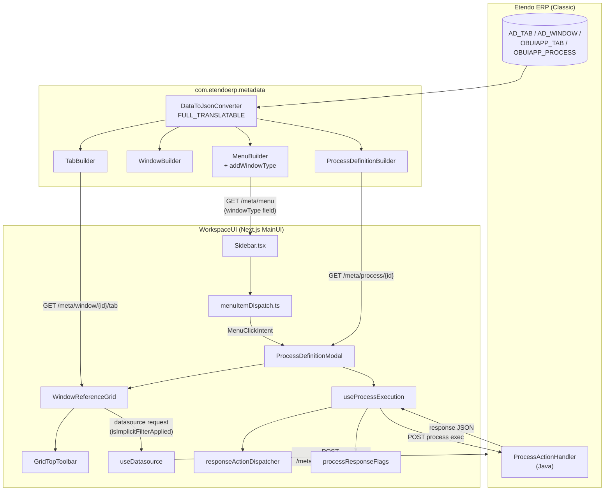

# Pick and Execute (P&E) — Implementation Snapshot

> **Status**: Work in progress. This document describes the state of the Pick and Execute (P&E) implementation on the `feature/ETP-3751` branch (parent: `epic/ETP-3931`) as of 2026-05-11. It is **not** the final documentation. Items that are still in flight or pending decisions are listed in the [Open Items](#open-items) section at the end.
>
> **Scope**: Covers the new Etendo WorkspaceUI (Next.js) and the `com.etendoerp.metadata` adapter module. The classic Openbravo backend is treated as a black box.

## 1. TL;DR

Pick and Execute (P&E) is the Etendo process pattern in which a user opens a dialog, picks records from one or more embedded grids, optionally fills inline values, and executes a server-side action against the selection. In Etendo Classic this is the `OBUIAPP_PickAndExecute` UI pattern.

This branch reproduces P&E in the new Next.js UI with the following capabilities:

1. **Menu-driven and button-driven entry** — P&E processes can be opened from a sidebar menu entry (window of type `OBUIAPP_PickAndExecute`) and from a Process Definition button rendered on a window form.
2. **Multi-grid support** — a single P&E process can stack multiple Window Reference grids (e.g. Add Payment shows 3 grids: orders/invoices, GL items, credit-to-use).
3. **Per-row mandatory cell validation** — the Execute button is disabled while any selected row has an empty mandatory cell.
4. **Single-record vs multi-record selection** — grid selection mode is driven by the tab's `obuiappSelectionType` column; execution mode (one vs many record IDs delivered to the handler) is driven by the process's `isMultiRecord` flag.
5. **Implicit filter toggle** — when the underlying tab carries an `hqlfilterclause` or `sQLWhereClause`, a funnel button is rendered in the toolbar; pressing it disables the implicit filter on subsequent datasource fetches.
6. **Auto-select from `onLoad`** — a JavaScript hook attached to the process can return an `autoSelectConfig` describing which records should be pre-selected on open.
7. **Structured response actions** — the post-execute response is parsed into a normalized list of typed actions (messages, grid refreshes, tab navigation, etc.) and dispatched as side effects.

The flow follows the project's standard 3-tier request path: **Next.js client → Next.js API → Etendo ERP**. No new server route was needed: the existing metadata adapter already serializes the required fields once the relevant catalog columns are populated upstream.

---

## 2. End-to-End Architecture



The branch only added code on the client and on the metadata adapter. The classic backend was not modified.

---

## 3. Backend Changes (`com.etendoerp.metadata`)

The metadata module is the only Java module touched in this branch. Diff vs `epic/ETP-3931`:

### 3.1 [src/com/etendoerp/metadata/builders/MenuBuilder.java](../../../../erp/modules/com.etendoerp.metadata/src/com/etendoerp/metadata/builders/MenuBuilder.java)

Added a private helper `addWindowType(JSONObject json, Window window)` and a call site inside the window-menu emission path. When the menu entry has an associated `AD_WINDOW`, the JSON now includes:

```json
{ "windowType": "OBUIAPP_PickAndExecute" }
```

The field is optional: if `Window.getWindowType()` is null the key is not emitted, matching the convention already used for `processId` and `formId`. The constant `JSON_WINDOW_TYPE_KEY = "windowType"` lives in [Constants.java](../../../../erp/modules/com.etendoerp.metadata/src/com/etendoerp/metadata/utils/Constants.java) to avoid magic strings.

**Why**: the sidebar needs to discriminate a P&E menu entry from a regular window entry before the modal is opened, so it can route the click to `ProcessDefinitionModal` instead of opening a normal window screen.

### 3.2 ProcessDefinitionBuilder — no code change, contract test added

`ProcessDefinitionBuilder.toJSON()` already invokes the converter with `DataResolvingMode.FULL_TRANSLATABLE`, which serializes every property of `OBUIAPP_PROCESS`, including `uIPattern` and `isMultiRecord`. No Java code change was required.

A new test file [ProcessDefinitionBuilderPickAndExecuteTest.java](../../../../erp/modules/com.etendoerp.metadata/src-test/src/com/etendoerp/metadata/builders/ProcessDefinitionBuilderPickAndExecuteTest.java) was added to lock in this contract:

| Test method | Asserts |
|---|---|
| `testPickAndExecuteMultiRecord` | P&E process with `isMultiRecord = true` round-trips through JSON |
| `testPickAndExecuteSingleRecord` | P&E process with `isMultiRecord = false` round-trips through JSON |
| `testAbsentUiPatternIsNotInjected` | The builder never injects `uIPattern` itself; absence is preserved |
| `testConverterCalledWithFullTranslatableMode` | The data-resolving mode is `FULL_TRANSLATABLE` |

### 3.3 Existing builders unchanged

`TabBuilder`, `WindowBuilder` and `ParameterBuilder` already serialize:

- `tab.hqlfilterclause` (from `OBUIAPP_TAB.HQL_FILTERCLAUSE`)
- `tab.sQLWhereClause` (from `AD_TAB.WhereClause`)
- `tab.obuiappSelectionType` (from `OBUIAPP_TAB.OBUIAPP_SELECTIONTYPE`)
- `tab.filterName` (from `OBUIAPP_TAB.FILTERNAME`)
- `window.windowType` (from `AD_WINDOW.WindowType`)

via `DataResolvingMode.FULL_TRANSLATABLE`. New test coverage was added in [MenuBuilderTest.java](../../../../erp/modules/com.etendoerp.metadata/src-test/src/com/etendoerp/metadata/builders/MenuBuilderTest.java) and [WindowBuilderTest.java](../../../../erp/modules/com.etendoerp.metadata/src-test/src/com/etendoerp/metadata/builders/WindowBuilderTest.java) to verify that these fields are present in the API response.

---

## 4. API Client Type Surface

[packages/api-client/src/api/types.ts](../../../packages/api-client/src/api/types.ts) gained the following type members. These mirror the JSON fields now exposed by the metadata adapter:

| Type | New field | Source column | Purpose |
|---|---|---|---|
| `UIPattern` (enum) | `PICK_AND_EXECUTE = "OBUIAPP_PickAndExecute"` | — | Discriminator constant |
| `WindowType` (enum) | `PICK_AND_EXECUTE = "OBUIAPP_PickAndExecute"` | `AD_WINDOW.WindowType` | Menu-level discriminator |
| `Menu` | `windowType?: string` | `AD_WINDOW.WindowType` | Surfaces window classification at the menu API |
| `Tab` | `filterName?: string` | `OBUIAPP_TAB.FILTERNAME` | Human-readable implicit-filter label (not currently rendered) |
| `Tab` | `obuiappSelectionType?: "M" \| "S" \| "N" \| null` | `OBUIAPP_TAB.OBUIAPP_SELECTIONTYPE` | Grid row-selection UI mode |
| `ProcessDefinition` | `uIPattern?: UIPattern \| string` | `OBUIAPP_PROCESS.UIPattern` | P&E discriminator at the process level |
| `ProcessDefinition` | `isMultiRecord?: boolean \| "Y" \| "N"` | `OBUIAPP_PROCESS.IsMultiRecord` | Execution-mode flag (legacy string shape supported) |

`Tab.hqlfilterclause` and `Tab.sQLWhereClause` were already on the `Tab` type before this branch.

---

## 5. Menu Dispatch

A new module [utils/menu/menuItemDispatch.ts](../../../packages/MainUI/utils/menu/menuItemDispatch.ts) encapsulates the decision tree that the sidebar applies when the user clicks a menu entry. It is pure (no React, no hooks) so it can be tested exhaustively.

### 5.1 Public surface

```ts
type MenuClickIntent =
  | { kind: "pick-and-execute"; button: ProcessDefinitionButton }
  | { kind: "process-definition"; button: ProcessDefinitionButton; processType: ProcessType }
  | { kind: "none" };

resolveMenuClickIntent(item: ExtendedMenu): MenuClickIntent;
isPickAndExecuteMenuItem(item: ExtendedMenu): boolean;
isProcessDefinitionMenuItem(item: ExtendedMenu): boolean;
isReportAndProcessMenuItem(item: ExtendedMenu): boolean;
mapMenuToProcessDefinitionButton(item: ExtendedMenu): ProcessDefinitionButton | null;
```

The decision precedence is:

1. **P&E** wins first — if `item.windowType === "OBUIAPP_PickAndExecute"` (even if `item.type === "ProcessDefinition"`).
2. **Process Definition** — `item.type === "ProcessDefinition" && item.id`.
3. **Report and Process** (legacy `Process` type) — both share the same modal; the dispatched intent carries `processType` so the modal knows which payload shape to send.
4. Anything else returns `{ kind: "none" }`, letting `Sidebar.tsx` fall through to its existing window/iframe routing.

Type constants for `MENU_ITEM_TYPES.PROCESS_DEFINITION`, `MENU_ITEM_TYPES.PROCESS`, etc. live in [menuItemTypes.ts](../../../packages/MainUI/utils/menu/menuItemTypes.ts) so the dispatch logic compares against named constants rather than magic strings.

### 5.2 Sidebar integration

[components/Sidebar.tsx](../../../packages/MainUI/components/Sidebar.tsx) was refactored to delegate the click logic to `resolveMenuClickIntent` and to centralize modal opening behind a single `openProcessModal` callback. The P&E intent and the Process Definition intent both end up calling `openProcessModal`, the difference being the `processType` carried in the intent (`PROCESS_DEFINITION` for both P&E and process definitions; `REPORT_AND_PROCESS` for the legacy Report and Process type).

---

## 6. P&E Discrimination & Mode Predicates

[utils/processes/definition/pickAndExecute.ts](../../../packages/MainUI/utils/processes/definition/pickAndExecute.ts) hosts three pure predicates used across the modal, the grid, and the menu layer.

### 6.1 `isPickAndExecute(process)`

```ts
const PICK_AND_EXECUTE_UI_PATTERN = "OBUIAPP_PickAndExecute";

export const isPickAndExecute = (process: ProcessDefinition | null | undefined): boolean => {
  if (!process) return false;
  if (process.uIPattern === PICK_AND_EXECUTE_UI_PATTERN) return true;
  return hasWindowReferenceParameter(process);
};
```

Primary discriminator is `uIPattern`. The fallback (checking for a Window Reference parameter via `FIELD_REFERENCE_CODES.WINDOW.id`) covers legacy seeds where `OBUIAPP_PROCESS.UIPattern` is not populated but the process clearly behaves as P&E — e.g. some core processes still carry the older `uIPattern = "A"` while declaring a Window Reference parameter.

### 6.2 `allowsMultipleRecords(process)`

```ts
export const allowsMultipleRecords = (process: ProcessDefinition | null | undefined): boolean => {
  if (!process) return true;
  const flag = process.isMultiRecord;
  if (typeof flag === "boolean") return flag;
  if (typeof flag === "string") return flag === "Y";
  return true;
};
```

Normalizes the legacy `"Y"` / `"N"` shape into a boolean. Default is `true` to match Etendo Classic.

> **Important semantic distinction.** This flag controls **execution behaviour** — whether the handler ultimately receives one record ID or many. It does **not** control grid selection mode.

### 6.3 `tabAllowsMultipleSelection(tab)`

```ts
export const tabAllowsMultipleSelection = (tab: Tab | null | undefined): boolean => {
  const sel = tab?.obuiappSelectionType;
  return sel !== "S" && sel !== "N";
};
```

Drives the grid's row-selection UI mode. Mapping mirrors the classic UI:

| `obuiappSelectionType` | Grid behaviour |
|---|---|
| `"M"` or absent | Multi-row (checkboxes) |
| `"S"` | Single-row |
| `"N"` | No selection (treated as single here) |

Tests live in [__tests__/pickAndExecute.test.ts](../../../packages/MainUI/utils/processes/definition/__tests__/pickAndExecute.test.ts).

---

## 7. Modal Orchestration (`ProcessDefinitionModal`)

[components/ProcessModal/ProcessDefinitionModal.tsx](../../../packages/MainUI/components/ProcessModal/ProcessDefinitionModal.tsx) is the dialog that hosts the P&E experience. The orchestration responsibilities split into:

### 7.1 Grid selection model

The modal maintains a single state shape keyed by parameter name:

```ts
export type GridSelectionStructure = {
  [parameterName: string]: {
    _selection: EntityData[];   // rows currently checked / picked
    _allRows: EntityData[];     // all rows visible in the grid (used by payscript / auto-select)
  };
};
```

Single-grid P&E processes (≈ 28 of the 32 catalog windows surveyed) populate one key. Multi-grid P&E (Add Payment, Modify Payment Plan, etc.) populates one key per grid. Each grid updates only its own slot.

A `GridSelectionUpdater` type accepts either a replacement object or a functional updater for finer-grained updates.

### 7.2 Display logic for grid parameters

`evaluateWindowReferenceDisplay(options)` evaluates a parameter's `displayLogic` expression against the current modal values, so a Window Reference grid can appear/disappear dynamically based on other parameter inputs. It re-evaluates on every render against the latest values; results are stable enough not to require memoization.

### 7.3 Auto-select from `onLoad`

A JavaScript hook attached to the process (`eTMETAOnload` column on `OBUIAPP_PROCESS`) may return:

```js
{
  autoSelectConfig: {
    table: "order_invoice",
    logic: { field: "salesOrderNo", operator: "=", valueFromContext: "documentNo" },
  }
}
```

When present, the modal pre-selects the matching rows once the grid has loaded. Two shapes are accepted:

- **Predicate-based**: `{ field, operator, value | valueFromContext }`. The modal pulls `value` directly or resolves `valueFromContext` from the parent window's context.
- **Explicit ID list**: `{ ids: ["id1", "id2", ...] }`.

The filter expressions returned from `onLoad` are also stored in a ref (`onLoadFilterExpressionsRef`) and re-applied to the grid's filter state so the user sees the same filtered slice the auto-select operated on.

### 7.4 Execute button gating

The Execute button is `disabled` when any of the following hold:

1. Any selected row in any grid has an empty mandatory cell (`hasInvalidSelection` from `useGridRowValidation`).
2. The grid for a P&E process required to have a non-empty selection has zero selected rows.
3. The user has already triggered execution and the response is in flight.

The first condition is the new contribution of this branch (see Section 9).

---

## 8. Window Reference Grid

[components/ProcessModal/WindowReferenceGrid.tsx](../../../packages/MainUI/components/ProcessModal/WindowReferenceGrid.tsx) renders the embedded grid for a single Window Reference parameter. It is built on top of Material React Table and `useDatasource`.

### 8.1 Selection modes — multi-select and single-select clamping

The component reads `tabAllowsMultipleSelection(stableWindowReferenceTab)` and toggles the MRT `enableMultiRowSelection` flag. When multi-selection is disabled (or when the process is `!allowsMultipleRecords`), the helper `clampToSingleRecord(next, prev)` keeps only the most recently toggled row even if MRT's internal selection model temporarily holds more than one. This guarantees CT-AD-2: under single-record P&E, clicking row B while A is selected results in only B being selected, regardless of timing.

The helper is exported for unit testing:

```ts
export const clampToSingleRecord = (
  next: MRT_RowSelectionState,
  prev: MRT_RowSelectionState
): MRT_RowSelectionState;
```

Unit tests in [__tests__/ProcessDefinitionModal.singleSelect.test.ts](../../../packages/MainUI/components/ProcessModal/__tests__/ProcessDefinitionModal.singleSelect.test.ts) cover the seven edge cases (empty input, single-row input, freshly toggled row detection, fallback when all IDs already in `prev`, ignoring explicitly false rows, and reference stability).

### 8.2 Mandatory cell validation

Each grid contributes its `selectedRows` and `fields` to the shared `useGridRowValidation` hook in [hooks/useGridRowValidation.ts](../../../packages/MainUI/components/ProcessModal/hooks/useGridRowValidation.ts):

```ts
const { hasInvalidSelection, invalidCellsByRow } = useGridRowValidation({
  grids: [
    { selectedRows: orderInvoiceSelection, fields: orderInvoiceTab.fields },
    { selectedRows: glItemsSelection,      fields: glItemsTab.fields },
    { selectedRows: creditToUseSelection,  fields: creditToUseTab.fields },
  ],
});
```

The hook collects mandatory + updatable + displayed fields per grid, then walks every selected row checking each mandatory field for emptiness. The "empty" predicate treats `null`, `undefined`, and whitespace-only strings as empty; `0` and `false` are valid. The result is a map of `rowId → set of empty hqlNames` for surfaceable feedback and a single `hasInvalidSelection` boolean for gating the Execute button.

Cell-level validation runs at selection time (not at execute time), so the Execute button reflects the live state.

### 8.3 Implicit filter button

When the grid's underlying tab carries an implicit server-side filter, a dedicated funnel button is rendered in the top toolbar.

**Gating condition** ([WindowReferenceGrid.tsx:736-739](../../../packages/MainUI/components/ProcessModal/WindowReferenceGrid.tsx#L736-L739)):

```ts
const initialIsFilterApplied = useMemo(
  () => !!(stableWindowReferenceTab?.hqlfilterclause || stableWindowReferenceTab?.sQLWhereClause),
  [stableWindowReferenceTab]
);
```

The button is rendered only when `initialIsFilterApplied` is true — i.e., when the tab actually has something to disable. Tabs with neither field populated never show the button (this differs from classic, which shows a non-functional funnel everywhere).

**State machine** for the single button:

| State | `isImplicitFilterApplied` | `effectiveImplicitFilter` | Icon | Color | Clickable | Resulting request param |
|---|---|---|---|---|---|---|
| Initial (filter active) | `undefined` | `true` (from `initialIsFilterApplied`) | `FilterAlt` | `--color-etendo-main` | yes | `isImplicitFilterApplied=true` |
| User clicked once | `false` | `false` | `FilterAltOff` | grey | **no** (disabled) | `isImplicitFilterApplied=false` |

Once disabled, the filter cannot be re-enabled from the UI — matching the classic UX (where the funnel is a one-shot toggle within a modal session). The button is rendered with a `<span>` wrapper because MUI requires it for `Tooltip` to receive mouse events over a disabled `IconButton`.

The `MRT_ToggleFiltersButton` (column-filter visibility toggle) sits to the right of the implicit-filter button and operates independently — its `showColumnFilters` is in MRT `initialState` (not `state`) so MRT can toggle it internally.

Source: [WindowReferenceGrid.tsx:2214-2229](../../../packages/MainUI/components/ProcessModal/WindowReferenceGrid.tsx#L2214-L2229).

### 8.4 Datasource integration

`useDatasource` has a default parameter `isImplicitFilterApplied = false`. The grid passes the value explicitly so the controlled state wins over the default:

```ts
} = useDatasource({
  entity: String(entityName),
  params: datasourceOptions,
  columns: rawColumns,
  activeColumnFilters: appliedTableFilters,
  skip: shouldSkipFetch,
  isImplicitFilterApplied: isImplicitFilterApplied ?? true,
});
```

The fallback `?? true` matches the classic default ("filter on" until the user disables it).

### 8.5 Multi-grid pattern (Add Payment)

Three Window Reference grids (`order_invoice`, `glItems`, `credit_to_use`) are rendered stacked inside a single modal. Each grid:

- Has its own `WindowReferenceGrid` instance.
- Maintains its own selection slot in `GridSelectionStructure`.
- Contributes its own entry to `useGridRowValidation` (so an empty mandatory cell in grid 2 disables Execute even if grids 1 and 3 are clean).
- Optionally fires a JS `onGridLoadFunction` hook from the parameter definition (used by APRM to compute outstanding amounts and payment distribution).

Isolation tests live in [__tests__/ProcessDefinitionModal.multiGrid.test.ts](../../../packages/MainUI/components/ProcessModal/__tests__/ProcessDefinitionModal.multiGrid.test.ts).

---

## 9. Execution Pipeline

[components/ProcessModal/hooks/useProcessExecution.ts](../../../packages/MainUI/components/ProcessModal/hooks/useProcessExecution.ts) is the hook that turns "user clicked Execute" into a request, parses the response, and triggers side effects.

### 9.1 Four execution paths

The hook picks one of four dispatch strategies based on the process metadata:

1. **Window Reference (P&E)** — `handleWindowReferenceExecute`. Builds the payload from `GridSelectionStructure`, appends any extra parameters from the modal form, and POSTs to the classic process servlet.
2. **Direct Java handler** — `executeJavaProcess`. Used for process definitions with `javaClassName` but no Window Reference. Sends the parameter values as a flat map.
3. **String function (legacy)** — for processes whose handler is a JavaScript function name. Looks up the function on the `OB` namespace and invokes it.
4. **Report and Process** — emits a download request for the report PDF/XLS.

The branch did not introduce new execution paths; it refactored the existing ones to consume the new response parser and flag helpers.

### 9.2 Response parsing (`responseActionDispatcher`)

[utils/responseActionDispatcher.ts](../../../packages/MainUI/components/ProcessModal/utils/responseActionDispatcher.ts) normalizes the `responseActions[]` array emitted by Etendo Classic handlers (`ResponseActionsBuilder.java` on the server) into a typed discriminated union.

Action keys recognized (constant `RESPONSE_ACTION_KEYS`):

| Key | Discriminator | Effect handled downstream |
|---|---|---|
| `showMsgInProcessView` | `message` (channel: `processView`) | Renders message inside the modal |
| `showMsgInView` | `message` (channel: `view`) | Toast in the parent window |
| `openDirectTab` | `openDirectTab` | Navigate to a record (modal closes) |
| `refreshGrid` | `refreshGrid` | Refresh parent window's main grid |
| `refreshGridParameter` | `refreshGridParameter` | Refresh a specific P&E grid by name (used by retry flows) |
| `setSelectorValueFromRecord` | `setSelectorValueFromRecord` | Patch a selector value in the parent form |
| `smartclientSay` | `smartclientSay` | Generic alert |

`readResponseActions(data)` extracts the array from any of three nested paths used by Etendo Classic (top-level, `response.responseActions`, `response.data.responseActions`). `dispatchResponseActions(data)` returns the normalized list; unknown keys are silently dropped so adding a new server-side action is a single new case.

Two convenience helpers preserve legacy ergonomics:
- `findFirstMessage(actions)` — backward compatible with the pre-existing message-extraction contract.
- `findFirstOpenDirectTab(actions)` — preferred over the legacy SmartClient HTML parser when both representations are present.

### 9.3 Response flags (`processResponseFlags`)

[utils/processResponseFlags.ts](../../../packages/MainUI/components/ProcessModal/utils/processResponseFlags.ts) reads two booleans from the response with the same triple-path lookup:

- `shouldRefreshAfterProcess(data)` — refresh the parent window unless the handler explicitly returns `refreshParent: false`. Default-true matches `BaseProcessActionHandler.doRefreshParent()` in classic.
- `shouldRetryAfterProcess(data)` — keep the modal open only when the handler returns `retryExecution: true`.

The two flags combine to produce four post-execute behaviours:

| `refreshParent` | `retryExecution` | Modal | Parent grid |
|---|---|---|---|
| `true` (default) | `false` (default) | Closes | Refreshes |
| `false` | `false` | Closes | No refresh |
| `true` | `true` | Stays open | Refreshes |
| `false` | `true` | Stays open | No refresh |

---

## 10. Tests

Eight new test suites land in this branch, plus a contract test on the Java side. Total ≈ 1,200 lines of test code.

### 10.1 Client (Jest + React Testing Library)

| File | What it locks in |
|---|---|
| [utils/processes/definition/__tests__/pickAndExecute.test.ts](../../../packages/MainUI/utils/processes/definition/__tests__/pickAndExecute.test.ts) | All three predicates: explicit `uIPattern`, Window Reference fallback, legacy `"Y"`/`"N"` normalization, `obuiappSelectionType` mapping |
| [utils/menu/__tests__/menuItemDispatch.test.ts](../../../packages/MainUI/utils/menu/__tests__/menuItemDispatch.test.ts) | Menu intent resolution decision tree, including P&E-over-ProcessDefinition precedence and fallback to legacy types |
| [components/ProcessModal/utils/__tests__/responseActionDispatcher.test.ts](../../../packages/MainUI/components/ProcessModal/utils/__tests__/responseActionDispatcher.test.ts) | All 7 action types normalized; nested-path extraction; unknown keys dropped |
| [components/ProcessModal/utils/__tests__/processResponseFlags.test.ts](../../../packages/MainUI/components/ProcessModal/utils/__tests__/processResponseFlags.test.ts) | Default-true / default-false semantics; precedence across the three nested paths |
| [components/ProcessModal/hooks/__tests__/useGridRowValidation.test.ts](../../../packages/MainUI/components/ProcessModal/hooks/__tests__/useGridRowValidation.test.ts) | Single-grid and multi-grid validation, empty detection for `null` / `undefined` / whitespace, ignored fields (non-mandatory, non-updatable, hidden) |
| [components/ProcessModal/hooks/__tests__/useProcessExecution.responseFlags.test.ts](../../../packages/MainUI/components/ProcessModal/hooks/__tests__/useProcessExecution.responseFlags.test.ts) | Interaction between `retryExecution` and `refreshParent` in the execution hook |
| [components/ProcessModal/__tests__/ProcessDefinitionModal.singleSelect.test.ts](../../../packages/MainUI/components/ProcessModal/__tests__/ProcessDefinitionModal.singleSelect.test.ts) | `clampToSingleRecord` invariants (CT-AD-2 spec) |
| [components/ProcessModal/__tests__/ProcessDefinitionModal.multiGrid.test.ts](../../../packages/MainUI/components/ProcessModal/__tests__/ProcessDefinitionModal.multiGrid.test.ts) | Multi-grid selection isolation and aggregated validation (CT-AD-3 spec) |

Run with `pnpm --filter @workspaceui/mainui test` (or `pnpm test:mainui` from the repo root).

### 10.2 Adapter (JUnit)

- [ProcessDefinitionBuilderPickAndExecuteTest.java](../../../../erp/modules/com.etendoerp.metadata/src-test/src/com/etendoerp/metadata/builders/ProcessDefinitionBuilderPickAndExecuteTest.java) — `uIPattern` + `isMultiRecord` round-trip through the converter; no Java injection.
- [MenuBuilderTest.java](../../../../erp/modules/com.etendoerp.metadata/src-test/src/com/etendoerp/metadata/builders/MenuBuilderTest.java) — `windowType` emitted for P&E and Maintain windows; absent when null.
- [WindowBuilderTest.java](../../../../erp/modules/com.etendoerp.metadata/src-test/src/com/etendoerp/metadata/builders/WindowBuilderTest.java) — `windowType` preserved by `/meta/window/{id}` endpoint.

---

## 11. File Index (Quick Reference)

### New files (client)

```
packages/MainUI/utils/processes/definition/pickAndExecute.ts
packages/MainUI/utils/processes/definition/__tests__/pickAndExecute.test.ts
packages/MainUI/utils/menu/menuItemDispatch.ts
packages/MainUI/utils/menu/menuItemTypes.ts
packages/MainUI/utils/menu/__tests__/menuItemDispatch.test.ts
packages/MainUI/components/ProcessModal/hooks/useGridRowValidation.ts
packages/MainUI/components/ProcessModal/hooks/__tests__/useGridRowValidation.test.ts
packages/MainUI/components/ProcessModal/hooks/__tests__/useProcessExecution.responseFlags.test.ts
packages/MainUI/components/ProcessModal/utils/responseActionDispatcher.ts
packages/MainUI/components/ProcessModal/utils/processResponseFlags.ts
packages/MainUI/components/ProcessModal/utils/__tests__/responseActionDispatcher.test.ts
packages/MainUI/components/ProcessModal/utils/__tests__/processResponseFlags.test.ts
packages/MainUI/components/ProcessModal/__tests__/ProcessDefinitionModal.singleSelect.test.ts
packages/MainUI/components/ProcessModal/__tests__/ProcessDefinitionModal.multiGrid.test.ts
```

### Modified files (client)

```
packages/api-client/src/api/types.ts                                  (+ UIPattern, WindowType, Menu, Tab, ProcessDefinition fields)
packages/MainUI/components/ProcessModal/ProcessDefinitionModal.tsx    (grid selection, auto-select, gating)
packages/MainUI/components/ProcessModal/WindowReferenceGrid.tsx       (selection modes, validation, implicit filter button)
packages/MainUI/components/ProcessModal/types.ts                      (new prop types)
packages/MainUI/components/ProcessModal/imports.ts                    (isPickAndExecute export)
packages/MainUI/components/ProcessModal/hooks/useProcessExecution.ts  (response parsing extraction)
packages/MainUI/components/Sidebar.tsx                                (menu dispatch refactor)
```

### New files (adapter)

```
src-test/src/com/etendoerp/metadata/builders/ProcessDefinitionBuilderPickAndExecuteTest.java
```

### Modified files (adapter)

```
src/com/etendoerp/metadata/builders/MenuBuilder.java                 (addWindowType helper)
src/com/etendoerp/metadata/utils/Constants.java                      (JSON_WINDOW_TYPE_KEY)
src-test/src/com/etendoerp/metadata/builders/MenuBuilderTest.java    (windowType coverage)
src-test/src/com/etendoerp/metadata/builders/WindowBuilderTest.java  (windowType passthrough)
```

---

## 12. Open Items

The following items are known to be incomplete or pending review. They should be the next blocks of work on top of this branch.

1. **`filterName` not yet surfaced.** The field is exposed on the `Tab` type and the metadata adapter emits it, but the implicit-filter button currently uses generic `table.tooltips.implicitFilterOn` / `Off` translations rather than the human-readable name. Consider showing the filter name inside an `aria-label` or expanded tooltip when present.
2. **Per-row display logic in grids.** `useGridRowValidation` deliberately does not evaluate per-row display logic — the comment on the helper notes the path forward (`compileExpression` + `createSmartContext` per row) if a future P&E ships dynamic column visibility.
3. **`refreshGridParameter` handler.** The action is parsed by `responseActionDispatcher` but the side-effect dispatcher in `useProcessExecution` does not yet route it to a specific P&E grid refresh — currently it falls through to the generic refresh path. To be wired once a backend handler actually emits it.
4. **Payscript integration on the modal.** The `etmetaPayscriptLogic` column on `OBUIAPP_PROCESS` (visible on the Add Payment fixture) is parsed elsewhere but its integration with the modal's recompute loop is being tracked separately.
5. **Single-record execution payload shape.** When `allowsMultipleRecords === false`, the handler still expects an array of one record ID in some legacy paths and a scalar in others. The execution payload builder normalizes this to an array; a follow-up audit is planned to confirm parity with the classic UI for every process in the catalog.
6. **Tests for the implicit filter button rendering.** Predicates and request-param threading are tested but the JSX-level rendering of the toolbar button (icon swap, disabled state, color) does not yet have a dedicated test. Worth adding under `WindowReferenceGrid.__tests__/`.
7. **Documentation gaps.** This document is a snapshot; once the items above land, sections 8.3 / 8.5 / 9 will need refreshes, and a final `Architecture Decisions` section should accompany the merge with rationales captured in ADR form.

---

## 13. Glossary

| Term | Meaning |
|---|---|
| **P&E** | Pick and Execute. UI pattern in Etendo Classic where the user picks records from one or more grids and triggers a server-side action against them. |
| **Window Reference** | A reference type (`reference = FF80818132D8F0F30132D9BC395D0038`) used by process parameters to embed an `AD_WINDOW` (and its tabs) inside the process dialog. |
| **Implicit filter** | A server-side HQL or SQL where-clause attached to a tab (`OBUIAPP_TAB.HQL_FILTERCLAUSE` / `AD_TAB.WhereClause`). The user can disable it from the toolbar funnel. |
| **`uIPattern`** | Column on `OBUIAPP_PROCESS`. `"OBUIAPP_PickAndExecute"` flags the process as P&E. |
| **`isMultiRecord`** | Column on `OBUIAPP_PROCESS`. Controls **execution** behaviour: whether the handler receives 1 or N record IDs. Independent of grid selection mode. |
| **`obuiappSelectionType`** | Column on `OBUIAPP_TAB`. Controls **grid selection UI** mode: `"M"` (multi), `"S"` (single), `"N"` (none). |
| **`responseActions`** | Structured array emitted by classic handlers; replaces the legacy SmartClient HTML parser path. |
| **`refreshParent` / `retryExecution`** | Boolean flags on the process response. Default `true` / `false` respectively. |
| **CT-AD-2 / CT-AD-3** | Internal spec IDs for the single-record clamping and multi-grid isolation acceptance criteria. |
