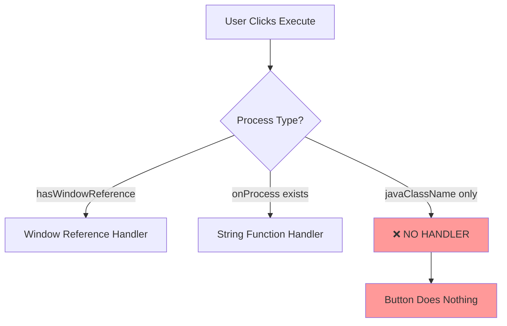
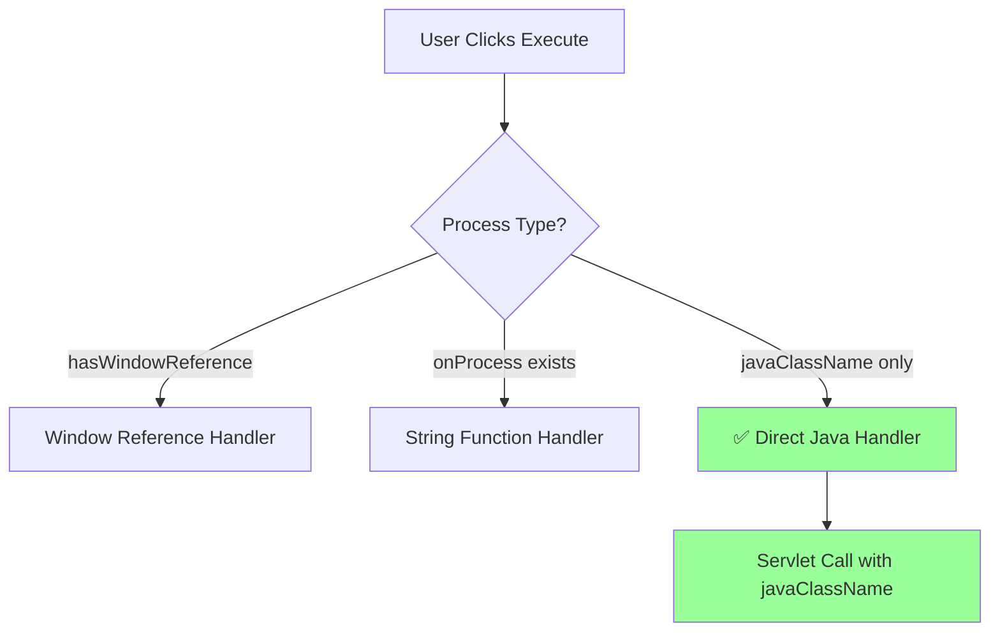

# Process Execution Button Non-Functional for Custom Java Handlers

**Issue Type:** Bug  
**Priority:** High  
**Component:** WorkspaceUI - Process Execution  
**Labels:** process-execution, servlet-integration, button-click, default-handler

---

## Issue Description

The ProcessDefinitionModal execute button is non-functional when processes use custom Java class handlers instead of the default process execution pattern. Users can open the modal, see parameters, but clicking "Execute" performs no action.

**Root Cause:** The system defaults to using `DefaultsProcessActionHandler` for all process execution, ignoring the specific `javaClassName` defined in process metadata. This causes processes like `com.etendoerp.copilot.process.CheckHostsButton` to fail silently.

**Business Impact:**
- Critical business processes cannot be executed from the UI
- Users experience non-responsive interface with no feedback
- Custom process implementations are effectively broken in WorkspaceUI
- Degrades user trust in the system reliability

**Affected Processes:**
- Any process with custom `javaClassName` but no client-side `onProcess` function
- Example: CheckHostsButton process (`com.etendoerp.copilot.process.CheckHostsButton`)

**Current Behavior:**
1. User clicks process button → Modal opens ✅
2. Modal loads with parameters ✅  
3. User clicks "Execute" button → No action ❌
4. No network request made ❌
5. No error message shown ❌

**Expected Behavior:**
1. User clicks process button → Modal opens ✅
2. Modal loads with parameters ✅
3. User clicks "Execute" button → Servlet call made ✅
4. Backend processes request with correct handler ✅
5. Result message displayed to user ✅

---

## Technical Definition

### Problem Analysis

**Current Implementation:**
```typescript
// useProcessDatasourceConfig.ts - Line 41
_action: "org.openbravo.client.application.process.DefaultsProcessActionHandler" // Hardcoded
```

**Required Implementation:**
```typescript
// Dynamic handler selection based on process metadata
_action: javaClassName || "org.openbravo.client.application.process.DefaultsProcessActionHandler"
```

### Architecture Issue

The process execution flow has a gap in handler routing:



**Missing Flow:**


### Secondary Issue: Response Misinterpretation

When servlet responses are received, the system incorrectly shows success for error responses:

**Backend Response (Error):**
```json
{
  "responseActions": [{
    "showMsgInProcessView": {
      "msgType": "error",
      "msgTitle": "",
      "msgText": "no protocol: ETENDO_HOST_NOT_CONFIGURED/sws/copilot/configcheck"
    }
  }]
}
```

**UI Display:** "Process completed successfully" ❌  
**Should Display:** Error message with proper styling ✅

### Files Requiring Modification

1. **`packages/MainUI/hooks/datasource/useProcessDatasourceConfig.ts`**
   - Add `javaClassName` parameter to hook interface
   - Use dynamic `_action` parameter instead of hardcoded value

2. **`packages/MainUI/components/ProcessModal/ProcessDefinitionModal.tsx`**
   - Add `handleDirectJavaProcessExecute()` function
   - Update `handleExecute()` routing logic
   - Fix response processing priority
   - Pass `javaClassName` to `useProcessConfig` hook

3. **Documentation**
   - Update technical documentation with process execution types
   - Document the three execution patterns

---

## Use Cases

### Use Case 1: Custom Java Process Execution (Primary Issue)
**Actor:** Business User executing CheckHostsButton process

**Preconditions:**
- Process metadata defines `javaClassName: "com.etendoerp.copilot.process.CheckHostsButton"`
- Process has no client-side `onProcess` function
- User has appropriate permissions

**Steps:**
1. User navigates to Agent tab
2. User clicks "Check Hosts" button
3. ProcessDefinitionModal opens with parameters
4. User reviews/fills any required parameters  
5. User clicks "Execute" button

**Expected Result:**
- HTTP request sent to kernel servlet with `_action=com.etendoerp.copilot.process.CheckHostsButton`
- Backend processes request using CheckHostsButton Java class
- Response message displayed based on execution result
- Success/error styling applied appropriately

**Current Result:**
- No HTTP request made
- Button appears to do nothing
- User receives no feedback

### Use Case 2: Process Error Handling
**Actor:** Business User encountering configuration error

**Preconditions:**
- CheckHostsButton process executes but encounters configuration error
- Backend returns error in `responseActions` format

**Steps:**
1. User executes process following Use Case 1
2. Backend returns error response (host not configured)
3. Modal should display error message

**Expected Result:**
- Error message: "no protocol: ETENDO_HOST_NOT_CONFIGURED/sws/copilot/configcheck"
- Red error styling applied
- User understands configuration issue

**Current Result (Secondary Issue):**
- Shows "Process completed successfully" with green styling
- User believes process worked when it failed

### Use Case 3: Maintain Existing Process Types
**Actor:** Business User using traditional processes

**Preconditions:**
- Process has `onProcess` client-side function OR window reference parameters
- These processes currently work correctly

**Steps:**
1. User executes existing process types

**Expected Result:**
- No regression in functionality
- Window reference processes continue working
- String function processes continue working

**Current Result:**
- These work correctly (no change needed)

### Use Case 4: Developer Understanding Process Types
**Actor:** Developer working on process execution feature

**Preconditions:**
- Developer needs to understand or modify process execution logic

**Steps:**
1. Developer reads technical documentation
2. Reviews code implementation

**Expected Result:**
- Clear documentation of three process execution types
- Architecture diagrams showing execution flow
- Code examples and patterns

**Current Result:**
- Limited documentation
- Mixed language documentation
- No clear architecture overview

---

## Acceptance Criteria

### Primary Fix (Execute Button Functionality)
- [ ] Execute button triggers HTTP request for custom Java processes
- [ ] Servlet receives correct `_action` parameter with `javaClassName`
- [ ] Process executes using specified Java handler class
- [ ] Network tab shows proper servlet call with correct parameters

### Secondary Fix (Error Response Handling)  
- [ ] Error responses display as errors (not false success)
- [ ] Success responses display with appropriate styling
- [ ] Response processing follows priority: responseActions > message > fallback

### Regression Prevention
- [ ] Window reference processes continue to work unchanged
- [ ] String function processes continue to work unchanged  
- [ ] Default processes (no javaClassName) use DefaultsProcessActionHandler

### Code Quality
- [ ] Remove hardcoded DefaultsProcessActionHandler references
- [ ] Add comprehensive JSDoc documentation in English
- [ ] Remove debug console.log statements
- [ ] Fix React dependency warnings

### Documentation
- [ ] Complete technical documentation in `/docs/features/process-execution/`
- [ ] Architecture diagrams showing all three execution types
- [ ] All documentation in English per project standards
- [ ] Code patterns documented for future developers

### Testing
- [ ] Manual testing with CheckHostsButton process shows execution
- [ ] Error scenarios display proper error messages
- [ ] No regressions in existing process types
- [ ] Edge cases handled (missing parameters, network errors)

## Definition of Done
- [ ] Execute button functions for all process types
- [ ] Error handling works correctly
- [ ] No regressions in existing functionality  
- [ ] Code review completed and approved
- [ ] Technical documentation complete
- [ ] Manual testing completed across all scenarios
- [ ] Ready for production deployment