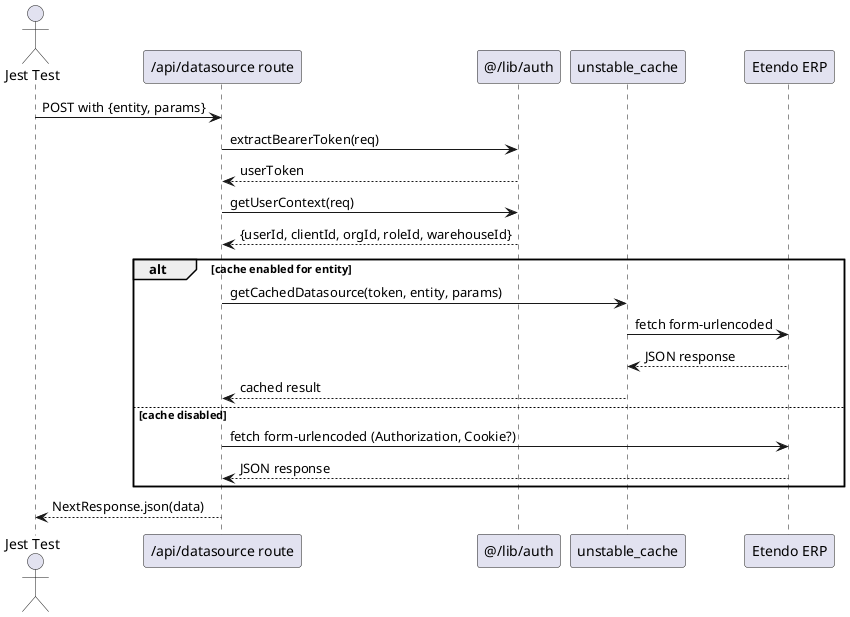
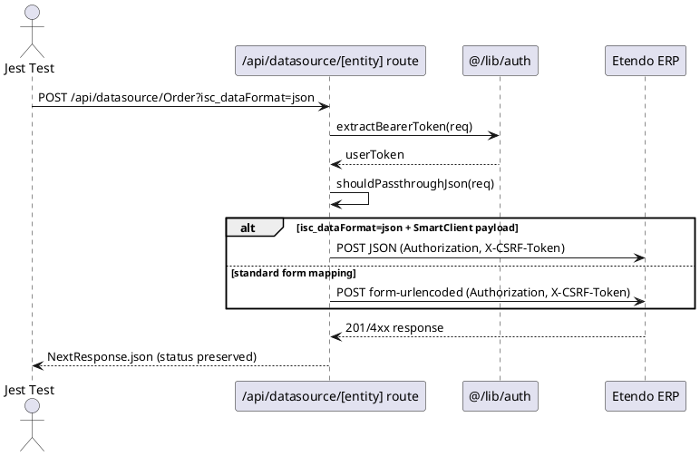

# PRD: API Integration Testing for WorkspaceUI (BFF, no UI E2E)

Status: FINAL - Phase 1 (Strategy and test cases)

## Executive Summary

**Objective:** Standardize BFF integration tests for WorkspaceUI API routes (`/api/datasource`, `/api/erp`, `/api/auth/*`) that act as a proxy to Etendo Classic, covering payload transformations, cookie policies, CSRF, JSON passthrough, and cache key composition.

**Why:** The critical logic (mappings, defaults, process execution) lives in the BFF handlers and is vulnerable to changes in Etendo. Automated tests provide confidence for PRs and deployments and make debugging in CI easier.

**Expected outcome:** A deterministic integration suite with >99% reliability, running in <10min on CI, validating BFF↔ERP contracts without external dependencies.

## Scope

**Included:**
- BFF integration tests: `/api/datasource`, `/api/datasource/:entity`, `/api/erp/*`, `/api/auth/*`
- Validations: form-urlencoded construction, JSON passthrough, headers (Authorization/Cookie/X-CSRF-Token), cookie forwarding policy, cache key composition, error propagation (4xx/5xx)
- Execution: Jest invoking handlers directly with deterministic mocks

**Excluded:**
- Visual E2E tests (Playwright/Cypress), performance/load tests, tests against the real ERP in PRs

## Quality Objectives (SMART)

- **Reliability:** >99% successful runs using stable mocks and deterministic fixtures
- **Speed:** <10min total in CI with parallelization and optimized unit/integration tests
- **Traceability:** Sufficient evidence on failures (logs, request/response dumps) for local reproduction
- **Coverage:** 100% of critical cases (form mapping, JSON passthrough, cookie policy, error propagation)

## Acceptance Criteria

- **[DS-READ]** `/api/datasource` builds the correct form-urlencoded payload, cache-key includes context, and 4xx/5xx errors are propagated
- **[DS-WRITE]** `/api/datasource/:entity` supports JSON→form mapping and `?isc_dataFormat=json` passthrough, forwards X-CSRF-Token correctly
- **[PROXY]** `ERP_FORWARD_COOKIES=false` prevents forwarding cookies to the ERP
- **[CI]** Jenkins runs the suite on PRs and publishes JUnit/coverage artifacts with no intermittent failures

## Validated Technical Context

**Confirmed stack:** Next.js App Router, Node 18+, Jest (no Supertest - direct handler invocation)

**Implemented routes:**
- `packages/MainUI/app/api/datasource/route.ts` (reads with cache)
- `packages/MainUI/app/api/datasource/[entity]/route.ts` (writes with JSON/form toggle)
- `packages/MainUI/app/api/erp/[...slug]/route.ts` (transparent forward)

**Existing utilities:**
- `app/api/_test-utils/datasource-test-utils.ts` (mocks + assertions)
- `app/api/_test-utils/api-test-utils.ts` (generic helpers)
- `app/api/_test-utils/fetch-assertions.ts` (ERP validation helpers)

## Validated testing architecture

**Key personas:**
- **QA Engineer:** Maintains the suite, analyzes failures, updates fixtures
- **Developer:** Implements handlers, fixes regressions found by tests
- **CI Engineer:** Configures Jenkins and manages JUnit/coverage artifacts

**Mocking strategy implemented:**
```typescript
// Mocking global.fetch (already implemented in test-utils)
global.fetch = jest.fn().mockResolvedValue({...})

// Mocking auth (already implemented)
jest.mock('@/lib/auth', () => ({
  getUserContext: () => ({ userId: '100', clientId: '23C5', ... }),
  extractBearerToken: () => 'token-default'
}))

// Mocking cache (already implemented)
jest.mock('next/cache', () => ({
  unstable_cache: (fn) => (...args) => fn(...args)
}))
```

**Direct handler invocation (no HTTP server):**
```typescript
import { POST } from '@/app/api/datasource/route'
const request = createMockRequest({...})
const response = await POST(request)
expect(response.status).toBe(200)
```

## Critical flows and sequence diagrams

### Flow 1: Datasource Read (grids/virtual scrolling)



### Flow 2: Datasource Write (with conditional JSON passthrough)



## Test case matrix (implementation)

**Structure:** `[ID] - Description | Preconditions | Input | Mocks | Assertions`

### Datasource Read Tests
**[DS-READ-01]** - Form-urlencoded construction and forward
- **Pre:** Auth mock returns valid userContext
- **Input:** `POST /api/datasource {entity: "Customer", params: {_startRow: 0}}`
- **Mocks:** `global.fetch` captures the request and returns 200 JSON
- **Assert:** fetch called with Content-Type form-urlencoded, body contains `_startRow=0`, Authorization header present

**[DS-READ-02]** - Cache key composition
- **Pre:** Mock unstable_cache to capture key builder
- **Input:** `POST /api/datasource {entity: "Product", params: {}}`
- **Assert:** Cache key includes userContext (userId, clientId, orgId, roleId, warehouseId)

**[DS-READ-03]** - Error propagation
- **Pre:** fetch mock returns 401 Unauthorized
- **Assert:** Response status 401, body propagated as-is

### Datasource Write Tests  
**[DS-WRITE-01]** - JSON passthrough enabled
- **Pre:** `?isc_dataFormat=json`, valid SmartClient payload
- **Input:** `POST /api/datasource/Order?isc_dataFormat=json {operationType: "add", data: {...}}`
- **Assert:** fetch called with Content-Type `application/json`, body is JSON (no form), query param preserved

**[DS-WRITE-02]** - Standard form mapping
- **Pre:** No `isc_dataFormat`, standard payload
- **Input:** `POST /api/datasource/Invoice {standard: "payload"}`
- **Assert:** fetch called with Content-Type form-urlencoded

**[DS-WRITE-03]** - CSRF token forwarding
- **Pre:** Request includes `X-CSRF-Token` header
- **Assert:** `X-CSRF-Token` header included in fetch to ERP

### Cookie Policy Tests
**[COOKIE-01]** - `ERP_FORWARD_COOKIES=false`
- **Pre:** `process.env.ERP_FORWARD_COOKIES='false'`, request includes cookies
- **Assert:** fetch called WITHOUT Cookie header

**[COOKIE-02]** - `ERP_FORWARD_COOKIES=true`
- **Pre:** `process.env.ERP_FORWARD_COOKIES='true'`, request includes cookies
- **Assert:** fetch called WITH Cookie header preserved

### ERP Forward Tests
**[ERP-GET-01]** - GET transparent forward
- **Input:** `GET /api/erp/some/path?foo=bar`
- **Assert:** fetch URL = `${ETENDO_CLASSIC_URL}/some/path?foo=bar`, method GET

**[ERP-POST-01]** - POST with body forward
- **Input:** `POST /api/erp/endpoint {data: "value"}`
- **Assert:** Body preserved, Authorization header included

## Mocks, Fixtures and Isolation Strategy

(Strategy details maintained in test-utils; use deterministic fixtures and shared builders to avoid duplication.)

## Technical Implementation

### Validated file structure

```
packages/MainUI/app/api/
├── _test-utils/                    # Shared utilities (✅ existing)
│   ├── datasource-test-utils.ts    # Datasource-specific mocks
│   ├── api-test-utils.ts           # Generic helpers
│   └── fetch-assertions.ts         # ERP validation helpers
├── datasource/
│   ├── route.ts                    # Datasource read handler
│   └── __tests__/                  # Tests colocated with code
│       ├── datasource.read.integration.test.ts
│       └── datasource.cache.integration.test.ts
├── datasource/[entity]/  
│   ├── route.ts                    # Datasource write handler
│   └── __tests__/
│       ├── datasource.write.integration.test.ts
│       └── datasource.passthrough.integration.test.ts
└── erp/[...slug]/
    ├── route.ts                    # ERP forward handler  
    └── __tests__/
        └── erp.forward.integration.test.ts
```

### Run commands

```bash
# Run specific tests (fish shell)
pnpm test packages/MainUI/app/api/datasource/__tests__/datasource.read.integration.test.ts

# Run full API integration suite
pnpm test packages/MainUI/app/api --testPathPattern="integration"

# CI with reports
pnpm test --ci --reporters=default --reporters=jest-junit --coverage
```

### CI/Jenkins configuration

```groovy
// Jenkinsfile snippet
stage('BFF Integration Tests') {
  environment {
    ETENDO_CLASSIC_URL = 'http://erp-mock.local'
    ERP_FORWARD_COOKIES = 'false'
  }
  steps {
    sh 'pnpm test --ci --testPathPattern="integration" --reporters=jest-junit'
    publishTestResults testResultsPattern: 'junit.xml'
    publishCoverage adapters: [istanbulCoberturaAdapter('coverage/cobertura-coverage.xml')]
  }
}
```

## Traceability and metrics

### Requirements → test cases mapping
| Requirement | Test Cases | Priority |
|-----------|------------|-----------|
| Form-urlencoded build | DS-READ-01 | High |
| Cache key composition | DS-READ-02 | High |  
| JSON passthrough | DS-WRITE-01 | High |
| Cookie forwarding policy | COOKIE-01, COOKIE-02 | Medium |
| ERP transparent forward | ERP-GET-01, ERP-POST-01 | Medium |
| Error propagation | DS-READ-03 | High |
| CSRF token handling | DS-WRITE-03 | Medium |

### Success metrics
- **Coverage:** >90% lines in API handlers
- **Performance:** <10min full suite on CI
- **Reliability:** <1% false positives in 30 days
- **Maintainability:** Test failures traceable and reproducible locally in <5min

## Risks and mitigations

| Risk | Probability | Impact | Mitigation |
|--------|--------------|---------|------------------------|
| Changes in Next.js APIs | Medium | High | Use tested shared utilities |
| Flaky tests due to timing | Low | Medium | Synchronous mocks, no timeouts |
| Coupling with real ERP | Low | High | `global.fetch` mock mandatory in CI |
| Unstable Cache API | Medium | Medium | Abstract wrapper around `unstable_cache` |

## Next steps (Phase 2)

**Immediate (next iteration):**
1. ✅ Implement DS-READ-01 using existing utilities
2. ✅ Validate mocks and assertion structure  
3. ⏳ Implement DS-WRITE-01 and COOKIE-01
4. ⏳ Configure CI reporters (JUnit/coverage)

**Mid term:**
- Extend coverage to `/api/auth/*` routes
- Implement nightly suite against ERP sandbox
- Add performance metrics and alerts
- Onboard QA Engineers with documentation

---

**Status:** ✅ PHASE 1 COMPLETED - Ready for implementation
**Next delivery:** Concrete tests implemented and validated in CI
