# Product Requirements Document (PRD)
## ProcessDefinitionModal Field Reference Extension

**Document Version:** 1.0  
**Created:** 2025-08-04  
**Status:** Draft  
**Owner:** Product Team  

---

## 1. Executive Summary

### Problem Statement
The current ProcessDefinitionModal component in Etendo WorkspaceUI has significant field reference support gaps, supporting only 2 out of 11 available FIELD_REFERENCE_CODES (Window and List references). The remaining 9 field reference types fall back to basic text inputs, creating:

- **Security vulnerabilities** through improper data validation
- **Poor user experience** with text inputs for complex data types
- **Data integrity risks** from unvalidated input formats
- **Operational inefficiency** requiring manual data formatting

### Business Impact
- **High Priority**: Security risks from unvalidated process parameters
- **Medium Priority**: User productivity loss from poor UX
- **Medium Priority**: Support burden from user input errors
- **Low Priority**: Technical debt accumulation

### Solution Overview
Extend ProcessDefinitionModal to support all 11 FIELD_REFERENCE_CODES by leveraging existing form selector components from FormView, creating a secure, user-friendly process execution interface that matches the quality of the main form system.

---

## 2. Current State Analysis

### Supported Field References (2/11)
| Reference Code | Type | Implementation | Status |
|---|---|---|---|
| `FF80818132D8F0F30132D9BC395D0038` | Window | WindowReferenceGrid | ✅ Complete |
| `17`, `13` | List | RadioSelector | ✅ Complete |

### Unsupported Field References (9/11)
| Reference Code | Type | Fallback | Risk Level | User Impact |
|---|---|---|---|---|
| `C5C21C28B39E4683A91779F16C112E40` | Password | Text Input | **High** | Security vulnerability |
| `95E2A8B50A254B2AAE6774B8C2F28120` | Product | Text Input | **High** | Invalid product IDs |
| `19`, `18` | Table Directory | Text Input | **High** | Foreign key violations |
| `15`, `16` | Date/DateTime | Text Input | **Medium** | Format validation errors |
| `20` | Boolean | Text Input | **Medium** | Type coercion issues |
| `29`, `22` | Quantity | Text Input | **Medium** | Numeric validation failures |
| `30` | Select | Text Input | **Medium** | Invalid option selection |
| `800008`, `11` | Decimal/Integer | Text Input | **Low** | Numeric formatting |

### Technical Architecture Gap
- **ProcessDefinitionModal** uses simplified `GenericSelector` (43 lines)
- **FormView** uses comprehensive `GenericSelector` (93 lines) with full field reference support
- No code reuse between process and form field rendering systems

---

## 3. Goals and Success Metrics

### Primary Goals
1. **Security**: Eliminate security vulnerabilities from unvalidated process parameters
2. **User Experience**: Provide consistent field input experience across forms and processes
3. **Data Integrity**: Ensure all process parameters are properly validated and formatted
4. **Technical Consistency**: Reuse existing form selector components

### Success Metrics
| Metric | Current | Target | Measurement |
|---|---|---|---|
| Field Reference Support | 18% (2/11) | 100% (11/11) | Code coverage analysis |
| Security Vulnerabilities | 9 high-risk gaps | 0 gaps | Security audit |
| User Error Rate | ~30% (estimated) | <5% | Process execution analytics |
| Code Reuse | 0% | 90%+ | Component sharing analysis |
| User Satisfaction | 3.2/5 (estimated) | 4.5/5+ | User survey |

### Key Results (KRs)
- KR1: Support all 11 FIELD_REFERENCE_CODES with proper validation
- KR2: Achieve 100% component reuse from existing FormView selectors
- KR3: Reduce process parameter input errors by 80%
- KR4: Maintain existing process execution performance (<500ms modal load)

---

## 4. User Stories and Acceptance Criteria

### Epic: Complete Field Reference Support
**As a** business user  
**I want** all process parameters to use appropriate input controls  
**So that** I can efficiently and accurately execute business processes  

#### Story 1: Password Field Security
**As a** system administrator  
**I want** password process parameters to use masked input fields  
**So that** sensitive information is not exposed during process execution  

**Acceptance Criteria:**
- Password fields display masked input (dots/asterisks)
- Password values are not logged or cached
- Copy/paste functionality is disabled for password fields
- Screen readers announce password field appropriately

#### Story 2: Product Selection
**As a** business user  
**I want** product parameters to show a searchable product selector  
**So that** I can easily find and select the correct product  

**Acceptance Criteria:**
- Product selector shows autocomplete dropdown
- Search includes product name, code, and description
- Selected product displays full identification
- Invalid product IDs are rejected with clear error messages

#### Story 3: Date/DateTime Input
**As a** business user  
**I want** date parameters to show date picker controls  
**So that** I can select dates without formatting errors  

**Acceptance Criteria:**
- Date fields show calendar picker
- DateTime fields include time selection
- Date format matches user locale preferences
- Invalid dates are rejected with validation messages

#### Story 4: Boolean Parameters
**As a** business user  
**I want** boolean parameters to show checkbox or toggle controls  
**So that** the true/false choice is visually clear  

**Acceptance Criteria:**
- Boolean fields show checkbox or toggle switch
- Current value is visually indicated
- Click/tap interaction is intuitive
- Screen readers announce state changes

#### Story 5: Numeric Input Validation
**As a** business user  
**I want** numeric parameters to validate input ranges  
**So that** I cannot enter invalid numeric values  

**Acceptance Criteria:**
- Quantity fields show numeric input with validation
- Min/max values are enforced
- Decimal precision matches field configuration
- Invalid numbers show immediate feedback

---

## 5. Technical Requirements

### 5.1 Architecture Requirements

#### Component Reuse Strategy
```typescript
// Current ProcessModal GenericSelector
packages/MainUI/components/ProcessModal/selectors/GenericSelector.tsx

// Target FormView GenericSelector (reuse)
packages/MainUI/components/Form/FormView/selectors/GenericSelector.tsx
```

#### Integration Pattern
- Create `ProcessParameterSelector` wrapper component
- Map `ProcessParameter` properties to `Field` interface
- Reuse existing selector components without modification
- Maintain backward compatibility for existing processes

#### Type Mapping Requirements
```typescript
interface ProcessParameterToFieldMapping {
  // ProcessParameter -> Field property mapping
  reference: string -> Field.column.reference
  dBColumnName: string -> Field.columnName
  name: string -> Field.name
  mandatory: boolean -> Field.isMandatory
  readOnlyLogicExpression?: string -> Field.readOnlyLogicExpression
}
```

### 5.2 Field Reference Implementation Map

| Reference | Component | Reuse Strategy | Complexity |
|---|---|---|---|
| Password | PasswordSelector | Direct reuse | Low |
| Product | TableDirSelector | Direct reuse | Low |
| Table Directory | TableDirSelector | Direct reuse | Medium |
| Date | DateSelector | Direct reuse | Low |
| DateTime | DatetimeSelector | Direct reuse | Low |
| Boolean | BooleanSelector | Direct reuse | Low |
| Quantity | QuantitySelector | Direct reuse | Medium |
| Select | SelectSelector | Direct reuse | Medium |
| Decimal | NumericSelector | Direct reuse | Low |
| Integer | NumericSelector | Direct reuse | Low |

### 5.3 Performance Requirements
- Modal load time: <500ms (maintain current performance)
- Field rendering: <100ms per field
- Memory usage: No significant increase
- Bundle size impact: <50KB additional

### 5.4 Compatibility Requirements
- Maintain existing ProcessDefinitionModal API
- Support existing process definitions without changes
- Preserve current execution workflows
- Maintain existing test coverage

---

## 6. Implementation Plan

### Phase 1: Foundation (Days 1-2)
**Sprint Goal**: Create component architecture for field reference support

#### Day 1: Component Mapping Infrastructure
- [ ] Create `ProcessParameterSelector` wrapper component
- [ ] Implement `ProcessParameter` to `Field` interface mapping
- [ ] Create type definitions and interfaces
- [ ] Set up unit test framework

#### Day 2: Basic Field Reference Support
- [ ] Implement Password field support (`PasswordSelector`)
- [ ] Implement Boolean field support (`BooleanSelector`)
- [ ] Implement Integer/Decimal support (`NumericSelector`)
- [ ] Integration testing for basic types

**Deliverable**: 3 additional field references supported (33% progress)

### Phase 2: Complex Field Types (Days 3-4)
**Sprint Goal**: Support complex field types with data dependencies

#### Day 3: Date and Selection Fields
- [ ] Implement Date field support (`DateSelector`)
- [ ] Implement DateTime field support (`DatetimeSelector`)
- [ ] Implement Select field support (`SelectSelector`)
- [ ] Cross-browser compatibility testing

#### Day 4: Data-Driven Fields
- [ ] Implement Product field support (`TableDirSelector`)
- [ ] Implement Table Directory support (`TableDirSelector`)
- [ ] Implement Quantity field support (`QuantitySelector`)
- [ ] Performance optimization and caching

**Deliverable**: 6 additional field references supported (82% progress)

### Phase 3: Integration and Testing (Days 5-6)
**Sprint Goal**: Complete implementation with comprehensive testing

#### Day 5: Final Integration
- [ ] Complete field reference mapping
- [ ] Error handling and validation
- [ ] Accessibility compliance (WCAG 2.1)
- [ ] Performance profiling and optimization

#### Day 6: Testing and Documentation
- [ ] Comprehensive integration testing
- [ ] User acceptance testing scenarios
- [ ] Performance benchmarking
- [ ] Documentation updates
- [ ] Production deployment preparation

**Deliverable**: 100% field reference support with full test coverage

### Implementation Dependencies

```mermaid
gantt
    title ProcessDefinitionModal Field Reference Extension
    dateFormat  X
    axisFormat %d
    
    section Phase 1
    Component Mapping     :done, p1a, 0, 1
    Basic Field Types     :done, p1b, 1, 2
    
    section Phase 2  
    Date & Selection      :active, p2a, 2, 3
    Data-Driven Fields    :p2b, 3, 4
    
    section Phase 3
    Integration           :p3a, 4, 5
    Testing & Docs        :p3b, 5, 6
```


---

## 7. Risk Assessment

### High Risks
| Risk | Impact | Probability | Mitigation Strategy |
|---|---|---|---|
| **Breaking Changes** | High | Medium | Comprehensive regression testing, feature flags |
| **Performance Degradation** | High | Low | Performance monitoring, lazy loading |
| **Security Vulnerabilities** | High | Low | Security review, input validation testing |

### Medium Risks
| Risk | Impact | Probability | Mitigation Strategy |
|---|---|---|---|
| **Component Compatibility** | Medium | Medium | Thorough integration testing, fallback mechanisms |
| **Type System Complexity** | Medium | Medium | Strong TypeScript coverage, documentation |
| **User Experience Regression** | Medium | Low | User testing, gradual rollout |

### Low Risks
| Risk | Impact | Probability | Mitigation Strategy |
|---|---|---|---|
| **Bundle Size Increase** | Low | High | Code splitting, tree shaking optimization |
| **Maintenance Burden** | Low | Medium | Code reuse, automated testing |

### Risk Mitigation Timeline
- **Week 1**: Implement feature flags for gradual rollout
- **Week 2**: Comprehensive automated testing suite
- **Week 3**: Performance monitoring and alerting
- **Week 4**: Security audit and penetration testing

---

## 8. Timeline and Resource Estimates

### Development Timeline: 6 Days
**Total Effort**: 48 hours (1 developer, 8 hours/day)

#### Resource Allocation
```
Frontend Developer (Senior): 48 hours
├── Component Development: 24 hours (50%)
├── Integration & Testing: 16 hours (33%)
├── Documentation: 4 hours (8%)
└── Code Review & Polish: 4 hours (8%)
```

#### Daily Breakdown
| Day | Focus Area | Hours | Deliverable |
|---|---|---|---|
| 1 | Component Architecture | 8h | Foundation infrastructure |
| 2 | Basic Field Types | 8h | 3 field types implemented |
| 3 | Complex Field Types | 8h | 6 field types implemented |
| 4 | Data Integration | 8h | All 11 field types complete |
| 5 | Testing & Polish | 8h | QA-ready implementation |
| 6 | Documentation & Deploy | 8h | Production-ready release |

### Quality Gates
- **Day 2**: 30% field reference coverage + unit tests
- **Day 4**: 100% field reference coverage + integration tests
- **Day 6**: Production deployment + documentation

---

## 9. Dependencies and Prerequisites

### Technical Prerequisites
- [x] Existing FormView selector components (available)
- [x] ProcessDefinitionModal infrastructure (available)
- [x] TypeScript type system (available)
- [x] React Hook Form integration (available)

### External Dependencies
| Dependency | Status | Risk Level | Owner |
|---|---|---|---|
| FormView Selectors | ✅ Available | Low | Frontend Team |
| ProcessParameter API | ✅ Available | Low | Backend Team |
| Design System | ✅ Available | Low | Design Team |
| Testing Infrastructure | ✅ Available | Low | QA Team |

### Team Dependencies
- **Backend Team**: No dependencies (using existing APIs)
- **Design Team**: No dependencies (using existing components)
- **QA Team**: Testing scenarios and validation (2 hours)
- **DevOps Team**: No deployment changes required

### Prerequisite Validation
```bash
# Verify component availability
find packages/MainUI/components/Form/FormView/selectors -name "*.tsx" | wc -l
# Expected: 12+ selector components

# Verify type definitions
grep -r "ProcessParameter" packages/api-client/src/api/types.ts
# Expected: ProcessParameter interface found

# Verify testing framework
npm list @testing-library/react
# Expected: Testing library available
```

---

## 10. Success Criteria and Definition of Done

### Acceptance Criteria Checklist

#### Functional Requirements ✓
- [ ] All 11 FIELD_REFERENCE_CODES supported with appropriate UI controls
- [ ] Existing process execution workflows remain unchanged
- [ ] Process parameter validation matches form field validation
- [ ] Error messages are clear and actionable
- [ ] Component reuse from FormView selectors achieved

#### Non-Functional Requirements ✓
- [ ] Modal load time remains <500ms
- [ ] Field rendering performance <100ms per field
- [ ] Bundle size increase <50KB
- [ ] Memory usage remains stable
- [ ] Accessibility compliance (WCAG 2.1 AA)

#### Security Requirements ✓
- [ ] Password fields properly masked
- [ ] Input validation prevents injection attacks
- [ ] No sensitive data logging
- [ ] Process parameter sanitization implemented

#### Testing Requirements ✓
- [ ] Unit test coverage >90%
- [ ] Integration test coverage for all field types
- [ ] Cross-browser compatibility verified
- [ ] Performance benchmarks established
- [ ] Regression testing passed

#### Documentation Requirements ✓
- [ ] Technical documentation updated
- [ ] User documentation for new field types
- [ ] Code comments and JSDoc completed
- [ ] Architecture decision records (ADRs) created

### Definition of Done

A field reference implementation is considered **Done** when:

1. **Functional**: Field renders correctly with proper validation
2. **Tested**: Unit and integration tests pass
3. **Secure**: Input validation and sanitization implemented
4. **Accessible**: WCAG 2.1 AA compliance verified
5. **Documented**: Code documentation completed
6. **Reviewed**: Code review approved by senior developer
7. **Integrated**: Works within existing ProcessDefinitionModal
8. **Validated**: QA testing scenarios passed

### Release Criteria

The entire feature is **Release Ready** when:

- ✅ All 11 field reference types implemented
- ✅ No regression in existing functionality
- ✅ Performance benchmarks met
- ✅ Security audit passed
- ✅ User acceptance testing completed
- ✅ Documentation published
- ✅ Production deployment tested in staging

---

## 11. Monitoring and Metrics

### Key Performance Indicators (KPIs)

#### User Experience Metrics
```typescript
interface ProcessExecutionMetrics {
  modalLoadTime: number;           // Target: <500ms
  fieldRenderTime: number;         // Target: <100ms
  parameterErrorRate: number;      // Target: <5%
  userSatisfactionScore: number;   // Target: >4.5/5
}
```

#### Technical Health Metrics
```typescript
interface TechnicalMetrics {
  bundleSizeIncrease: number;      // Target: <50KB
  memoryUsage: number;             // Target: stable
  fieldTypeCoverage: number;       // Target: 100%
  testCoverage: number;            // Target: >90%
}
```

#### Security Metrics
```typescript
interface SecurityMetrics {
  vulnerabilityCount: number;      // Target: 0
  inputValidationCoverage: number; // Target: 100%
  passwordFieldSecurityScore: number; // Target: A+
}
```

### Success Dashboard

#### Week 1 Targets
- Field Reference Coverage: 100% (11/11)
- Security Vulnerabilities: 0
- Test Coverage: >90%
- Performance Regression: 0%

#### Month 1 Targets  
- User Error Rate: <5%
- User Satisfaction: >4.5/5
- Support Tickets: -60%
- Process Execution Success Rate: >95%

### Alerting and Monitoring

#### Critical Alerts
- Process execution failure rate >10%
- Modal load time >1000ms
- Field rendering errors >1%
- Security vulnerability detected

#### Performance Monitoring
```javascript
// Process execution performance tracking
analytics.track('process_modal_performance', {
  modalLoadTime: loadTime,
  fieldCount: parameterCount,
  fieldTypes: supportedTypes,
  errorCount: validationErrors
});
```

---

## 12. Conclusion

### Business Value Proposition
This PRD outlines a comprehensive 6-day sprint to eliminate critical security vulnerabilities and UX gaps in ProcessDefinitionModal field reference support. By leveraging existing FormView components, we achieve maximum value with minimal risk and development time.

### Expected Outcomes
- **Security**: Eliminate 9 high-risk security vulnerabilities
- **User Experience**: Provide consistent, intuitive process parameter input
- **Technical Debt**: Reduce code duplication through component reuse
- **Operational Efficiency**: Reduce user errors and support burden by 80%

### Next Steps
1. **Stakeholder Approval**: Review and approve PRD with product stakeholders
2. **Sprint Planning**: Schedule 6-day development sprint
3. **Resource Allocation**: Assign senior frontend developer
4. **Kickoff Meeting**: Align team on requirements and success criteria

### Long-term Vision
This implementation establishes a foundation for advanced process parameter features:
- Dynamic parameter validation based on process context
- Real-time parameter suggestions and defaults
- Process parameter templates and saved configurations
- Advanced workflow integration with form field dependencies

The investment in proper field reference support pays dividends in security, user experience, and maintainability while positioning Etendo WorkspaceUI as a best-in-class ERP interface.

---

**Document Status**: Ready for Review  
**Next Review Date**: 2025-08-05  
**Approvers**: Product Manager, Engineering Manager, Security Team