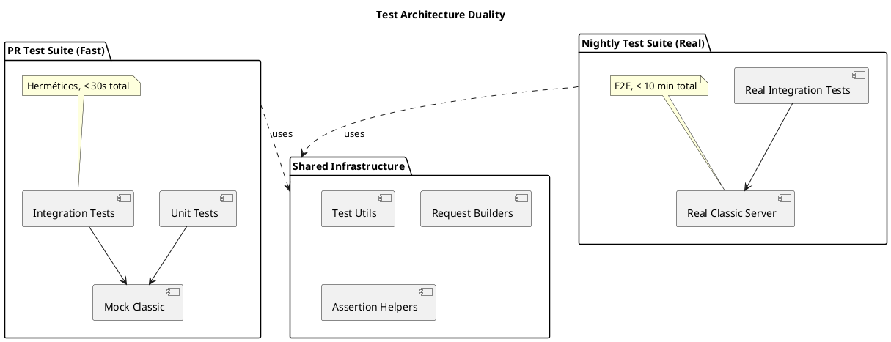

# Technical Design Document: Suite Nightly - Tests de Integración Real

## 1. Arquitectura de Alto Nivel

### 1.1. Contexto y Motivación
La suite de tests actual utiliza mocks para validar la lógica del BFF, pero no verifica la integración real con Etendo Classic. Esta propuesta establece una suite nightly complementaria que ejecuta contra un servidor Classic real.

**Problema actual:**
- Tests existentes son herméticos (usan mocks) → rápidos pero no detectan incompatibilidades de contrato
- No hay validación end-to-end de políticas de cookies, CSRF, timeouts reales
- Regresiones de integración solo se detectan en entornos de staging/producción

**Solución propuesta:**
- Suite nightly separada con tests que llaman al BFF → Classic real
- Ejecución independiente del CI de PR (no bloquea desarrollo)
- Misma estructura de tests pero con configuración real

### 1.2. Patrón de Diseño: Test Suite Duality



## 2. Desglose de Componentes

### 2.1. Nuevos Componentes a Crear

#### 2.1.1. Real Test Suite Foundation
**Ubicación:** `tests/e2e/real-classic/`

**Estructura propuesta:**
```
tests/
└── e2e/
    └── real-classic/
        ├── setup.ts              # Configuración global
        ├── utils/
        │   ├── auth.ts           # Authentication helpers
        │   ├── fixtures.ts       # Data fixtures for tests
        │   ├── assertions.ts     # Custom assertions
        │   └── cleanup.ts        # Test data cleanup
        ├── datasource/
        │   ├── datasource.read.nightly.integration.test.ts
        │   ├── datasource.write.nightly.integration.test.ts
        │   └── datasource.cache.nightly.integration.test.ts
        └── erp/
            ├── erp.forward.nightly.integration.test.ts
            └── erp.kernel.nightly.integration.test.ts
```

#### 2.1.2. Test Configuration Management
**Ubicación:** `tests/e2e/real-classic/setup.ts`

**Responsabilidades:**
- Configuración de entorno para tests reales
- Validación de conectividad con Classic
- Setup de credenciales y timeouts extendidos

**Interface:**
```typescript
export interface RealTestConfig {
  classicUrl: string;
  testUser: string;
  testPassword: string;
  timeout: number;
  retryAttempts: number;
  cleanupEnabled: boolean;
}

export function setupRealTestEnvironment(): Promise<RealTestConfig>;
```

#### 2.1.3. Real Classic Test Client
**Ubicación:** `tests/e2e/real-classic/utils/auth.ts`

**Responsabilidades:**
- Autenticación real contra Classic
- Manejo de tokens JWT y JSESSIONID
- Session management para tests

**Interface:**
```typescript
export class RealClassicClient {
  constructor(config: RealTestConfig);
  
  async authenticate(): Promise<AuthTokens>;
  async createTestRequest(options: RequestOptions): Promise<SuperTestRequest>;
  async cleanup(): Promise<void>;
}

export interface AuthTokens {
  jwt: string;
  jsessionId: string;
  expires: number;
}
```

#### 2.1.4. Test Data Fixtures Manager
**Ubicación:** `tests/e2e/real-classic/utils/fixtures.ts`

**Responsabilidades:**
- Gestión de datos de prueba temporales
- Cleanup automático de datos creados
- Generación de identificadores únicos

**Interface:**
```typescript
export class TestDataManager {
  async createTestRecord(entity: string, data: any): Promise<TestRecord>;
  async cleanupTestData(): Promise<void>;
  generateUniqueId(prefix: string): string;
}

export interface TestRecord {
  id: string;
  entity: string;
  createdAt: number;
  needsCleanup: boolean;
}
```

### 2.2. Archivos Existentes a Extender

#### 2.2.1. Jest Configuration (`jest.config.js`)
**Modificaciones requeridas:**
- Agregar configuración específica para tests nightly
- Timeouts extendidos
- Variables de entorno específicas

#### 2.2.2. Package.json Scripts

# Technical Design Document: Nightly Suite — Real Integration Tests

## 1. High-level Architecture

### 1.1 Context and Motivation
The current test suite is largely hermetic (mocks). That is fast and reliable for unit and integration logic, but it does not validate the real contracts and runtime behaviors between the BFF (WorkspaceUI) and Etendo Classic.

This document describes a complementary nightly suite that runs tests end-to-end against a real Etendo Classic instance to catch integration regressions that mocks miss: cookie handling, CSRF, real timeouts, and ERP behavior.

### 1.2 Design Pattern — Test Duality

Two parallel testing approaches coexist:
- Fast PR suite: unit and integration tests that use mocks (short feedback loop)
- Nightly real-suite: slower end-to-end tests that execute against a real Classic server (deeper contract validation)

Both suites should reuse shared test utilities (request builders, fixtures, assertion helpers).

## 2. Component Breakdown

### 2.1 New components to implement

- Real test suite root: `tests/e2e/real-classic/`
- `tests/e2e/real-classic/setup.ts` — global test setup and environment validation
- `tests/e2e/real-classic/utils/auth.ts` — real authentication helper (JWT + JSESSIONID handling)
- `tests/e2e/real-classic/utils/fixtures.ts` — test data creation and cleanup helpers
- `tests/e2e/real-classic/utils/http.ts` — resilient HTTP client with retry/backoff for test stability
- `tests/e2e/real-classic/cleanup.ts` — centralized cleanup invoked after tests

Suggested test folder structure:
```
tests/e2e/real-classic/
  setup.ts
  utils/
    auth.ts
    fixtures.ts
    http.ts
    cleanup.ts
  auth/
    login.nightly.integration.test.ts
  datasource/
    datasource.read.smoke.nightly.integration.test.ts
    datasource.write.nightly.integration.test.ts
```

### 2.2 Existing files to extend

- Extend existing `jest.config.js` to add an optional nightly profile or create `jest.config.nightly.js` for running only nightly tests with extended timeouts and node environment.
- Add npm scripts in `package.json` to run nightly tests (e.g. `test:nightly`, `test:nightly:ci`).

## 3. Specific Test Designs

### 3.0 Phase 1 — Basic smoke tests (Login + Fetch)

Goal: validate the minimal end-to-end path BFF → Classic with two stable smoke tests. These are small and should run quickly to verify environment health.

#### AUTH-REAL-LOGIN-01 — Real login via BFF
- File: `tests/e2e/real-classic/auth/login.nightly.integration.test.ts`
- Input: Use environment test credentials (`TEST_CLASSIC_USER`, `TEST_CLASSIC_PASSWORD`) or call `/api/auth/login` depending on the canonical login flow.
- Expected output: HTTP 200 and a JWT in response body. The BFF should also cause Classic to issue a `JSESSIONID` (stored server-side). The test will validate JWT structure and perform a follow-up call to ensure the session is usable.
- Acceptance criteria:
  - Response contains a token that matches the `header.payload.signature` pattern (structure only).
  - A subsequent datasource read with the returned token succeeds (no 401/403).
  - Test shows minimal logs and records artifacts for failure analysis.

#### DS-REAL-READ-01 — Datasource smoke read
- File: `tests/e2e/real-classic/datasource/datasource.read.smoke.nightly.integration.test.ts`
- Input: POST `/api/datasource` with `{ entity: 'Organization', params: { _startRow: 0, _endRow: 1 } }` and `Authorization: Bearer <JWT>` header.
- Expected output: HTTP 200 with a Classic-style datasource response `{ response: { status, data, totalRows } }`.
- Acceptance criteria:
  - `status` indicates a successful response (e.g. `0` or equivalent success indicator).
  - `data` is an array (0..n items) and `totalRows` is a number >= 0.
  - No session-related errors (401/403) or CSRF errors for read operations.
  - Request/response headers relevant to debugging are captured in artifacts (without sensitive content).

Notes:
- These smoke tests are intentionally minimal to give quick feedback about environment health. Additional, slower tests (writes, complex flows) are added in later phases.

### 3.1 Datasource read/write tests (Phase 2)

- `datasource.read.nightly.integration.test.ts` — richer read tests asserting schema, filters, and pagination
- `datasource.write.nightly.integration.test.ts` — create/update/delete flows using fixtures and cleanup

Each write test must register created records for cleanup. The `TestDataManager` will track created records and attempt deletion during `afterAll`.

## 4. Test Data Strategy

Principles:
- Isolation: each test creates and cleans its own data
- Uniqueness: use timestamp/randomized suffixes for keys
- Minimalism: create only data required for the scenario

Lifecycle:
1. Setup uses `TestDataManager.generateUniqueId()` to create unique keys.
2. Tests create records via BFF calls and register them in the cleanup manager.
3. After test suite execution, cleanup manager deletes created records in reverse order.

## 5. Environment Configuration

Recommended environment variables for nightly runs:
```
TEST_CLASSIC_URL=http://classic-test.etendo.com:8080/etendo
TEST_CLASSIC_USER=nightly-test-user
TEST_CLASSIC_PASSWORD=secure-test-password

TEST_TIMEOUT=300000               # 5 minutes per test
TEST_MAX_RETRIES=3                # Retry flaky failures
TEST_CLEANUP_ENABLED=true
TEST_PARALLEL_WORKERS=1           # Run sequentially by default for stability

# BFF-specific
ETENDO_CLASSIC_URL=${TEST_CLASSIC_URL}
ERP_FORWARD_COOKIES=true
```

Jest configuration suggestion (separate file `jest.config.nightly.js`): run with `testEnvironment: 'node'`, increased `testTimeout`, and a `setupFilesAfterEnv` pointing to `tests/e2e/real-classic/setup.ts`.

## 6. Metrics and Observability

Key metrics to collect on each nightly run:
- Total tests, passed, failed, skipped
- Execution time (total and per-test)
- Flaky test list (tests that pass after retry)
- Coverage of critical endpoints

Artifacts to publish for failures:
- JUnit XML (jest-junit)
- HTTP request/response logs (sanitized)
- Relevant headers (set-cookie, content-type, status)

Alerting thresholds (suggested):
- Warning if failure rate > 5%
- Critical if failure rate > 20% or if total execution time exceeds threshold

## 7. Error Handling and Resilience

Strategies to keep nightly runs stable and diagnostic:

- Test-level retry wrapper with exponential backoff for network blips
- Resilient HTTP client that retries on transient errors (ECONNRESET, ETIMEDOUT, 5xx)
- Timeouts and max attempts configurable via env vars
- Failure artifacts stored for post-mortem (no secrets)

Isolation techniques:
- Prefer creating minimal records and deleting them after tests
- When possible, use transactional rollback pattern in test-support endpoints (if Classic supports it or via a test-only API)

## 8. Migration and Rollout (no CI pipeline details)

Phased implementation:

- Phase 1 — Foundation (1-2 weeks):
  - Implement `tests/e2e/real-classic` structure
  - Add `RealClassicClient` with authentication and a minimal `authenticate()` method
  - Add the two smoke tests: `AUTH-REAL-LOGIN-01` and `DS-REAL-READ-01`
  - Add cleanup manager and simple fixtures helper

- Phase 2 — Core tests (3-4 weeks):
  - Add write/delete tests, more complex reads, and edge cases
  - Improve fixture generation and cleanup robustness
  - Add more observability and test artifacts

- Phase 3 — Stabilization and maintenance (ongoing):
  - Reduce flakiness, tune retries/timeouts, and add new critical scenarios
  - Implement metrics collection and dashboards

Rollback and safety:
- The nightly suite is opt-in and separated from PR checks; disabling the nightly suite is safe via environment flags.

## 9. Maintenance Strategy

Operational tasks:
- Weekly: review flaky test reports, update fixtures, review failures
- Monthly: analyze coverage gaps and optimize slow tests
- Quarterly: review strategy, update dependencies, and perform performance tuning

## 10. Success Criteria

Technical acceptance criteria:
- Flake rate < 5% over 30 days
- Suite runtime acceptable for nightly window (target < 10 minutes for initial scope)
- 80%+ coverage of critical BFF endpoints by real integration tests

Business acceptance criteria:
- Detect integration regressions before staging/production deployments
- Reduce integration bugs reported from staging by measurable amount

---

Files created/edited in this TDD:
- `tests/e2e/real-classic/setup.ts` — test environment setup (implement in Phase 1)
- `tests/e2e/real-classic/auth/login.nightly.integration.test.ts` — auth smoke test
- `tests/e2e/real-classic/datasource/datasource.read.smoke.nightly.integration.test.ts` — datasource smoke test

Next steps I can take now:
1. Scaffold the `tests/e2e/real-classic` directory with the setup file and the two smoke tests.
2. Add `package.json` scripts and a minimal `jest.config.nightly.js` (optional).
3. Implement the `RealClassicClient.authenticate()` helper used by tests.

Tell me which next step to run and I will implement it.
  }
