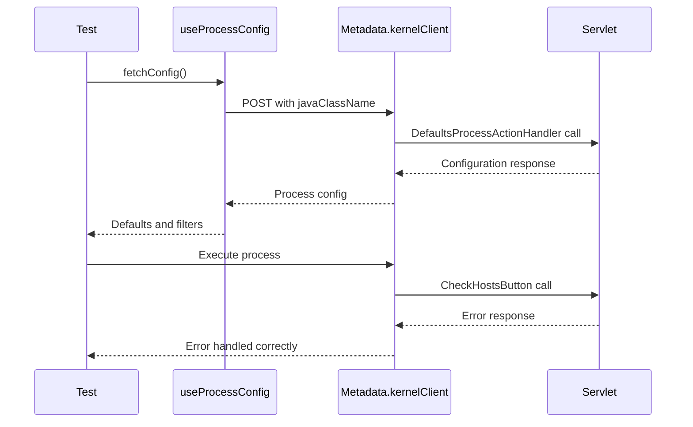

# Process Execution Testing Strategy

## Overview

This document outlines the testing strategy for the Process Execution feature fixes, focusing on logic-only tests without visual/UI testing. The tests are designed to validate the core functionality changes made to support custom Java process handlers.

## Test Structure

### 1. Unit Tests - useProcessConfig Hook
**File:** `packages/MainUI/__tests__/hooks/useProcessDatasourceConfig.test.ts`

**Purpose:** Test the hook that manages process configuration loading via DefaultsProcessActionHandler.

**Key Test Cases:**
- ✅ Hook initialization with correct default state
- ✅ Dynamic `_action` parameter selection (DefaultsProcessActionHandler vs custom javaClassName)
- ✅ Response processing and state management
- ✅ Error handling (network errors, malformed responses)
- ✅ Loading state management
- ✅ Hook dependency management and memoization

**Critical Logic Tested:**
```typescript
// Before: Always hardcoded
_action: "org.openbravo.client.application.process.DefaultsProcessActionHandler"

// After: Dynamic selection
_action: javaClassName || "org.openbravo.client.application.process.DefaultsProcessActionHandler"
```

### 2. Unit Tests - Process Handlers Logic
**File:** `packages/MainUI/__tests__/components/ProcessModal/ProcessDefinitionModal.handlers.test.ts`

**Purpose:** Test the process execution handlers logic in isolation using a custom hook pattern.

**Key Test Cases:**
- ✅ `handleDirectJavaProcessExecute()` function logic
- ✅ Servlet call with correct `_action` parameter
- ✅ Response processing priority (responseActions > message > fallback)
- ✅ Error response handling (no false success messages)
- ✅ Execution state management (isExecuting, isSuccess)
- ✅ Handler routing logic in `handleExecute()`

**Critical Logic Tested:**
```typescript
// Response Processing Priority
if (response?.data?.responseActions?.[0]?.showMsgInProcessView) {
  // Handle standard format
} else if (response?.data?.message) {
  // Handle legacy format  
} else if (response?.data && !response.data.responseActions) {
  // Fallback success
}
```

### 3. Integration Tests - End-to-End Flow
**File:** `packages/MainUI/__tests__/integration/processExecution.integration.test.ts`

**Purpose:** Test the complete process execution flow from configuration loading to execution.

**Key Test Cases:**
- ✅ Full CheckHostsButton process execution flow
- ✅ Configuration loading → Process execution sequence
- ✅ Error response handling (no false success)
- ✅ Success response handling
- ✅ Legacy message format support
- ✅ Fallback to DefaultsProcessActionHandler
- ✅ Network error handling
- ✅ Concurrent request handling
- ✅ State management during async operations

**Critical Flow Tested:**


## Testing Methodology

### 1. Logic-Only Focus
- **No UI Rendering:** Tests focus on function logic, not visual components
- **Mock External Dependencies:** Metadata client, logger, translation functions
- **Hook Testing:** Using `@testing-library/react-hooks` for hook logic
- **Custom Hook Pattern:** Extract handler logic for isolated testing

### 2. Comprehensive Error Scenarios
- Network failures
- Malformed responses
- Missing parameters
- Legacy response formats
- Unknown error types

### 3. State Management Validation
- Loading states during async operations
- Error state propagation
- Success state transitions
- Concurrent operation handling

## Key Issues Being Tested

### Primary Issue: Execute Button Functionality
**Problem:** Execute button non-functional for custom Java processes
**Root Cause:** Hardcoded DefaultsProcessActionHandler usage
**Test Coverage:**
- Dynamic `_action` parameter selection
- Correct servlet calls with custom javaClassName
- Handler routing logic

### Secondary Issue: Error Response Misinterpretation
**Problem:** Error responses shown as success
**Root Cause:** Incorrect response processing priority
**Test Coverage:**
- Response format prioritization
- Error message display logic
- False success prevention

## Running the Tests

### Individual Test Files
```bash
# Hook tests
npm test -- useProcessDatasourceConfig.test.ts

# Handler tests  
npm test -- ProcessDefinitionModal.handlers.test.ts

# Integration tests
npm test -- processExecution.integration.test.ts
```

### All Process Execution Tests
```bash
# Run all related tests
npm test -- --testPathPattern="(useProcessDatasourceConfig|ProcessDefinitionModal\.handlers|processExecution\.integration)"
```

### With Coverage
```bash
npm test -- --coverage --testPathPattern="(useProcessDatasourceConfig|ProcessDefinitionModal\.handlers|processExecution\.integration)"
```

## Test Data and Mocks

### Mock Responses
- **Configuration Response:** Simulates DefaultsProcessActionHandler response
- **Execution Response:** Simulates custom Java handler responses
- **Error Response:** Tests error scenarios (network, business logic)
- **Legacy Response:** Tests backward compatibility

### Mock Process Data
- **CheckHostsButton:** Primary test case process
- **Test Entity:** Generic entity for testing
- **Session Data:** User session context

## Expected Coverage

### Code Coverage Targets
- **useProcessConfig Hook:** 100% line coverage
- **Handler Functions:** 95%+ line coverage
- **Error Paths:** 100% coverage of error scenarios
- **Integration Flow:** Complete end-to-end coverage

### Scenario Coverage
- ✅ Custom Java process execution
- ✅ DefaultsProcessActionHandler fallback
- ✅ Error response handling
- ✅ Success response handling
- ✅ Legacy format support
- ✅ Network error scenarios
- ✅ Edge cases and malformed data

## Maintenance

### Adding New Tests
1. Follow existing pattern of logic-only testing
2. Mock external dependencies appropriately
3. Test both success and error scenarios
4. Include edge cases and error boundaries

### Updating Tests
- Update when handler logic changes
- Maintain backward compatibility tests
- Update mock data when response formats change
- Keep integration tests aligned with actual API changes

## Regression Prevention

These tests specifically prevent:
- ❌ Execute button returning to non-functional state
- ❌ Hardcoded DefaultsProcessActionHandler reintroduction
- ❌ Error responses being treated as success
- ❌ Loss of support for legacy response formats
- ❌ Breaking changes to existing process types