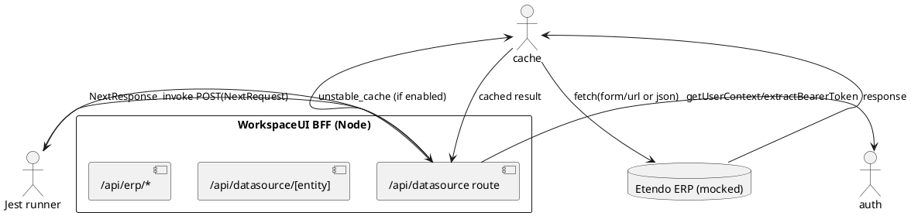
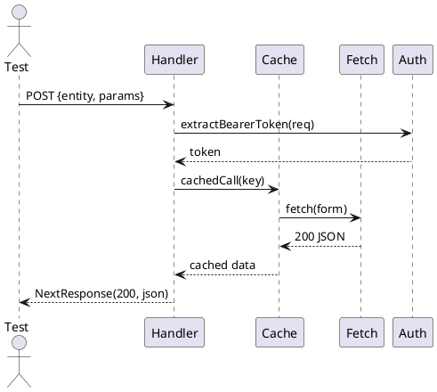
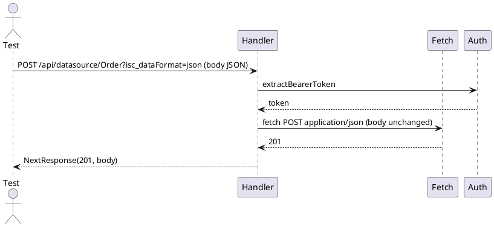

# Solution Design: API Integration Testing for WorkspaceUI

Status: DRAFT - Phase 2 (Technical Design)

## Overview
This document provides the technical design to implement the integration testing suite described in `PRD-API-Integration-Testing.md`. It includes a high-level architecture, component breakdown, API contracts for the tests, data/fixture models, sequence diagrams, test harness and CI wiring, plus non-functional considerations.

Feature short-name: API-Integration-Testing

Success criteria (implementation):
- Reusable test harness that runs Jest tests invoking Next.js App Router handlers directly.
- Deterministic mock layer for `global.fetch`, `@/lib/auth` and `next/cache` to make tests hermetic.
- 8-12 integration test cases implemented (DS-READ/WRITE/COOKIE/ERP) with JUnit output in CI.
- Tests run reliably locally and in CI in under 10 minutes.

---

## Contract (tiny spec)

- Inputs: Next.js `NextRequest` resembling incoming client requests to BFF handlers. For most tests a JSON-like request body or query string will be sufficient.
- Outputs: `NextResponse` (or object with `.status` and `.json()` results) as returned by handlers. Tests should assert status and decoded body or inspect the `global.fetch` calls to verify ERP payload and headers.
- Error modes: upstream ERP 4xx/5xx should be propagated by handlers (preserve status and body), and tests must assert propagation. Authentication failures (missing token) should produce 401 from handler.
- Success criteria: For each case the test asserts both (a) handler response shape/status and (b) exact ERP-forward call (method, url, headers, body), via fetch assertions.

Edge cases to cover:
- Missing or malformed request properties
- Large payloads (simulate with modest sized fixtures)
- CSRF header present vs absent
- Cookies forwarding on/off

---

## High-level architecture

- Test runner: Jest (repo already configured)
- Test harness: `packages/MainUI/app/api/_test-utils/*` extended with new helpers where needed
- Mocking layer:
  - `global.fetch` replaced per-test with deterministic jest.fn() that captures calls
  - `@/lib/auth` mocked to return controlled `getUserContext` and `extractBearerToken`
  - `next/cache` (`unstable_cache`) mocked with a wrapper that allows key capture
- Test files colocated in each API folder under `__tests__` using naming convention `*.integration.test.ts`
- CI: Jenkins job invoking `pnpm test --ci --testPathPattern="integration"` and producing `junit.xml` and coverage artifacts

Component diagram (PlantUML):



---

## Components and responsibilities

1. Test utilities (existing) — `packages/MainUI/app/api/_test-utils/`
   - datasource-test-utils.ts: factories for `NextRequest`, setup/teardown hooks, `assertDatasourceCall()`.
   - api-test-utils.ts: generic request/response helpers.
   - fetch-assertions.ts: helpers to decode and assert forwarded body and headers.
   - Additions: `captureCacheKey()` helper to intercept `unstable_cache` key generation and `mockFetchFactory()` to create standard fetch behaviours.

2. Tests — colocated with handlers in `__tests__` directories. Each test file should:
   - Call `setupDatasourceTestEnvironment()` in beforeEach to configure `process.env` and install default mocks
   - Create a `NextRequest` (or minimal object) and invoke the handler directly: e.g. `await POST(req as any)`
   - Use fetch assertion helpers to validate ERP payload and headers

3. CI/Wiring — Jenkins job uses environment overrides and stores artifacts.

4. Fixtures — JSON fixtures live under `packages/MainUI/app/api/__fixtures__/` or in `__tests__/fixtures` next to tests for small, test-specific payloads.

---

## Data and Fixtures

Fixtures should be small and focused. Example directories:

```
packages/MainUI/app/api/__fixtures__/
  - datasource/customer.read.json
  - datasource/order.write.json
  - erp/standard-response.json
```

Fixture shape guidance:
- Datasource read: { entity: string, params: Record<string,string|number> }
- Datasource write (SmartClient): { operationType: 'add' | 'update' | 'remove', data: Record }
- ERP response: { status, body } (for fetch mock to return)

---

## API Contracts for tests

1) POST `/api/datasource` (read)
- Request body: { entity: string, params?: Record<string, any> }
- Behavior under test: builds form-urlencoded body for ERP, sets Authorization header from extracted token, optionally includes Cookie header (controlled by `ERP_FORWARD_COOKIES`), uses cache when `shouldCacheDatasource(entity)` is true.
- Test assertions: fetch was called once with correct URL, method POST, headers include `Content-Type: application/x-www-form-urlencoded` and `Authorization: Bearer <token>`, and body includes encoded `_startRow` (if provided).

2) POST `/api/datasource/:entity` (write)
- Query string `?isc_dataFormat=json` toggles JSON passthrough. Otherwise convert SmartClient payload into form-urlencoded POST.
- CSRF: if the original request has `X-CSRF-Token`, it must be forwarded.
- Test assertions: when `isc_dataFormat=json` present the fetch call has `Content-Type: application/json` and unmodified JSON body; otherwise Content-Type form-urlencoded and form body asserted.

3) Any `/api/erp/*` forward
- Transparent forward: method, path, query and body preserved. Authorization header forwarded.
- Test assertions: constructed URL equals `${ETENDO_CLASSIC_URL}/${slug}${query}` and body preserved.

---

## Sequence diagrams (PlantUML)

Datasource Read (cache path):



Datasource Write (json passthrough):



Cache key capture (design note): use a wrapper for `unstable_cache` that calls a test-exposed hook `captureCacheKey(keyParts)` before delegating to the real fn. In tests this hook will record keyParts for assertions.

---

## Test harness and helper design

- `mockFetchFactory(responseSpec)` returns a jest.fn() that returns a Response-like object that supports `.json()` and `.text()` and `.status`.
- `installAuthMock(userContext, token)` helper to mock `@/lib/auth` consistently.
- `captureCacheKey()` - a test utility exported from `_test-utils` used to assert cache arguments were derived from user context.

Example minimal helper API:

```ts
// in datasource-test-utils.ts
export function setupDatasourceTestEnvironment(overrides?: Partial<Record<string,string>>) { /* ... */ }
export function mockFetchFactory(spec: { status: number, json?: any, text?: string }) { /* ... */ }
export function captureCacheKey() { /* return spy that records keys */ }
```

---

## CI and execution

- Local dev:

```bash
# fish shell
pnpm test packages/MainUI/app/api/datasource/__tests__/datasource.read.integration.test.ts
```

- CI (Jenkins): run all integration tests and publish JUnit and coverage reports as in PRD.

Performance notes: parallelize test files across available cores (`--maxWorkers=50%`), and prefer small, focused tests to avoid slow setup/teardown.

---

## Non-functional requirements

- Tests must be deterministic; no network access allowed during CI runs.
- Quick failure feedback: tests should fail fast with clear assertion messages.
- Minimal maintenance surface: prefer reusing existing `_test-utils` and fixtures.

---

## Implementation plan and milestones

1. Create new helpers in `_test-utils`: `captureCacheKey`, `mockFetchFactory`, `installAuthMock` (1 day)
2. Implement DS-READ-01 test using the new helpers (0.5 day)
3. Run and stabilize DS-READ-01 locally and in CI; fix lint/types (0.5 day)
4. Implement DS-WRITE-01, COOKIE-01, DS-READ-02 (1.5 days)
5. Add CI reporters and finalize Jenkins step (0.5 day)

Total estimate: 3.5 - 4 days (including validation and CI stabilization)

---

## Open decisions & questions

- Do you want full Supertest HTTP-server-based tests in addition to direct handler invocation? (current recommendation: no, keep direct invocation)
- Preferred location for shared fixtures: `packages/MainUI/app/api/__fixtures__` or per-test `__tests__/fixtures`?

---

## Files to create/update (implementation work)
- `packages/MainUI/app/api/_test-utils/datasource-test-utils.ts` (add helpers)
- Add tests: `packages/MainUI/app/api/datasource/__tests__/*` (DS-READ-02, DS-WRITE-01, COOKIE-* etc.)
- `Jenkinsfile` snippet already in PRD; add to team's pipeline if approved.


---

End of design.
